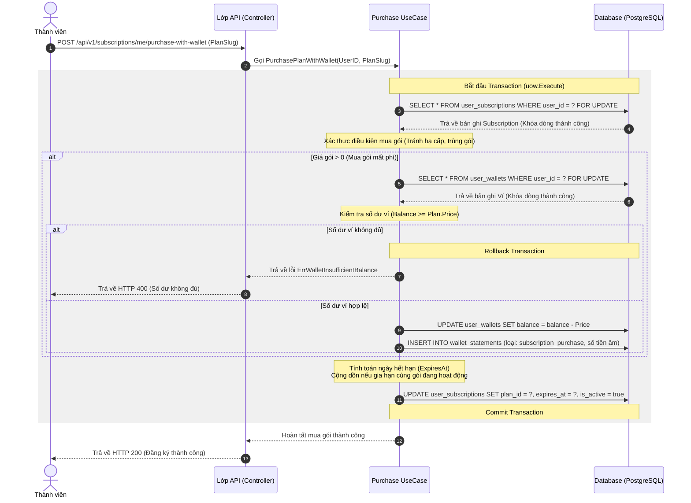
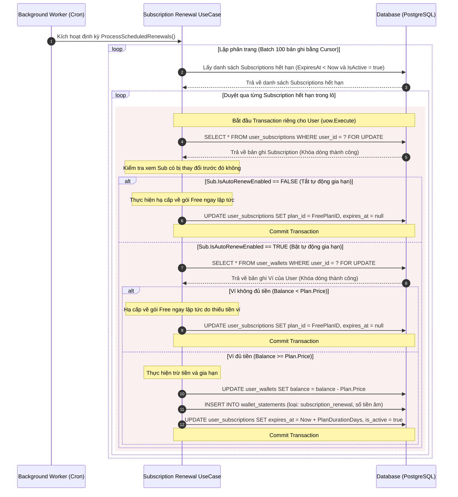

# Đặc tả Chi tiết Luồng Nghiệp vụ của các Core Feature

Tài liệu này mô tả chi tiết các luồng đi của những tính năng cốt lõi (Core Features) trong hệ thống Smart Wardrobe, bao gồm các tác nhân (Actors), Endpoint API liên quan, cấu trúc dữ liệu, các bước xử lý nghiệp vụ, quản lý giao dịch (Transaction/Locking) và chuyển đổi trạng thái (State Transition). 

Mục tiêu là cung cấp thông tin kỹ thuật đầy đủ để đội ngũ phát triển vẽ chính xác **Activity Diagram** và **Sequence Diagram**.

---

## Danh sách các Core Feature Đặc tả
1. [Luồng số hóa tủ đồ tự động (Automated Wardrobe Digitization Flow - Tính sẵn HSL)](#digitization-flow)
2. [Luồng gợi ý phối đồ AI & lưu Outfit (AI Outfit Recommendation & Save Flow - RAG 4 Giai đoạn & Trừ Quota khi thành công)](#outfit-recommendation-flow)
3. [Luồng Stylist AI Chatbot (AI Style Stylist Chatbot Flow - Trừ Quota khi thành công)](#chatbot-flow)
4. [Luồng chuyển nhượng vật phẩm P2P (P2P Marketplace Item Transfer Flow - Chi tiết ẩn/hiện Sibling Items)](#item-transfer-flow)
5. [Luồng mua gói hội viên trực tiếp (Direct Subscription Purchase Flow via PayOS)](#direct-purchase-flow)
6. [Luồng nạp tiền và mua gói bằng ví nội bộ (Wallet Top-up & Purchase Flow - Chi tiết Transaction & Lock)](#wallet-purchase-flow)
7. [Luồng tự động gia hạn hội viên định kỳ (Scheduled Auto-Renewal Worker Flow - Chi tiết Transaction & Lock)](#auto-renewal-flow)
8. [Luồng tính điểm và hiển thị Feed cộng đồng (Community Hotness & Feed Ranking Flow)](#feed-ranking-flow)

---

## 1. Luồng số hóa tủ đồ tự động (Automated Wardrobe Digitization Flow - Tính sẵn HSL)

Luồng này xử lý việc tải ảnh trang phục lên và sử dụng AI kết hợp các thư viện xử lý ảnh để phân tích thuộc tính (màu sắc HEX/HSL, chất liệu, phong cách, danh mục...) rồi lưu vào tủ đồ cá nhân dưới dạng nền xử lý bất đồng bộ (Asynchronous Worker).

### Các bước trong Luồng (Step-by-step Flow)

#### Giai đoạn 1: Khởi tạo tải lên (Đồng bộ - Synchronous)
1. **Frontend:** Yêu cầu lấy chữ ký upload qua `GET /api/v1/wardrobe-items/upload-signature`, sau đó Frontend tải ảnh trực tiếp lên **Cloudinary** để lấy `ImageUrl` và `ImagePublicID`.
2. **API Request:** Frontend gửi HTTP POST tới `/api/v1/wardrobe-items/batch-upload` với body chứa danh sách các ảnh (`ImageUrl`, `ImagePublicID`) và `CategoryID` (nếu chọn thủ công).
3. **Kiểm tra Quota (Subscription):**
   - Hệ thống gọi Subscription Contract để kiểm tra giới hạn sức chứa tủ đồ của user (`MaxWardrobeItems`).
   - Nếu `CurrentCount + NewItems > MaxWardrobeItems`, trả về lỗi `ErrWardrobeLimitExceeded`.
4. **Tạo Bản ghi Tạm thời (Database):**
   - Hệ thống thực hiện `BulkCreate` lưu các item vào DB với trạng thái `Status = "processing"` (đang xử lý).
5. **Phát sự kiện (Event Publishing):**
   - Hệ thống phát đi các event `wardrobe.batch_upload` tương ứng với từng Item ID lên hàng đợi tin nhắn / event publisher.
6. **API Response:** API trả về danh sách các Item vừa tạo ở trạng thái `processing` cho Client ngay lập tức mà không cần đợi AI xử lý xong.

#### Giai đoạn 2: Xử lý nền bằng Worker (Bất đồng bộ - Asynchronous)
1. **Worker Lắng nghe:** `WardrobeBatchUploadWorker` nhận event từ topic `wardrobe.batch_upload`.
2. **Phân tích Ảnh bằng AI & Trích xuất màu:**
   - Worker gọi AI Service (`AnalyzeFashionImage`) gửi ảnh trang phục đi kèm danh sách danh mục hệ thống để AI chọn danh mục phù hợp nhất.
   - AI trả về metadata phân tích: danh mục trang phục (`CategorySlug`), màu sắc chủ đạo (`ColorName` và mã màu HEX như `#FFD1DC`), phong cách (`Style`), chất liệu (`Material`), kiểu dáng (`Fit`), mùa (`Seasonality`), mô tả chi tiết (`Description`).
3. **Tính toán hệ màu HSL (Pre-computation):**
   - Worker lấy mã màu HEX (ví dụ: `#FFD1DC`) trích xuất từ bước trên.
   - Sử dụng thuật toán chuyển đổi màu toán học nội bộ để **chuyển đổi HEX sang HSL** (Hue: 0-360, Saturation: 0-100%, Lightness: 0-100%).
4. **Tạo Embedding Vector:**
   - Từ metadata AI trả về, Worker nối chuỗi tạo thành ngữ cảnh văn bản phong phú (Rich Text Context).
   - Worker gọi AI Service (`GenerateEmbeddings`) để chuyển văn bản này thành vector embedding 768-chiều.
5. **Cập nhật Database:**
   - Worker cập nhật bản ghi Wardrobe Item: ghi đè thông tin danh mục, các thuộc tính thời trang, **giá trị tính sẵn `color_hue`, `color_saturation`, `color_lightness`**, vector embedding và chuyển trạng thái `Status = "in_wardrobe"`.
   - Nếu xảy ra lỗi tạm thời trong quá trình gọi AI/xử lý, Worker sẽ tự động retry (tối đa 3 lần) với cơ chế exponential backoff. Nếu vượt quá số lần retry, cập nhật `Status = "failed"`.
6. **Phát Event hoàn tất:**
   - Phát sự kiện `wardrobe.event.created` để báo hiệu item đã được số hóa thành công.

---

## 2. Luồng gợi ý phối đồ AI & lưu Outfit (AI Outfit Recommendation & Save Flow - RAG 4 Giai đoạn & Trừ Quota khi thành công)

Gợi ý phối đồ cá nhân hóa dựa trên dữ liệu tủ đồ thực tế của người dùng, sử dụng mô hình Hybrid RAG (Phối hợp Backend lọc thô và AI phối tinh) tuỳ biến theo đầu vào từ giao diện. Quota chỉ bị trừ khi hệ thống phản hồi kết quả thành công.

### Các bước trong Luồng (Step-by-step Flow)

#### Giai đoạn 1: Khởi tạo & Kiểm tra Quota (Không trừ quota ở bước này)
1. **API Request:** User gửi HTTP POST tới `/api/v1/ai/outfit-recommendations` chứa thông tin từ FE:
   - Tham số tùy chọn rõ ràng từ giao diện (nếu có): `ColorTone`, `Occasion`.
   - Ghi chú mô tả thêm dạng tự do (nếu có): `Details`.
2. **Kiểm tra Quota:**
   - Hệ thống thực hiện kiểm tra số quota phối đồ còn lại trong ngày (`CheckOutfitQuota`). **Nếu số quota còn lại <= 0, chặn và báo lỗi ngay lập tức** `ErrOutfitQuotaExceeded`. Không trừ quota tại đây.

---

#### Giai đoạn 2: Lọc ứng viên bằng Hybrid Search & Re-ranking
Backend hiện không còn tách cứng thành hai nhánh menu-vs-vector như mô tả cũ. Thay vào đó hệ thống dùng một pipeline lai để lấy ra tập ứng viên khoảng 15-20 món đồ:

1. **Lấy tập đồ khả dụng ban đầu:** Truy vấn tủ đồ của user và chỉ giữ các món có trạng thái khả dụng `in_wardrobe`.
2. **Phân tích ý định cục bộ:** Dùng `LocalNLPParser` để tách các tín hiệu từ `Details` như dịp mặc, tông màu, mùa, phong cách và semantic query.
3. **Hợp nhất bộ lọc có cấu trúc:** Nếu FE truyền `Occasion` hoặc `ColorTone`, backend ghi đè hoặc bổ sung các tín hiệu này vào parsed intent.
4. **Sinh vector truy vấn khi cần:** Nếu parsed intent tạo ra semantic query có ý nghĩa, hệ thống gọi embedding service để sinh vector truy vấn.
5. **Lấy ứng viên bằng hybrid retrieval:** Gọi `GetHybridCandidates(...)` để phối hợp keyword matching, semantic vector matching và các tiêu chí lọc từ DB nhằm lấy tối đa khoảng 40 ứng viên.
6. **Bù ứng viên nếu thiếu:** Nếu số ứng viên trả về còn ít, backend bổ sung thêm từ tập active items để đảm bảo đủ độ phủ.
7. **Re-ranking theo luật thời trang:** Chấm điểm lại ứng viên dựa trên occasion, color tone, seasonality, recently worn penalty và long-unworn bonus, rồi lấy top khoảng 15-20 món tốt nhất.

---

#### Giai đoạn 3: Phối đồ tinh tế (AI/LLM làm việc trên tập ứng viên)
1. **Xây dựng Prompt ngữ cảnh:**
   - Backend lấy thông tin chi tiết (Tên, Loại đồ, Màu sắc, Chất liệu, Phong cách, Mô tả, HSL) của 15-20 món đồ ứng viên đã chọn từ Giai đoạn 2.
   - Ghép thành danh sách kèm yêu cầu bối cảnh của người dùng (Thời tiết, dịp mặc).
2. **Gọi LLM (AI Fashion Reasoning Engine):**
   - Gửi prompt tới LLM. Yêu cầu LLM đóng vai trò Stylist cá nhân:
     - Tự tính toán độ phối hợp màu sắc (dựa trên nhãn màu sắc/HSL của 15 món đồ).
     - Ghép cặp món đồ chính cho từng vai trò thời trang (**Primary** - ví dụ: 1 áo thun trắng, 1 quần jean xanh, 1 giày sneaker).
     - Chọn ra tối đa 2 phương án thay thế (**Alternatives** - ví dụ: áo thun đen, quần kaki đen) từ chính tập ứng viên.
     - Viết 1 đoạn giải thích ngắn gọn bằng tiếng Việt lý giải tại sao bộ phối này đẹp và phù hợp.
   - LLM trả về kết quả dưới dạng cấu trúc JSON định dạng sẵn.
3. **Xác thực và Kiểm tra lỗi (Backend Validation):**
   - Backend phân tích JSON trả về, đối chiếu các Item ID được chọn xem có thực sự nằm trong 15 món ứng viên đã gửi đi không.
   - Nếu AI "ảo tưởng" trả về ID lạ, Backend tự động lọc bỏ hoặc chọn món có độ tương đồng cao nhất thay thế.
   - **Cơ chế Dự phòng (Fallback):** Trong trường hợp gọi AI Service thất bại (quá tải hoặc hết quota), Backend tự động kích hoạt thuật toán so màu HSL nội bộ của mình để ghép cặp đồ ngay trên tập ứng viên.

---

#### Giai đoạn 4: Trừ Quota khi thành công & Trả về kết quả
1. **Trừ Quota sử dụng:**
   - Sau khi kết quả phối đồ được sinh thành công và xác thực hợp lệ ở Giai đoạn 3, hệ thống mở một transaction ngắn thực hiện trừ 1 lượt quota phối đồ trong ngày của user (`DeductOutfitQuota`).
   - *Lưu ý:* Nếu ở Giai đoạn 2 hoặc Giai đoạn 3 xảy ra lỗi (LLM sập, lỗi DB, hoặc không tìm thấy ứng viên), hệ thống trả về HTTP Error và **không thực hiện trừ quota** của người dùng.
2. **API Response:** Trả về đối tượng gợi ý phối đồ gồm:
   - `Title`, `Explanation`, và danh sách các nhóm vai trò thời trang (mỗi vai trò chứa 1 item `Primary` và mảng `Alternatives`).
   - **`IsFallback` (Boolean Flag):** Trả về `true` nếu kết quả được sinh bằng thuật toán ghép màu HSL dự phòng của Backend, và `false` nếu được sinh bằng AI thành công.
   - **`RemainingQuota`:** Trả về số lượt gợi ý phối đồ còn lại sau khi hệ thống đã trừ quota thành công.
3. **Đổi món cục bộ (Local Swap):**
   - Khi người dùng nhấn nút đổi món trên giao diện, Frontend tự hoán đổi item `Primary` hiện tại với một item trong mảng `Alternatives` ngay lập tức **mà không cần gọi lại API Backend**.

---

#### Giai đoạn 5: Lưu Outfit
1. **API Request:** Người dùng nhấn "Lưu Outfit", Frontend gửi HTTP POST tới `/api/v1/outfits` chứa thông tin outfit (tên, các Item ID được chọn kèm toạ độ hiển thị).
2. **Kiểm tra giới hạn số lượng Outfit:**
   - Hệ thống kiểm tra số outfit hiện tại của user đạt giới hạn quota cho phép (`MaxOutfits`) hay chưa.
3. **Database Transaction:**
   - Lưu bản ghi `Outfit` và `OutfitItem`.
   - Cập nhật trường `last_used_at` của các món đồ được chọn về thời gian hiện tại (phục vụ tính năng hao mòn vòng đời trang phục).

---

## 3. Luồng Stylist AI Chatbot (AI Style Stylist Chatbot Flow - Trừ Quota khi thành công)

Luồng tư vấn thời trang trực tuyến với Stylist AI qua kết nối SSE stream, tự động phát hiện ý định phối đồ để điều hướng và thực hiện nén bộ nhớ hội thoại bất đồng bộ. Quota chỉ bị trừ khi tin nhắn được truyền phát thành công.

### Các bước trong Luồng (Step-by-step Flow)

1. **API Request:** User gửi tin nhắn thông qua HTTP POST SSE tới `/api/v1/ai/chat/sessions/:contextID/messages/stream` chứa nội dung tin nhắn (`Content`).
2. **Kiểm tra Quota (Không trừ quota ở bước này):**
   - Kiểm tra xem user có còn quota chat AI trong ngày hay không (`CheckAiChatQuota`). Nếu hết quota, trả về lỗi ngay lập tức.
3. **Kiểm tra Intent & Điều hướng (Chatbot Redirect Engine):**
   - Hệ thống kiểm tra từ khóa hoặc sử dụng bộ phân loại ý định (Intent Classifier) trên nội dung tin nhắn (`Content`) của người dùng để phát hiện ý định muốn tạo một outfit hoàn chỉnh (`isOutfitIntent`).
   - **Nhánh A (Bị điều hướng):** Nếu phát hiện ý định tạo outfit:
     - Hệ thống **bỏ qua việc gọi LLM** tư vấn thời trang.
     - Trả về ngay một tin nhắn điều hướng chuẩn chỉnh: *"Để nhận được gợi ý phối đồ chuẩn xác nhất từ thuật toán của Smart Wardrobe, bạn vui lòng sử dụng chức năng Phối đồ trên màn hình chính."*
     - Do đây là phản hồi điều hướng tĩnh, **không thực hiện trừ quota** chat của user.
     - Kết thúc luồng phản hồi SSE.
   - **Nhánh B (Tiếp tục tư vấn phong cách):** Nếu tin nhắn chỉ là hỏi đáp thời trang thông thường:
     - Tiếp tục thực hiện bước 4 dưới đây.
4. **Xây dựng ngữ cảnh Prompt:**
   - Hệ thống lấy 5 tin nhắn gần nhất của phiên chat từ DB.
   - Lấy toàn bộ thông tin tủ đồ hiện tại của user để AI biết user đang có những gì (giảm thiểu ảo tưởng - hallucination).
   - Lấy `ContextSummary` (tóm tắt nội dung hội thoại cũ trước đó).
   - Ghép thành hệ thống System Prompt phong phú.
5. **Gọi AI stream phản hồi:**
   - Gửi prompt tới AI Service để sinh nội dung phản hồi.
   - Nhận kết quả và stream từng chunk dữ liệu (Server-Sent Events) về cho Client với event `chunk` và gửi event `done` khi kết thúc.
6. **Lưu lịch sử hội thoại & Trừ Quota khi thành công (Database Transaction):**
   - Sau khi stream dữ liệu thành công đến khi hoàn tất, hệ thống thực hiện 1 transaction:
     - Lưu tin nhắn của User.
     - Lưu tin nhắn phản hồi của AI.
     - Cập nhật thời gian thay đổi của phiên chat (`ConversationalContext.UpdatedAt`).
     - **Trừ 1 lượt quota chat trong ngày của user** (`DeductAiChatQuota`).
     - *Lưu ý:* Nếu trong quá trình stream bị đứt mạng giữa chừng hoặc lỗi LLM, **không thực hiện trừ quota**.
7. **Tự động Nén bộ nhớ hội thoại (Asynchronous Compress):**
   - Hệ thống kiểm tra số tin nhắn thô chưa nén trong phiên chat hiện tại.
   - **Nếu số tin nhắn >= 10:**
     - Lấy ra 10 tin nhắn cũ nhất của phiên.
     - Gộp 10 tin nhắn này và `ContextSummary` cũ gửi tới AI Service để sinh một bản tóm tắt hợp nhất mới (New Summary).
     - Trong một transaction khác:
       - Cập nhật `ContextSummary = New Summary` vào phiên chat.
       - Xóa cứng 10 tin nhắn thô cũ đó khỏi DB để giải phóng dung lượng và tối ưu hóa context window cho các lượt chat sau.

---

## 4. Luồng chuyển nhượng vật phẩm P2P (P2P Marketplace Item Transfer Flow - Chi tiết ẩn/hiện Sibling Items)

Luồng cho phép người dùng đăng bán quần áo và thực hiện quy trình giao dịch vật phẩm an toàn giữa Người bán (Seller) và Người mua (Buyer). Hệ thống tự động quản lý trạng thái hiển thị của trang phục trên nhiều bài đăng khác nhau (Sibling Items) để ngăn chặn việc bán trùng.

> [!NOTE]
> * Luồng này thực hiện chuyển nhượng quyền sở hữu số hóa (Digital Ownership Copy) trực tiếp trên database của hệ thống. Không liên kết với các dịch vụ giao vận vật lý bên ngoài.
> * **Không tự động hủy:** Sau khi Seller chấp nhận yêu cầu mua, trạng thái giao dịch sẽ được treo ở trạng thái `pending` vô thời hạn cho đến khi Buyer chủ động thao tác xác nhận (`Confirm`) hoặc hủy (`Decline`). Không áp dụng bộ đếm thời gian tự động hủy.

### Các bước chi tiết trong Luồng

#### Giai đoạn 1: Đăng bài bán (Seller)
1. Seller gửi HTTP POST tới `/api/v1/posts` với `PostType = "SALE"`, đính kèm danh sách các Wardrobe Item ID, giá tiền và thông tin liên hệ.
2. Hệ thống gọi Wardrobe Contract để xác thực các trang phục này có thuộc quyền sở hữu của Seller và không ở trạng thái `Sold`.
3. Hệ thống kiểm tra xem các trang phục này có đang nằm trong một giao dịch chuyển nhượng active nào khác không (`GetActiveTransfersByItemIDs`). Nếu có, chặn lại.
4. **Database Transaction:**
   - Tạo bài đăng `Post`.
   - Tạo các bản ghi `PostItem` với trạng thái `Status = "available"` and `TransferState = "none"`.
   - Cập nhật trạng thái trang phục trong tủ đồ của Seller thành `Status = "selling"`.
   - Tính toán và cập nhật tổng giá trị bài đăng (`SyncPostTotalPrice`).

#### Giai đoạn 2: Gửi yêu cầu mua (Buyer)
1. Buyer xem bài đăng và gửi yêu cầu mua thông qua HTTP POST tới `/api/v1/transfers/requests` kèm danh sách `PostItemIDs`.
2. Hệ thống kiểm tra:
   - Bài đăng không thuộc sở hữu của chính Buyer đó.
   - Trạng thái `PostItem` phải là `available` và `TransferState` phải là `none`.
3. Lưu bản ghi `TransferRequest` với trạng thái `Status = "pending"`.

#### Giai đoạn 3: Seller chấp nhận bán (Seller Approve)
1. Seller chọn một Buyer trong danh sách yêu cầu và gửi yêu cầu xác nhận bán qua HTTP POST tới `/api/v1/transfers/mark-sold` kèm danh sách `PostItemIDs` và `BuyerID` được chọn.
2. **Database Transaction:**
   - Xác thực quyền sở hữu bài đăng của Seller.
   - Kiểm tra xem vật phẩm có đang ở giao dịch active nào khác không.
   - Cập nhật trạng thái `TransferRequest` của Buyer được chọn sang `Accepted`.
   - Cập nhật tất cả các `TransferRequest` của các Buyer khác đối với vật phẩm này sang `Rejected`.
   - Cập nhật `PostItem` được chọn: `Status = "sold"`, `BuyerUserID = BuyerID`, `TransferState = "pending"`, `SoldAt = now`.
   - **Xử lý ẩn Sibling Items:**
     - Truy vấn tất cả các bản ghi `PostItem` khác trong DB có cùng `ItemID` (món đồ vật lý) nhưng thuộc các bài đăng khác (`PostID` khác). Những bản ghi này gọi là Sibling Items (sản phẩm bán song hành).
     - Duyệt qua từng Sibling Item: Cập nhật trạng thái của chúng sang `Status = "hidden"` (ẩn khỏi bài đăng khác để người khác không thể mua món đồ này nữa).
   - Đồng bộ lại giá của bài đăng hiện tại và toàn bộ các bài đăng chứa Sibling Items vừa bị ẩn (`SyncPostTotalPrice`).

#### Giai đoạn 4a: Buyer xác nhận đã nhận đồ (Buyer Confirm)
1. Buyer gửi HTTP POST tới `/api/v1/transfers/accept` kèm danh sách `PostItemIDs`.
2. **Database Transaction:**
   - Kiểm tra `PostItem` phải có `BuyerUserID` trùng với user đang gọi và `TransferState` là `pending`.
   - Sao chép vật lý món đồ sang tủ đồ của Buyer: gọi `CopyItemToUser` tạo một `WardrobeItem` mới thuộc về Buyer (sao chép ảnh, thuộc tính, embedding vector) có trạng thái `in_wardrobe` và loại `user_item`.
   - Cập nhật trạng thái trang phục gốc trong tủ đồ của Seller sang `Status = "sold"`.
   - Cập nhật `PostItem.TransferState = "accepted"`.
   - **Xử lý Sibling Items:**
     - Truy vấn toàn bộ Sibling Items của trang phục này.
     - Cập nhật trạng thái của Sibling Items thành ẩn vĩnh viễn (`Status = "hidden"`, đồng thời reset `TransferState = "none"`, `BuyerUserID = nil` để dọn dẹp).
   - Đồng bộ lại giá của bài đăng hiện tại và toàn bộ các bài đăng chứa Sibling Items.

#### Giai đoạn 4b: Buyer từ chối nhận đồ / Hủy giao dịch (Buyer Decline)
1. Buyer gửi HTTP POST tới `/api/v1/transfers/decline` kèm danh sách `PostItemIDs`.
2. **Database Transaction:**
   - Kiểm tra điều kiện hợp lệ (`BuyerUserID` khớp và `TransferState == "pending"`).
   - Cập nhật `PostItem`: `TransferState = "declined"`, `Status = "available"`, `DeclinedAt = now` (Trở lại trạng thái sẵn sàng để người khác mua trên bài đăng này).
   - Cập nhật `TransferRequest` của Buyer này sang `Status = "canceled"`.
   - Kiểm tra xem món đồ vật lý đó có còn giao dịch active nào khác không. Nếu không còn giao dịch nào:
     - Đưa trạng thái trang phục gốc của Seller về lại `selling`.
     - **Xử lý khôi phục Sibling Items:**
       - Truy vấn toàn bộ Sibling Items của trang phục này.
       - Cập nhật trạng thái của chúng trở lại `Status = "available"` (cho phép món đồ tiếp tục bán trên các bài đăng khác của Seller).
   - Đồng bộ lại giá của bài đăng hiện tại và toàn bộ các bài đăng chứa Sibling Items.

---

## 5. Luồng mua gói hội viên trực tiếp (Direct Subscription Purchase Flow via PayOS)

Luồng cho phép người dùng thanh toán trực tiếp qua cổng thanh toán ngân hàng (PayOS) để nâng cấp lên Premium mà không cần thông qua ví nội bộ.

### Các bước trong Luồng (Step-by-step Flow)

#### Giai đoạn 1: Khởi tạo liên kết thanh toán (Đồng bộ)
1. **API Request:** User gửi HTTP POST tới `/api/v1/subscriptions/me/purchase` chứa `PlanSlug`, `ReturnUrl` và `CancelUrl`.
2. **Kiểm tra và Xác thực nghiệp vụ:**
   - Lấy thông tin gói hội viên cần mua. Nếu gói có giá bằng 0, báo lỗi `ErrFreePlanDirectPurchase`.
   - Kiểm tra xem user có giao dịch mua trực tiếp nào khác đang ở trạng thái `pending` hay không. Nếu có, báo lỗi `ErrPendingPaymentExists`.
   - Kiểm tra và chặn việc hạ cấp gói (Downgrade): Gói hiện tại của user vẫn còn hạn và là gói trả phí cao hơn gói chuẩn bị mua (`ErrSubscriptionStillActive`).
   - Chặn việc mua trùng gói không thời hạn (Unlimited Plan).
3. **Khởi tạo giao dịch (Database Transaction):**
   - Trong 1 transaction:
     - Tạo bản ghi `DepositTransaction` với trạng thái `Status = "pending"`, `TransactionType = "direct_purchase"`, và tạo một mã số đơn hàng duy nhất `OrderCode`.
     - Gọi dịch vụ cổng thanh toán PayOS (`CreateCheckoutSession`) gửi mã đơn hàng và số tiền để lấy liên kết thanh toán (`PaymentUrl`).
     - Cập nhật `PaymentUrl` vào bản ghi `DepositTransaction`.
4. **API Response:** Trả về `PaymentUrl` và `OrderCode` cho Frontend. Frontend chuyển hướng người dùng sang trang thanh toán của ngân hàng.

#### Giai đoạn 2: Xử lý Webhook khi thanh toán thành công (Bất đồng bộ)
1. **Webhook Trigger:** Cổng thanh toán PayOS gửi POST request kèm chữ ký số và dữ liệu giao dịch về endpoint webhook `/api/v1/subscriptions/payos-webhook`.
2. **Xác thực chữ ký:** Hệ thống thực hiện kiểm tra chữ ký số bằng mã hash bảo mật để tránh giả mạo webhook (`VerifyWebhook`).
3. **Xử lý giao dịch (Database Transaction):**
   - Trong 1 transaction:
     - Khóa dòng dữ liệu giao dịch `DepositTransaction` bằng cơ chế **FOR UPDATE** dựa trên `OrderCode` để đảm bảo tính tuần tự và tránh xử lý trùng lặp (Idempotency).
     - Nếu trạng thái giao dịch đã là `success`, dừng xử lý (bỏ qua).
     - Kiểm tra số tiền thanh toán thực tế trong webhook có khớp với số tiền của gói hay không.
     - Cập nhật trạng thái `DepositTransaction` sang `success` và lưu các mã tham chiếu từ ngân hàng.
     - Kích hoạt gói hội viên: Gọi usecase `ApplySubscriptionPlan`:
       - Khóa dòng dữ liệu đăng ký gói của user (`UserSubscription`) bằng cơ chế **FOR UPDATE**.
       - Nếu user đang mua gói Premium trùng với gói hiện tại và gói hiện tại vẫn còn hạn, hệ thống thực hiện **cộng dồn thời gian sử dụng** (`ExpiresAt = CurrentExpiresAt + PlanDurationDays`).
       - Nếu user mua gói mới hoặc gói cũ đã hết hạn, ngày hết hạn tính từ thời điểm hiện tại (`ExpiresAt = Now + PlanDurationDays`).
       - Cập nhật trạng thái đăng ký hoạt động (`IsActive = true`) và lưu lại DB.

---

## 6. Luồng nạp tiền và mua gói bằng ví nội bộ (Wallet Top-up & Purchase Flow - Chi tiết Transaction & Lock)

Luồng cho phép người dùng nạp tiền vào ví điện tử cá nhân trên hệ thống thông qua PayOS, sau đó dùng số dư ví để mua gói Premium. Luồng này mô tả chi tiết cách thức thiết lập khóa và phạm vi Transaction.

### Chi tiết các bước và Quản lý Transaction / Lock

---

## 7. Luồng tự động gia hạn hội viên định kỳ (Scheduled Auto-Renewal Worker Flow - Chi tiết Transaction & Lock)

Hệ thống thiết lập một background worker chạy định kỳ hàng ngày để quét các gói hội viên đã hết hạn và thực hiện tự động gia hạn (trừ tiền ví) hoặc hạ cấp về gói mặc định (Free). 

> [!IMPORTANT]
> **Không áp dụng thời gian ân hạn (Grace Period):** Ngay khi gói hội viên hiện tại hết hạn (`ExpiresAt < Now`), nếu không kích hoạt tự động gia hạn hoặc ví của người dùng không đủ số dư để gia hạn, hệ thống lập tức thực hiện hạ cấp (`Immediate Downgrade`) tài khoản về gói Free.

### Chi tiết các bước và Quản lý Transaction / Lock

---

## 8. Luồng tính điểm và hiển thị Feed cộng đồng (Community Hotness & Feed Ranking Flow)

Luồng xử lý việc phân phối nội dung bài đăng trên cộng đồng thông qua thuật toán tính điểm nóng toàn cục (Global Hotness Score) kết hợp cá nhân hóa thời gian thực (Personalized Blending) theo gu thời trang của người xem.

### Các bước trong Luồng (Step-by-step Flow)

#### Giai đoạn 1: Background Worker cập nhật Điểm nóng toàn cục (Global Hotness)
1. `PostHotnessWorker` chạy định kỳ theo **chu kỳ thời gian cấu hình động** (mặc định cấu hình 10 phút).
2. **Quét các bài đăng cần cập nhật:**
   - Lấy danh sách các bài đăng bị đánh dấu bẩn (`dirty`) do có tương tác mới (like, comment).
   - Lấy danh sách các bài đăng mới đăng trong vòng 3 ngày gần đây để tính lại độ suy giảm (Time-decay).
   - Lấy danh sách các bài đăng có điểm số cao nhưng đã lâu chưa cập nhật điểm.
   - Hợp nhất và loại bỏ trùng lặp (Deduplicate) các ID bài đăng thu được.
3. **Tính toán điểm số theo công thức Time-Decay:**
   - Với mỗi bài đăng, Worker lấy số lượt thích (`LikeCount`) và số lượt bình luận (`CommentCount`) thực tế cùng thời gian đăng (`AgeInHours`).
   - Áp dụng công thức tính điểm nóng:
     $$\text{Global\_Score} = \frac{(\text{Like\_Count} \times 1) + (\text{Comment\_Count} \times 2) - 1}{(\text{Age\_In\_Hours} + 2)^{1.5}}$$
4. **Cập nhật database:**
   - Thực hiện `Upsert` ghi nhận điểm số `GlobalHotnessScore` mới vào bảng `post_score_snapshots`.
   - Xóa cờ `dirty` của các bài đăng vừa được cập nhật.

#### Giai đoạn 2: Truy vấn Feed Cá nhân hóa (Personalized Ranking)
1. **API Request:** User gửi HTTP GET tới `/api/v1/posts?sort=hot` để lấy feed.
2. **Kiểm tra trạng thái đăng nhập:**
   - **Nếu là Khách (Guest) hoặc User chưa có Gu thời trang (Style Profile):**
     - Hệ thống thực hiện truy vấn trực tiếp DB sắp xếp các bài đăng theo `GlobalHotnessScore` giảm dần.
     - Thực hiện phân trang ở mức SQL và trả về kết quả.
   - **Nếu là Thành viên đã đăng nhập và có Style Profile:**
     - **Bước A: Lấy ứng viên:** Hệ thống lấy tối đa 1000 bài đăng có điểm nóng cao nhất làm tập ứng viên (`GetHotFeedCandidates`).
     - **Bước B: Lấy Style Profile:** Lấy vector gu thời trang của người xem (`TasteEmbedding`).
     - **Bước C: Tính điểm phù hợp gu thời trang (Style Score):**
       - Với mỗi bài đăng trong tập ứng viên, hệ thống duyệt qua danh sách các trang phục trong bài đăng đó.
       - Tính khoảng cách Cosine (`cosineDistance`) giữa vector gu của user và vector embedding của từng trang phục.
       - Điểm phù hợp gu thời trang của bài đăng đối với user là độ tương đồng lớn nhất trong các trang phục đó:
         $$\text{Style\_Score} = 1 - \frac{\text{Min\_Cosine\_Distance}}{2}$$
     - **Bước D: Trộn điểm (Blending Score):**
       - Tính điểm xếp hạng cuối cùng bằng cách trộn tỉ lệ 40% điểm nóng toàn cầu và 60% điểm phù hợp gu cá nhân:
         $$\text{Final\_Score} = (\text{Global\_Score} \times 0.4) + (\text{Style\_Score} \times 0.6)$$
     - **Bước E: Sắp xếp và phân trang:**
       - Sắp xếp toàn bộ tập ứng viên theo `Final_Score` giảm dần.
       - Kiểm tra trạng thái thích bài đăng (`IsLiked`) của người xem đối với các bài đăng trong trang hiện tại.
       - Thực hiện phân trang mềm ở mức ứng dụng (Slice mảng kết quả) và trả về cho Client.
