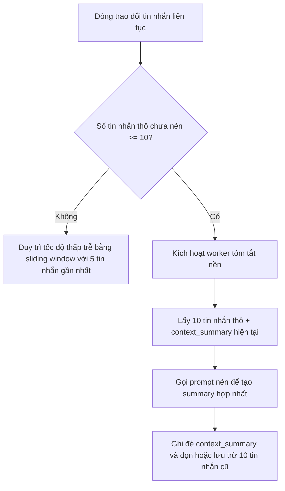

# Đặc tả các quy tắc bất đồng bộ, ngưỡng và tương quan theo thời gian

## I. Pipeline bộ nhớ hội thoại theo ngưỡng bất đồng bộ

Để tránh phình to context window và tối ưu chi phí token, hệ thống không nên xử lý lại toàn bộ lịch sử hội thoại theo thời gian thực. Thay vào đó, nó phối hợp cơ chế tóm tắt bất đồng bộ theo ngưỡng cùng với sliding window.

### 1. Cơ chế vận hành mục tiêu

- **Đánh giá luồng đang hoạt động:** khi người dùng đang chat, hệ thống chỉ lấy một cửa sổ nhỏ các tin nhắn gần nhất để giữ độ trễ thấp.
- **Ngưỡng kích hoạt bất đồng bộ:** khi số tin nhắn thô chạm ngưỡng, một tiến trình nền được kích hoạt.
- **Hợp nhất tiến dần:** worker nén phần hội thoại thô với summary hiện có.
- **Ghi nhận trạng thái:** summary mới thay thế summary cũ và dữ liệu thô cũ được dọn bớt.

### 2. Phiên bản hiện tại

Phiên bản hiện tại của backend đã có:

- phiên chat AI
- danh sách phiên
- lịch sử tin nhắn
- xử lý phản hồi theo stream

Tuy nhiên, pipeline summary nền theo ngưỡng như mô tả trên vẫn nên được xem là **thiết kế mục tiêu hoặc hướng mở rộng kiến trúc**, không mặc định hiểu là toàn bộ cơ chế này đã chạy đầy đủ nếu code chưa thể hiện trọn vẹn.

### 3. Ma trận đánh đổi kiến trúc

Tư duy chọn cơ chế ngưỡng tin nhắn thay vì phụ thuộc vào việc người dùng rời phiên vẫn còn giá trị ở mức thiết kế:

| Thuộc tính kiến trúc      | Lợi ích vận hành                                                                                                                                                                                                 | Đánh đổi hệ thống                                                                                                                                                                                                 |
| ------------------------- | ----------------------------------------------------------------------------------------------------------------------------------------------------------------------------------------------------------------- | ----------------------------------------------------------------------------------------------------------------------------------------------------------------------------------------------------------------- |
| **Giữ context gọn**       | Việc nén định kỳ giúp prompt chính duy trì kích thước token ổn định, giảm trượt ngữ cảnh và giảm chi phí.                                                                                                      | Phát sinh thêm chi phí nền cho việc tóm tắt nếu người dùng chat rất dài.                                                                                                                                        |
| **Tính xác định ở server** | Logic kích hoạt nằm hoàn toàn ở phía server, ít phụ thuộc vào hành vi phía client.                                                                                                                               | Nếu prompt tóm tắt không tốt, thông tin cũ có thể bị mờ dần sau nhiều vòng nén.                                                                                                                                |

---

## II. Thành phần xu hướng toàn cục của hệ thống cộng đồng

Feed cộng đồng dùng tư duy gravity và time-decay thay vì chỉ xếp theo thời gian tạo.

### 1. Tầng ghi nhận tương tác thời gian thực

Khi người dùng like hoặc comment:

- bộ đếm `like_count` và `comment_count` được cập nhật ngay
- bước này được tối giản để tránh làm chậm tương tác

### 2. Tầng phân tích theo lịch

Thiết kế cũ mô tả một job chạy định kỳ để tính lại `global_hotness_score` theo công thức time-decay.

$$\text{global\_hotness\_score} = \frac{(\text{Like\_Count} \times 1) + (\text{Comment\_Count} \times 2) - 1}{(\text{Age\_In\_Hours} + 2)^{G}}$$

### 3. Phiên bản hiện tại

Phiên bản hiện tại đã có:

- post score snapshot
- feed hot
- personalized hot feed
- logic mark dirty và các lớp repository phục vụ cập nhật score

Điều này cho thấy ý tưởng global hotness vẫn đang tồn tại ở sản phẩm, dù chu kỳ job hoặc chi tiết công thức cụ thể có thể khác implementation lý tưởng trong docs cũ.

### 4. Ý nghĩa của các tham số

- **Like count** và **comment count** vẫn là hai tín hiệu tương tác quan trọng.
- **Age in hours** vẫn là cơ sở hợp lý để giảm dần lợi thế của bài cũ.
- **Gravity coefficient** vẫn là biến điều tiết mức suy giảm theo thời gian.

### Thiết kế mục tiêu và phiên bản hiện tại

Tài liệu này giữ nguyên công thức cũ như đặc tả mục tiêu để tránh mất ý tưởng thuật toán, đồng thời khi đọc cần hiểu rằng code hiện tại đang hiện thực hóa cùng tinh thần business nhưng có thể không dùng đúng nguyên văn toàn bộ chi tiết này.

---

## III. Các cơ chế bất đồng bộ đã có thật trong phiên bản hiện tại

Phần dưới đây được bổ sung để phản ánh chính xác hơn trạng thái backend hiện tại mà không xóa đi phần thiết kế cũ.

### 1. Worker gia hạn hội viên tự động

Phiên bản hiện tại đã có worker gia hạn hội viên:

- chạy một lần khi ứng dụng khởi động
- sau đó chạy theo lịch hằng ngày
- gọi usecase `ProcessScheduledRenewals`

Đây là cơ chế bất đồng bộ thật đang tồn tại trong hệ thống.

### 2. Worker batch upload wardrobe

Phiên bản hiện tại đã có worker tiêu thụ job batch upload:

- nhận job từ hệ thống phát sự kiện
- xử lý từng item ở nền
- gọi AI để phân tích ảnh
- cập nhật metadata và embedding

Điều này là hiện thực trực tiếp của tư duy “digitization bất đồng bộ” đã được mô tả ở các tài liệu trước.

### 3. Worker dọn item lỗi

Phiên bản hiện tại đã có worker dọn item thất bại:

- chạy lúc khởi động
- chạy theo lịch định kỳ
- gọi `CleanupFailedItems`

Vai trò của worker này là giữ cho dữ liệu tủ đồ không bị tích tụ item lỗi lâu ngày.

### 4. Retry và backoff cho job xử lý nền

Phiên bản hiện tại đã có các hành vi thực tế sau:

- phân biệt lỗi tạm thời và lỗi nghiêm trọng
- retry job với số lần giới hạn
- tăng dần thời gian chờ giữa các lần retry
- đánh dấu item thất bại nếu vượt ngưỡng

Đây là phần triển khai thực tế rất quan trọng cần được ghi nhận như hiện trạng của hệ thống.

### 5. Dữ liệu `last_used_at` và suy giảm vòng đời item

Tài liệu cũ nói nhiều về decay theo thời gian.

Phiên bản hiện tại đã có nền dữ liệu để phục vụ hướng này:

- khi người dùng lưu outfit hoặc cập nhật outfit, hệ thống chạm `last_used_at` cho các item liên quan

Điều đó có nghĩa là:

- phần suy giảm vòng đời item chưa nên coi là hoàn tất toàn bộ
- nhưng nền dữ liệu cho decay logic đã thực sự có trong code

---

## IV. Cách đọc tài liệu này trong bối cảnh hiện tại

Khi đọc tài liệu này, cần phân biệt hai lớp:

- **Thiết kế mục tiêu:** summary theo ngưỡng cho chat, công thức hotness hoàn chỉnh, các engine giảm tải token hoặc correlation sâu hơn
- **Phiên bản hiện tại:** renewal worker, batch upload worker, cleanup worker, retry và dữ liệu `last_used_at`

Nhờ vậy, tài liệu vẫn giữ nguyên toàn bộ mô tả cũ, nhưng không còn làm người đọc hiểu nhầm rằng mọi phần đều đã được implement giống hệt đặc tả ban đầu.
