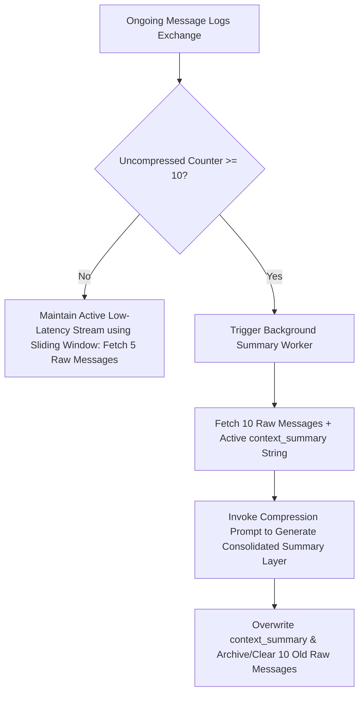

# ASYNCHRONOUS THRESHOLD & GRAPH CORRELATION RULES SPECIFICATION

## I. ASYNCHRONOUS THRESHOLD-BASED CONVERSATIONAL MEMORY PIPELINE

To prevent Context Window inflation and optimize token consumption costs, the system rejects real-time full-history reprocessing. It coordinates an asynchronous, threshold-driven summarization mechanism combined with a sliding window architecture.

### 1. Operational Workflow Mechanics

- **Active Stream Evaluation (Sliding Window):** During active user interactions, the server interface bypasses historical parsing. It fetches exclusively the $5$ closest raw dialogue entries from the operational log pool to feed directly into the processing context. This logic maintains chatbot interface metrics at a low-latency performance tier.

- **Asynchronous Consolidation Trigger:** The coordination service tracks uncompressed dialogue thresholds. The exact moment the local uncompressed conversation counter reaches a limit of **10 raw uncompressed messages**, an isolated background processing task automatically fires.

- **Progressive Context Fusion:** The background processing worker isolates the $10$ target uncompressed raw messages and aggregates them alongside the existing string located in the `context_summary` field. This bundle passes to a compression prompt utility to build a consolidated summary layer.

- **State Committal:** The resulting data object completely overwrites the existing string inside the `context_summary` destination field. The system immediately clears or archives the $10$ processed raw dialogue lines to reclaim database operations bandwidth.

### 2. Architectural Trade-offs Matrix

The engineering choice to build an **Explicit Message Count Counter Limit Trigger (Option 1)** instead of a **Session Inactivity / Client Disconnect Event Trigger (Option 2)** reflects a deliberate technical decision:

| Architectural Attribute      | The Pros (Operational Advantages)                                                                                                                                                                                                                                                     | The Cons (System Trade-offs)                                                                                                                                                                                                                                                |
| ---------------------------- | ------------------------------------------------------------------------------------------------------------------------------------------------------------------------------------------------------------------------------------------------------------------------------------- | --------------------------------------------------------------------------------------------------------------------------------------------------------------------------------------------------------------------------------------------------------------------------- |
| **Context Window Isolation** | Enforcing rolling compression cycles every 10 messages anchors main chatbot prompts to minimal, predictable token dimensions. This bounds conversational API fees and eliminates historical attention degradation during long interactions.                                           | **Elevated Background Token Traffic:** Sustained continuous user messaging profiles generate recurring background summarization invocations. For example, a 100-message chat session triggers exactly 10 sequential compression worker executions.                          |
| **State Determinism**        | Processing logic stays entirely enclosed on the server tier via an internal calculation check ($\text{if } \text{counter} \ge 10 \rightarrow \text{invoke worker}$). This drops edge-case vulnerabilities tied to unreliable client frontends, such as network drops or tab closures. | **Summary Attrition Risk:** Rolling summarization depends heavily on prompt engineering precision. Suboptimal phrasing can cause a gradual loss of historical data facts (e.g., specific style properties mentioned early in the session) over multiple compression cycles. |

---

## II. SYSTEM GLOBAL TRENDING COMPONENT (GLOBAL HOTNESS ALGORITHM)

The community feed leverages a gravity-driven algorithm based on interaction velocity and time decay, moving away from purely static or simple chronological presentation orders.

### 1. Ingestion Tier: Real-time Interaction Tracking

When an active client fires an explicit social interaction (Like or Comment action), the platform executes an atomic increment/decrement operation ($+1$ / $-1$) on the cached counters `like_count` and `comment_count` within the core post state. This execution bypasses complex scoring pathways to keep transaction times minimal.

### 2. Analytical Tier: Scheduled Scoring Loop

An isolated background execution cron task runs on a periodic cycle (configured to execute exactly **once every 10 minutes**). It sweeps all articles possessing fresh interaction metrics to compute their popularity rank using a gravity time-decay formula:

$$\text{global\_hotness\_score} = \frac{(\text{Like\_Count} \times 1) + (\text{Comment\_Count} \times 2) - 1}{(\text{Age\_In\_Hours} + 2)^{G}}$$

### 3. Parameter Boundary Explanations

- **Interaction Counter Weights:** `Like_Count` and `Comment_Count` represent the real-time social engagement counters extracted from the data layer. Comments receive double the score weight ($\times 2$) of likes ($\times 1$) because written interaction indicates a higher tier of user retention.

- **Temporal Age Variable ($\text{Age\_In\_Hours}$):** Represents the precise decimal duration in hours since the creation timestamp (`created_at`) relative to the active processing execution timestamp.

- **Gravity Coefficient ($G$):** An explicitly assigned gravity time-decay parameter (configured to a default value of $1.5$ or $1.8$). This denominator forces a monotonic decay curve on historical items. It guarantees that older posts automatically lose ranking gravity over time, freeing prime discovery slots for newly published items regardless of the historical engagement volume.
