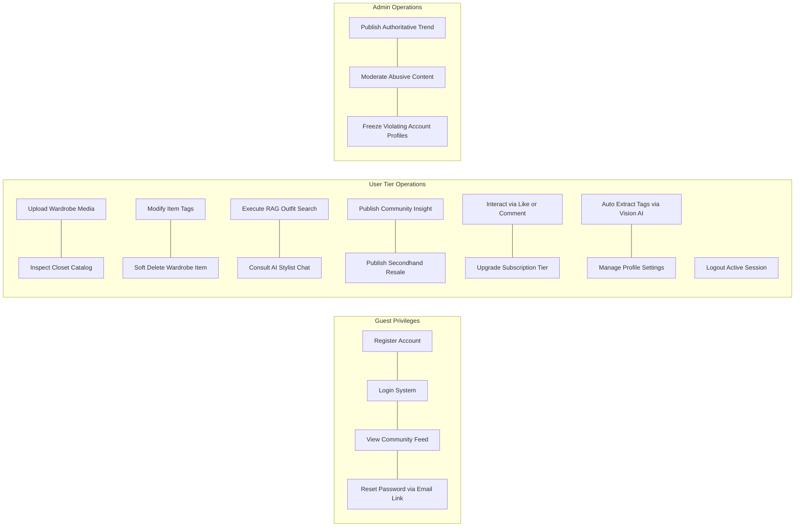

# BUSINESS ENGINE & LOGIC SPECIFICATION

## I. SYSTEM ROLES & PERMISSIONS (ACTORS)

The system categorizes operational permissions into three primary human roles and two account tiers:

- **Guest:** Unregistered visitor. Restricted to read-only views of fashion updates, styling inspirations, and community marketplace entries.

- **Free User:** Standard registered user bound by system resource constraints and lower daily action limits.

- **Premium User:** Paid subscriber with elevated system resource limits and expanded daily action counters.

- **Admin:** System moderator responsible for authoritative trend publishing, platform enforcement, and user isolation.

---

## II. ACCOUNT TIERS & RESOURCE QUOTAS

System enforcement services must dynamically validate action allocations based on the active account subscription tier:

| Business Constraint Metric                 | Free User Tier   | Premium User Tier |
| ------------------------------------------ | ---------------- | ----------------- |
| **Max Wardrobe Capacity** (Physical Items) | Max 50 Items     | Max 150 Items     |
| **Max Saved Outfits Storage** (Lookbook)   | Max 50 Outfits   | Max 150 Outfits   |
| **AI Outfit Generation Daily Limit**       | 3 Requests / Day | 28 Requests / Day |
| **AI Chatbot Consultations Daily Limit**   | 3 Queries / Day  | 30 Queries / Day  |

---

## III. CORE BUSINESS RULES & ENGINES

### 1. Lazy Reset Quota Engine

To guarantee continuous system availability and bypass compute-heavy midnight cron loops, user quota limits must follow a lazy-evaluation lifecycle:

- **Trigger:** Initiated exclusively when a user fires their first AI-related operational request (AI Outfit or AI Chatbot).

- **Evaluation Steps:**

1. Fetch the user's `last_reset_date` from the profile.
2. Compare `last_reset_date` with the current transaction `system_date`.
3. If `system_date` > `last_reset_date`, execute an atomic update:

- Reset both `outfit_recommend_count` and `ai_usage_count` back to `0`.
- Update `last_reset_date` to equal the current `system_date`.

4. If the check passes (or after a reset occurs), verify that the current count is strictly less than the allowed subscription tier limit.

### 2. Chatbot Outfit Request Redirect Engine

Prevents users from bypassing the separate "AI Outfit" counter by attempting to request outfit combinations inside the conversational AI Chatbot:

- **Rule Criteria:** When a user initiates a conversation query inside the AI Chatbot expressing an intent to generate, assemble, or recommend a new outfit combination (e.g., asking to match clothing items or create style sets for occasions), the Chatbot's System Prompt / Guardrail intercepts the request.

- **Deduction Rule:** Deduct exactly **0 units** from the AI Outfit recommendation quota and **0 units** from the AI Chatbot quota for outfit generation. The chatbot blocks the generation and returns a standardized, friendly guidance message directing the user to the dedicated **Outfit Generator (Phối đồ)** feature on the home dashboard.

### 3. Automated Wardrobe Digitization Engine

Processes unstructured visual assets to catalog apparel with zero user manual input:

- **Input Stage:** User uploads a singular, flat, clear image of an individual piece of clothing.

- **AI Analysis Pipeline:** The system passes the image asset to the vision parsing service to execute:

- Classification mapping (e.g., Categorizing into T-shirt, jeans, jacket, skirt).

- Primary color extraction (Isolating predominant visual hex/color profiles).

- Material/Fabric detection (e.g., Denim, Cotton, Wool, Leather).

- Style classification (Tagging items as Casual, Formal, Sporty, Vintage).

- **Persistence Condition:** Catalog the finalized item attributes automatically into the user's active digital wardrobe inventory.

### 4. Interactive Fashion Stylist Engine (AI Chatbot)

Maintains grounded context during continuous, free-form natural language interactions:

- **Constraint Boundaries:** The assistant must strictly ground its styling suggestions using only the items verified as active within the user's digitized closet inventory.

- **Hallucination Guardrails:** The context prompt explicitly bans the recommendation of external fashion products, unowned clothing pieces, or fabrications that do not exist within the user's specific closet data.

- **Context Maintenance:** The service summarizes long conversational interactions dynamically into contextual summaries to preserve long-term dialogue awareness across subsequent conversation updates.

### 5. Peer-to-Peer Marketplace Consignment Logic (C2C)

Provides a bridge enabling items to move smoothly from a user's closet to the community feed space:

- **Trigger Action:** A user toggles an active item inside their digital closet and assigns its status to "Selling".

- **Listing Generation:** The platform automatically constructs a structured public marketplace listing using the item's existing cataloged properties (color, style, category), requiring the user to supply only two mandatory inputs:

1. Target transaction price (`total_price` or item price).

2. Direct user contact coordinates (e.g., Phone number or social link).

- **Transaction Decoupling:** The platform strictly treats the listing as an informational matchmaker. Financial clearing, payment escrows, item tracking, and physical shipping distributions remain fully decoupled off-platform and occur entirely peer-to-peer.

### 6. Platform Content Moderation & Account Isolation Rules

Enforces compliance standards to keep the platform community safe and clear of violations:

- **Content Purging:** Administrators have structural authority to inspect open platform activities, flag anomalies, and execute instant moderation commands to hide or completely delete fraudulent resale listings or abusive commentary.

- **Malicious Profile Ban:** When an administrator flags a profile and applies a "Banned" status trigger, the system must forcefully terminate all active authorization tokens linked to that identity across every connected device, blocking any further backend API interactions immediately.

---

## IV. ALGORITHMIC GRAPH & USERFLOW REFERENCE

### 1. Unified Functional Use Case Mapping

For reference, below is the logic hierarchy mapped to target actors:

