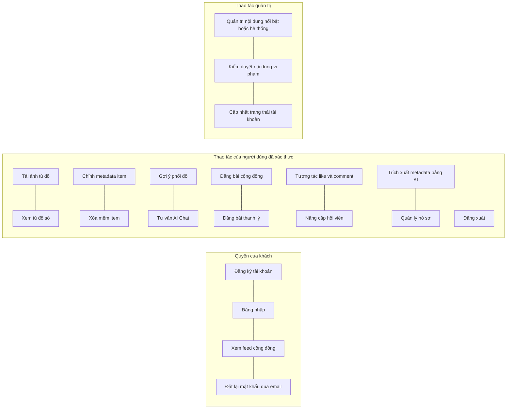

# Đặc tả động cơ nghiệp vụ và logic hệ thống

## I. Vai trò và quyền trong hệ thống

Hệ thống phân loại quyền vận hành theo ba nhóm vai trò chính và hai tầng hội viên.

### Khách

Khách là người chưa đăng nhập.

Khách chỉ được xem ở mức đọc các nội dung công khai như:

- feed cộng đồng
- chi tiết bài đăng
- bình luận và lượt thích của bài đăng
- danh sách gói hội viên

### Người dùng thường

Người dùng thường là người đã đăng ký và sử dụng gói mặc định hoặc gói không trả phí.

Họ chịu ràng buộc bởi:

- giới hạn số lượng item trong tủ đồ
- giới hạn số lượng outfit lưu
- quota ngày cho các chức năng AI

### Người dùng premium

Người dùng premium là người có gói trả phí đang hoạt động.

Họ được mở rộng:

- hạn mức tủ đồ
- hạn mức outfit
- quota AI
- khả năng sử dụng sâu hơn các chức năng cá nhân hóa

### Quản trị viên

Admin là tác nhân điều phối và kiểm soát hệ thống.

Phiên bản hiện tại của backend cho phép admin:

- xem danh sách người dùng
- cập nhật trạng thái người dùng
- quản trị bài đăng cộng đồng
- quản trị bình luận
- quản trị post item
- quản trị danh mục hệ thống của wardrobe

### Phiên bản hiện tại

So với mô tả ban đầu, phạm vi quản trị hiện đã rõ ràng hơn và đã được hiện thực qua các route admin riêng.

---

## II. Các tầng hội viên và hạn mức tài nguyên

Hệ thống kiểm soát phân bổ tài nguyên theo gói hội viên đang hoạt động của người dùng.

| Chỉ số ràng buộc nghiệp vụ              | Gói thường      | Gói premium      |
| --------------------------------------- | --------------- | ---------------- |
| **Sức chứa tối đa của tủ đồ**           | 50 item         | 150 item         |
| **Số outfit lưu tối đa**                | 50 outfit       | 150 outfit       |
| **Giới hạn gợi ý phối đồ AI mỗi ngày**  | 3 lượt mỗi ngày | 15 lượt mỗi ngày |
| **Giới hạn tư vấn chatbot AI mỗi ngày** | 3 lượt mỗi ngày | 20 lượt mỗi ngày |

### Phiên bản hiện tại

Các hạn mức này không còn chỉ là quy ước trong tài liệu. Backend hiện đã có:

- API lấy quota ngày
- API lấy gói hiện tại
- logic hội viên dùng để kiểm tra giới hạn tủ đồ và outfit
- auto-renew
- mua gói bằng thanh toán trực tiếp hoặc bằng ví

### Thiết kế mục tiêu

Các thay đổi sâu hơn về kinh tế học sản phẩm như quota mới, OOTD hằng ngày hay nhiều tầng gói hơn vẫn có thể mở rộng tiếp mà không làm mất đi bảng hạn mức hiện tại.

---

## III. Các quy tắc nghiệp vụ và engine cốt lõi

### 1. Lazy Reset Quota Engine

Để bảo đảm hệ thống hoạt động liên tục và tránh phụ thuộc hoàn toàn vào cron nửa đêm cho mọi thao tác AI, giới hạn quota ngày được thiết kế theo kiểu lazy evaluation.

#### Quy tắc nghiệp vụ

- Trigger xảy ra khi người dùng gọi các chức năng AI.
- Hệ thống kiểm tra `last_reset_date`.
- Nếu đã sang ngày mới, hệ thống reset các bộ đếm AI về `0`.
- Sau đó hệ thống mới xác nhận người dùng còn quota hay không.

#### Phiên bản hiện tại

Phiên bản hiện tại đã có API quota ngày và contract quota thực thi ở module subscription.

Mô tả cũ về lazy reset vẫn được giữ vì đây vẫn là định hướng logic phù hợp với domain. Tuy nhiên, khi đọc tài liệu cần hiểu rằng chi tiết triển khai thực tế nằm ở contract và usecase của subscription hiện tại.

### 2. Chatbot Outfit Request Redirect Engine

Mục tiêu của rule này là ngăn người dùng lách quota gợi ý phối đồ bằng cách yêu cầu tạo outfit ngay trong AI Fashion Chatbot.

#### Quy tắc nghiệp vụ mục tiêu

- Khi chatbot phát hiện ý định tạo outfit hoàn chỉnh, hệ thống không trừ quota outfit và cũng không trừ quota chat cho phần tạo outfit đó.
- Chatbot chuyển hướng người dùng sang tính năng gợi ý phối đồ chuyên dụng.

#### Phiên bản hiện tại

Backend hiện đã có AI chat theo phiên và AI outfit recommendation tách riêng.

Đối với AI outfit recommendation, kỳ vọng output hiện tại cũng đã chuyển sang dạng có cấu trúc hơn:

- có tiêu đề outfit
- có phần giải thích
- có các nhóm item theo vai trò
- mỗi vai trò có item chính và các item thay thế

Đây là nền phù hợp để các rule nghiệp vụ như local swap, partial re-roll hoặc chọn item thay thế theo từng vai trò phát triển tiếp mà không cần đổi hoàn toàn contract đầu ra.

Tuy nhiên, rule redirect ở mức system prompt hoặc orchestration nâng cao vẫn nên được xem là phần thiết kế mục tiêu hoặc guardrail nghiệp vụ cần duy trì, chứ không nên hiểu là toàn bộ logic đó đã được đóng gói trọn vẹn như mô tả cũ.

### 3. Automated Wardrobe Digitization Engine

Engine này xử lý ảnh quần áo để số hóa tủ đồ với ít thao tác tay nhất có thể.

#### Luồng mục tiêu

- Người dùng tải lên ảnh item.
- AI phân tích để nhận diện:
    - loại trang phục
    - màu sắc chủ đạo
    - chất liệu
    - phong cách
- Sau đó hệ thống lưu item vào tủ đồ số.

#### Phiên bản hiện tại

Hiện backend đã có:

- batch upload item
- xử lý nền qua worker
- AI phân tích ảnh và sinh metadata
- sinh embedding cho item
- cập nhật item sau khi xử lý thành công

Điều đó có nghĩa là mô tả này đã được triển khai một phần rõ ràng trong code, nhưng hình thức hiện tại là pipeline bất đồng bộ nhiều bước thay vì chỉ là một lời mô tả khái quát.

Dữ liệu từ wardrobe hiện cũng là nền đầu vào cho recommendation output theo cấu trúc nhóm vai trò:

- outfit có tiêu đề và phần giải thích
- từng nhóm item gắn với vai trò cụ thể
- mỗi vai trò có item ưu tiên và phương án thay thế

### 4. Interactive Fashion Stylist Engine

Chatbot thời trang tương tác có mục tiêu giữ ngữ cảnh và bám sát dữ liệu tủ đồ thật.

#### Quy tắc mục tiêu

- Chỉ dựa trên các item có thật trong tủ đồ đã số hóa của người dùng.
- Hạn chế hallucination về sản phẩm ngoài hệ thống.
- Có cơ chế duy trì ngữ cảnh hội thoại qua thời gian.

#### Phiên bản hiện tại

Phiên bản hiện tại đã có:

- tạo phiên chat
- lấy lịch sử chat
- lưu trữ phiên
- gửi tin nhắn theo stream

Các mô tả cũ như ReAct agent loop, summary dài hạn hoặc orchestration theo ngưỡng vẫn được giữ như thiết kế mục tiêu của engine này.

### 5. Peer-to-Peer Marketplace Consignment Logic

Đây là logic cầu nối giúp một item trong tủ đồ đi vào không gian cộng đồng theo mô hình C2C.

#### Quy tắc mục tiêu

- Người dùng đánh dấu item để bán.
- Hệ thống dựng bài đăng công khai dựa trên dữ liệu đã có của item.
- Người dùng chỉ cần cung cấp thêm giá và thông tin liên hệ.
- Giao dịch tài chính, vận chuyển và hậu kiểm vẫn nằm ngoài nền tảng.

#### Phiên bản hiện tại

Phiên bản hiện tại đã có thêm:

- bài đăng bán item
- tạo yêu cầu mua
- người bán xem các luồng chuyển nhượng
- đánh dấu đã bán
- người mua chấp nhận hoặc từ chối

Tức là logic marketplace hiện không còn chỉ ở mức mô tả listing, mà đã có vòng đời chuyển nhượng item rõ hơn.

### 6. Platform Content Moderation và Account Isolation Rules

Hệ thống cần giữ cộng đồng an toàn và giảm nội dung vi phạm.

#### Quy tắc mục tiêu

- Admin có quyền kiểm duyệt hoặc gỡ nội dung vi phạm.
- Khi khóa tài khoản độc hại, hệ thống có thể cắt quyền truy cập của người dùng đó.

#### Phiên bản hiện tại

Hiện backend đã có:

- cập nhật trạng thái user
- xóa và khôi phục bài đăng
- xóa và khôi phục bình luận
- ẩn hoặc xóa post item

Rule “ban tài khoản và vô hiệu hóa toàn bộ phiên” vẫn là một nguyên tắc nghiệp vụ cần được giữ lại trong docs, dù chi tiết enforcement có thể thay đổi theo implementation.

---

## IV. Bản đồ use case và luồng người dùng

### 1. Bản đồ use case hợp nhất

Sơ đồ dưới đây vẫn có giá trị như một khung nhìn business-level về các năng lực của hệ thống:

### Phiên bản hiện tại

So với sơ đồ cũ, khi đọc trong bối cảnh hiện tại cần hiểu rằng:

- `UC08` hiện đã có API recommendation thật
- `UC09` hiện đã có chat theo phiên và stream
- `UC11` hiện đã có thêm seller hoặc buyer transfer flow
- `UC13` hiện đã có cả ví, nạp tiền và mua gói

Tài liệu giữ nguyên tinh thần use case cũ, nhưng cần được đọc cùng với thực trạng backend đã mở rộng đáng kể.
