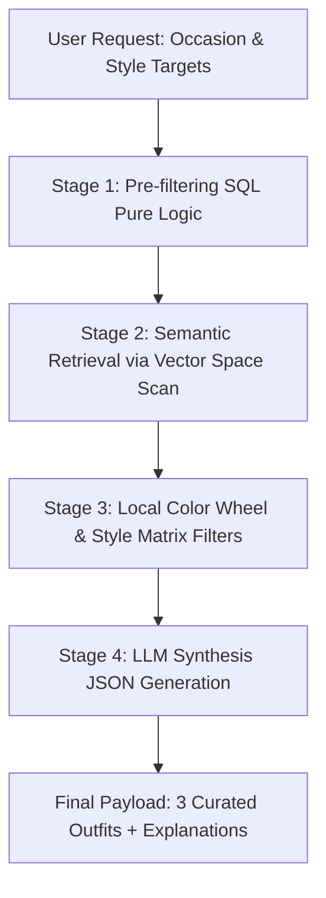
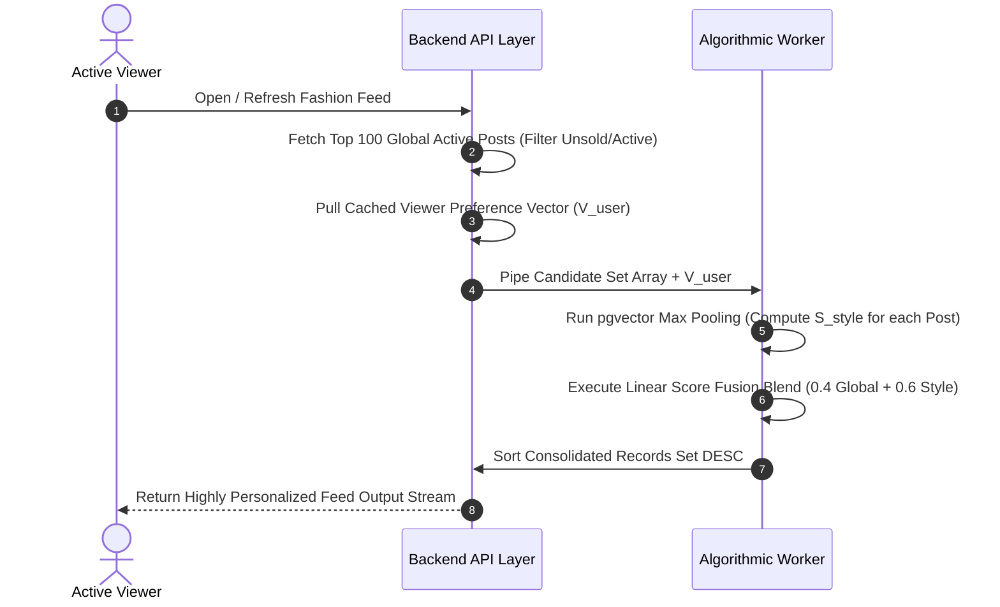

# CORE ENGINE & ALGORITHMIC PIPELINE SPECIFICATION

## I. ADVANCED AI WARDROBE PIPELINES (MODULE 3)

### 1. Asynchronous Wardrobe Digitization Flow

To preserve system responsiveness during heavy compute phases, the digitization pipeline decouples user requests from the analytical worker execution via an event mechanism:

- **Ingestion Phase:** The client asset handling layer processes and pushes media components to storage.

- **Task Acceptance Event:** The ingestion API returns an immediate payload acknowledgment to the caller without holding the request stream open.

- **Data Mapping Rules:** Raw unstructured classifications received from vision utilities cannot be mapped directly into the persistent layer. The processing engine performs standard dictionary token normalization:

- Maps natural language tokens to normalized taxonomy definitions.

- Clusters erratic visual hexadecimal notations into clean, bounded palette groupings.

### 2. Multi-Stage RAG Outfit Recommendation Pipeline

Instead of introducing excessive token overhead by flooding prompt scopes with unvetted closet inventories, outfit generation follows a sequential data refinement architecture:

- **Stage 1: Structural Operational Pre-filtering** Excludes unavailable garments or assets matching conflicting seasonal target bounds from the processing array.

- **Stage 2: Vector Space Semantic Retrieval** Executes mathematical similarity sweeps across vector structures to extract the top 20 most styling-compatible item candidates.

- **Stage 3: Geometric Rule & Cohesion Verification**

- **Design Language Matrix Filter:** Applies explicit cross-category rules to drop invalid design pairings.

- **Geometric Complementary Check:** Catches high-contrast radial variations bounded inside a $15^\circ$ calculation window:

$$165^\circ \le \Delta H_{\text{final}} \le 195^\circ$$

- **Geometric Analogous Check:** Catches close, smooth color sequences:

$$\Delta H_{\text{final}} < 30^\circ$$

- **Stage 4: LLM Synthesis & Stylistic Reason Generation** Packages the pre-validated structural pairs alongside individual body metric files into a rigid content object. The prompt architecture enforces strict schema execution constraints to output exactly 3 complete optimal clothing combinations alongside stylized rationales.

### 3. Conversational ReAct Autonomous Agent Loop

The interaction chatbot interface abandons typical linear text reply behaviors, running as an autonomous agent that handles local tool execution workflows:

- **Step 1: Sliding Window Memory Management** To mitigate context window inflation, the state runtime strictly fetches only the 5 closest conversational message logs, merging them with historical summary payloads.

- **Step 2: ReAct Cycle (Thought $\rightarrow$ Action)** The assistant receives input and computes an analytical thought path. Detecting a lack of information regarding the user's closet state, it suspends text production and surfaces a structured function call execution request:

$$\text{execute\_tool}(name=\text{"search\_wardrobe"}, args=\{\dots\})$$

- **Step 3: Tool Execution & System Observation** The server system intercepts the function invocation call, translates the parameters into concrete querying commands to compile real-world proof metrics, and pipe-lines the response stream back into the model profile.

- **Step 4: Grounded Text Synthesis** The model consumes verified data facts to generate an advisory response, effectively eliminating logical hallucination anomalies.

---

## II. TWO-STAGE HYBRID FEED RANKING ALGORITHM (MODULE 4)

The discovery engine divides global background calculation tasks from light personal ranking cycles, allowing low-latency operations under heavily constrained target hardware profiles.

### 1. Stage 1: Global Gravity Time-Decay Computation

A detached background cron loop executes constant batch evaluations over community interactions to update global popularity indices. This routine processes engagement velocity, dousing historical entries monotonically via a strict mathematical time-decay factor:

$$\text{Global\_Score} = \text{Time-Decay}(\text{like\_count}, \text{comment\_count}, \text{item\_age})$$

### 2. Stage 2: Personalization & Real-time Score Fusion

When an active client initiates a feed ingestion request, the backend coordinates a multi-tier calculations matrix:

#### Step A: User Vector Compilation

The backend reads the viewer's distinct style identity vector ($V_{\text{user}}$). This matrix is computed asynchronously through rolling geometric averages reflecting closet updates to remove real-time run calculation overhead:

$$V_{\text{user}} = \frac{1}{N} \sum_{i=1}^{N} V_{i}$$

#### Step B: Style Proximity Scoring ($S_{\text{style}}$) via Max Pooling

For each article component within the top 100 global set, the proximity engine computes similarity values across item variations, applying a Max Pooling strategy to anchor relevance to the most compatible piece:

$$S_{\text{style}} = \max_{i \in \text{Post}} \left( 1 - \frac{\text{Distance}_{\text{pgvector}}(V_{\text{user}}, V_{\text{item}\_i})}{2} \right)$$

- $\text{Distance}_{\text{pgvector}}(V_{\text{user}}, V_{\text{item}\_i})$ represent raw spatial distance measures bounding intervals between $0.0$ and $2.0$.

- The mathematical expression $1 - \frac{\text{Distance}}{2}$ recalibrates distance values into a clean similarity spectrum bounded within $[0.0, 1.0]$.

#### Step C: Linear Score Fusion

The sorting system runs a single-pass combination function to resolve the final presentation rank:

$$\text{Final\_Feed\_Score} = (\text{Global\_Score} \times 0.4) + (S_{\text{style}} \times 0.6)$$

- **Weights Allocation Intent:** The model distributes scaling fractions ($0.4$ vs $0.6$) to emphasize explicit personal styling relevance over collective platform trending metrics, guaranteeing that the feed discovery stream is custom-tailored to individual tastes.

- The resulting array is sorted in descending order before presentation pipelines return the payload asset stream.
