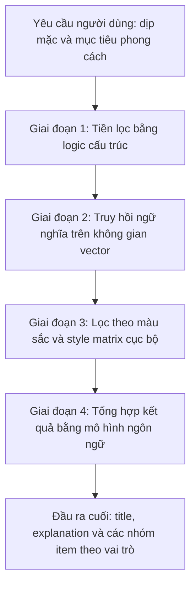
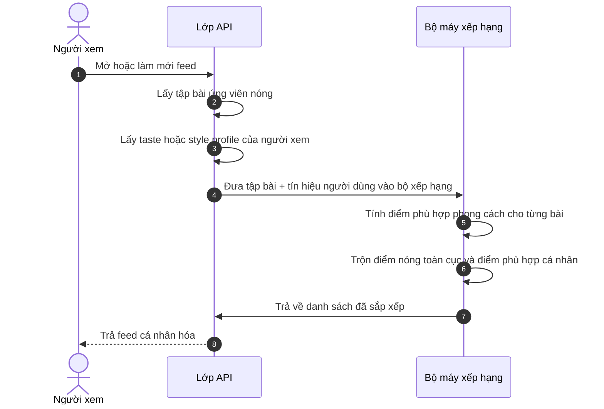

# Đặc tả pipeline lõi và luồng thuật toán của hệ thống

## I. Các pipeline AI và tủ đồ nâng cao

### 1. Luồng số hóa tủ đồ bất đồng bộ

Để giữ cho hệ thống phản hồi tốt trong các giai đoạn tính toán nặng, pipeline số hóa tủ đồ tách request của người dùng khỏi phần phân tích AI ở nền thông qua cơ chế sự kiện.

#### Thiết kế mục tiêu

- Client xử lý upload media và đưa ảnh lên hạ tầng lưu trữ.
- API tiếp nhận yêu cầu và trả kết quả chấp nhận nhanh thay vì chờ AI xử lý xong.
- Hệ thống ánh xạ kết quả AI vào dữ liệu domain trước khi lưu chính thức.

#### Phiên bản hiện tại

Phiên bản hiện tại của backend đã triển khai rõ phần này dưới dạng:

- API batch upload wardrobe items
- tạo item nhanh với trạng thái đang xử lý
- phát job nền cho từng item
- worker tiêu thụ job
- AI phân tích ảnh, sinh metadata và embedding
- cập nhật lại item sau khi hoàn tất
- có retry và backoff cho lỗi tạm thời

Nói cách khác, mô tả cũ về bất đồng bộ không bị loại bỏ, mà đã được hiện thực thành một pipeline nền cụ thể hơn.

#### Quy tắc ánh xạ dữ liệu

Các mô tả cũ về chuẩn hóa taxonomy, gom nhóm màu hoặc ánh xạ nhãn AI sang dữ liệu domain vẫn cần được giữ như định hướng quan trọng, vì đây là lớp trung gian giúp dữ liệu AI có thể dùng được trong hệ thống thật.

### 2. Multi-Stage RAG Outfit Recommendation Pipeline

Để tránh bơm toàn bộ tủ đồ vào prompt và làm chi phí token tăng quá mạnh, hệ thống dùng tư duy pipeline nhiều bước để tinh lọc dữ liệu trước khi tổng hợp outfit.

#### Thiết kế mục tiêu

- **Giai đoạn 1:** loại bỏ các item không khả dụng hoặc không phù hợp ngữ cảnh.
- **Giai đoạn 2:** lấy nhóm item có độ liên quan ngữ nghĩa cao.
- **Giai đoạn 3:** chạy các luật cục bộ về màu sắc và độ hòa hợp.
- **Giai đoạn 4:** dùng mô hình ngôn ngữ để tạo ra outfit hoàn chỉnh, phần diễn giải và cấu trúc nhóm item.

#### Phiên bản hiện tại

Phiên bản hiện tại đã có API `RecommendOutfit`, đã có quota AI, dữ liệu tủ đồ, metadata item và dữ liệu `last_used_at`.

Kỳ vọng đầu ra hiện tại của `RecommendOutfit` cũng đã rõ hơn ở lớp DTO:

- trả về `title`
- trả về `explanation`
- trả về `items` theo từng `role`
- mỗi `role` có một `primary` và nhiều `alternatives`

Tuy nhiên, toàn bộ pipeline 4 giai đoạn theo đúng mô tả cũ không nên được hiểu là đã bộc lộ đầy đủ ở tầng code hiện tại. Tài liệu này giữ lại kiến trúc mục tiêu, đồng thời ghi nhận rằng backend hiện đã có ít nhất các phần sau:

- dữ liệu tủ đồ thật
- metadata và embedding của item
- quota hội viên
- logic lưu outfit và cập nhật `last_used_at`

Các lớp RAG sâu hơn vẫn là định hướng thuật toán quan trọng của sản phẩm.

#### Hình dạng đầu ra nghiệp vụ của recommendation

Theo kỳ vọng hiện tại, recommendation không chỉ là một “bộ đồ hoàn chỉnh” duy nhất, mà là một gói kết quả có thể hỗ trợ quyết định:

- `title`: tên hoặc nhãn của outfit được đề xuất
- `explanation`: lý do bộ gợi ý phù hợp với dịp mặc, phong cách hoặc bối cảnh
- `items`: tập các nhóm item theo vai trò

Mỗi nhóm item theo vai trò gồm:

- `role`: vai trò của item trong outfit
- `primary`: item được ưu tiên chọn
- `alternatives`: các item thay thế cùng vai trò

Ý nghĩa business của dạng output này là:

- frontend có thể hiển thị outfit linh hoạt hơn
- người dùng dễ hiểu vì sao outfit được chọn
- hệ thống có nền sẵn cho local swap hoặc re-roll theo từng vai trò
- recommendation không còn bị khóa chặt vào một phương án duy nhất

### Phiên bản hiện tại của local swap

Trong phiên bản hiện tại, local swap được hỗ trợ theo hướng frontend sử dụng trực tiếp mảng `alternatives` của từng vai trò.

Điều này có nghĩa là:

- backend không cần mở thêm một flow swap riêng cho mỗi lần đổi món
- local swap không tiêu tốn thêm quota outfit mới
- số lần local swap không bị backend giới hạn theo lượt đổi
- giới hạn thực tế chỉ nằm ở số phương án thay thế đang có trong payload recommendation

#### Giai đoạn 3: kiểm tra màu và độ hòa hợp

Các quy tắc như:

- complementary check
- analogous check
- style matrix filter

vẫn được giữ nguyên trong tài liệu như thiết kế mục tiêu của engine phối đồ, ngay cả khi implementation hiện tại có thể dùng chúng ở mức độ khác hoặc chưa thể hiện hết.

### 3. Conversational ReAct Autonomous Agent Loop

Tương tác chatbot trong hệ thống được mô tả như một agent có khả năng suy nghĩ, gọi công cụ và tổng hợp câu trả lời có căn cứ.

#### Thiết kế mục tiêu

- **Bước 1:** quản lý ký ức hội thoại bằng sliding window.
- **Bước 2:** model nhận đầu vào và quyết định có cần gọi tool hay không.
- **Bước 3:** hệ thống backend thực thi tool để truy hồi dữ liệu thật.
- **Bước 4:** model tạo câu trả lời dựa trên dữ liệu đã xác minh.

#### Phiên bản hiện tại

Phiên bản hiện tại của backend đã có:

- tạo phiên chat
- lấy danh sách phiên
- lấy tin nhắn
- lưu trữ phiên
- gửi tin nhắn và stream phản hồi

Vì vậy, engine chat không còn chỉ là ý tưởng. Tuy nhiên, phần ReAct loop hoàn chỉnh, summary nền và orchestration tool-call vẫn nên được đọc như thiết kế mục tiêu hoặc lớp mở rộng kiến trúc cần giữ trong tài liệu.

---

## II. Thuật toán feed lai hai giai đoạn

Hệ thống discovery chia nhỏ phần tính toán nền toàn cục và phần xếp hạng cá nhân hóa theo thời gian thực, giúp đạt độ trễ thấp hơn.

### 1. Giai đoạn 1: Tính điểm nóng toàn cục theo time-decay

Một tiến trình nền tách biệt đánh giá tương tác cộng đồng để cập nhật chỉ số nóng toàn cục của bài đăng.

#### Thiết kế mục tiêu

$$\text{Global\_Score} = \text{Time-Decay}(\text{like\_count}, \text{comment\_count}, \text{item\_age})$$

Mô hình này nhấn mạnh rằng điểm nóng không nên chỉ dựa trên số tương tác thô, mà cần giảm dần theo thời gian.

#### Phiên bản hiện tại

Backend hiện tại đã có:

- feed nóng
- tập bài ứng viên cho personalized hot feed
- điểm nóng toàn cục ở snapshot
- logic sắp xếp kết hợp điểm nóng và điểm phù hợp cá nhân

Điều đó có nghĩa là mô tả cũ về global hotness vẫn còn đúng ở mức business concept, dù công thức và cách cron chạy thực tế có thể khác chi tiết theo implementation.

### 2. Giai đoạn 2: Cá nhân hóa và trộn điểm theo thời gian thực

Khi người dùng mở feed, hệ thống kết hợp dữ liệu toàn cục và tín hiệu cá nhân hóa.

#### Bước A: tổng hợp vector hoặc profile người dùng

Thiết kế cũ giả định hệ thống có một vector gu thời trang riêng của người xem.

#### Phiên bản hiện tại

Code hiện tại đã có `StyleProfile` hoặc `TasteEmbedding` ở user và dùng nó để tính style score cho personalized hot feed. Vì vậy, phần này không còn là giả định hoàn toàn mà đã có hiện thực ban đầu.

#### Bước B: tính điểm phù hợp phong cách

Thiết kế cũ dùng tư duy max pooling trên các item trong bài đăng.

#### Phiên bản hiện tại

Backend hiện tại thực sự đã có bước tính style score dựa trên item trong post và embedding của người dùng, sau đó trộn điểm với global hotness score.

#### Bước C: trộn tuyến tính điểm

Thiết kế cũ mô tả công thức:

$$\text{Final\_Feed\_Score} = (\text{Global\_Score} \times 0.4) + (S_{\text{style}} \times 0.6)$$

#### Phiên bản hiện tại

Phiên bản hiện tại cũng đang đi đúng tinh thần này: trộn điểm nóng toàn cục với điểm phù hợp cá nhân để tạo feed hot mang tính cá nhân hóa.

### Kết luận cho phần feed

Phần feed trong docs cũ không nên bị bỏ vì nó vẫn phản ánh đúng ý đồ sản phẩm. Điều cần làm là đọc nó như:

- **thiết kế mục tiêu** ở mức lý tưởng đầy đủ
- **phiên bản hiện tại** đã có một phần hiện thực hóa khá rõ ở backend
