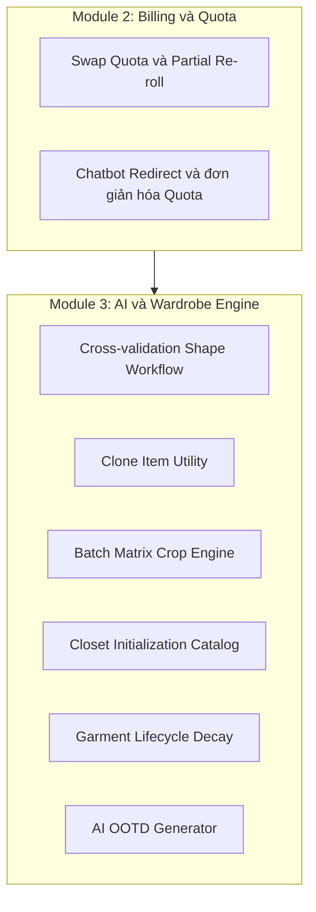

# Đặc tả các yêu cầu nghiệp vụ sắp tới và kế hoạch mở rộng tính năng

Tài liệu này mô tả các yêu cầu nghiệp vụ sắp tới, các tính năng chiến lược và các cập nhật thuật toán cốt lõi nhằm tối ưu trải nghiệm người dùng, loại bỏ các lỗ hổng gây hao tài nguyên, giảm chi phí AI và tăng mức độ giữ chân người dùng.

---

## I. Tổng quan mở rộng kiến trúc nghiệp vụ

Để giải quyết các friction point đã nhận diện trong quá trình kiểm thử người dùng, nhiều capability mở rộng được đề xuất trên các module Billing, Quota, AI và Wardrobe.



### Phiên bản hiện tại

Một số capability trong tài liệu này hiện đã được triển khai một phần hoặc triển khai theo hình thức khác trong code hiện tại, ví dụ:

- `Clone Item Utility`
- `Closet Initialization Catalog`
- nền dữ liệu cho `Garment Lifecycle Decay`
- `AI Fashion Chatbot` theo phiên

Tuy nhiên, tài liệu này vẫn giữ nguyên toàn bộ các mô tả roadmap vì chúng còn bao hàm thiết kế mục tiêu hoàn chỉnh, không chỉ là trạng thái implementation hiện tại.

---

## II. Chi tiết các tính năng mở rộng và workflow thuật toán

### 1. Swap Quota và Partial Re-roll Pipeline

#### A. Bài toán nghiệp vụ

Người dùng có thể quên cập nhật trạng thái vật lý của item, ví dụ item đang bẩn hoặc cần sửa. Khi AI gợi ý một outfit có chứa item không còn sẵn sàng sử dụng, người dùng dễ bị buộc phải tốn thêm quota chỉ để đổi một phần nhỏ của outfit.

#### B. Đặc tả chức năng mục tiêu

- Người dùng có thể bấm **“Đổi món này”** trên một item cụ thể trong outfit đã được tạo.
- Hành động đổi cục bộ không tiêu tốn thêm một lượt quota outfit mới.
- Mỗi outfit được tạo từ một lượt quota không giới hạn số lần local swap.

#### C. Luồng xử lý mục tiêu ban đầu

Để tránh tăng token và tăng độ trễ, local swap theo thiết kế mục tiêu sẽ không gọi lại toàn bộ LLM pipeline:

1. Cập nhật trạng thái item được thay.
2. Lấy lại tập ứng viên item đã lưu của phiên recommendation.
3. Chạy bộ lọc cục bộ theo màu sắc và style matrix.
4. Chọn item thay thế và cập nhật outfit.

#### D. Phiên bản hiện tại

Phiên bản hiện tại của backend đã có:

- recommendation API
- quota AI
- dữ liệu item, metadata và trạng thái
- output theo nhóm vai trò với `primary` và `alternatives`

Trong phiên bản hiện tại, local swap không còn nên được hiểu là một flow backend riêng bị giới hạn số lần đổi. Thay vào đó:

- backend trả sẵn các phương án thay thế trong `alternatives`
- frontend chủ động xử lý trải nghiệm đổi món theo từng vai trò
- việc local swap không tiêu tốn thêm quota outfit mới
- số lần local swap không bị giới hạn bởi backend, miễn là còn phương án thay thế phù hợp trong dữ liệu đã trả về

Vì vậy, phần mô tả backend flow ở trên nên được đọc là **thiết kế mục tiêu ban đầu** hoặc hướng mở rộng về sau, không phải ràng buộc của phiên bản hiện tại.

---

### 2. Cross-validation Shape Workflow

#### A. Bài toán nghiệp vụ

Ảnh người dùng mặc đồ rộng có thể làm sai lệch suy luận body shape, kéo theo recommendation thiếu chính xác.

#### B. Đặc tả mục tiêu

- AI suy luận body shape ban đầu.
- Hệ thống lưu dữ liệu gợi ý với trạng thái chưa được người dùng xác minh.
- Người dùng có thể ghi đè lại thông tin shape hoặc số đo.
- Recommendation engine ưu tiên dữ liệu đã được xác minh.

#### C. Cấu trúc dữ liệu mục tiêu

```json
{
    "height_cm": 178.0,
    "weight_kg": 72.5,
    "body_shape": "hourglass",
    "measurements": {
        "chest_cm": 95.0,
        "waist_cm": 78.0,
        "hip_cm": 96.0
    },
    "inferred_by_ai": {
        "body_shape": "rectangle",
        "confidence_score": 0.68
    },
    "verified_by_user": true,
    "last_updated_at": "2026-05-30T14:30:00Z"
}
```

#### D. Phiên bản hiện tại

Phiên bản hiện tại đã có:

- `body_profile`
- cờ `verified_by_user`
- khả năng cập nhật body profile

Điều đó có nghĩa là workflow này không còn hoàn toàn ở mức ý tưởng. Tuy nhiên, trải nghiệm xác minh nhiều bước bằng UI giàu ngữ cảnh và tích hợp sâu vào recommendation vẫn là mục tiêu mở rộng.

---

### 3. Clone Item Utility

#### A. Bài toán nghiệp vụ

Người dùng thường sở hữu nhiều item giống nhau. Việc bắt chụp và phân tích AI lặp lại cho từng item gây friction lớn.

#### B. Đặc tả mục tiêu

- Có nút clone trên item đã xác minh.
- Người dùng nhập số lượng cần nhân bản.
- Hệ thống tạo nhiều bản ghi mới bằng bulk insert.
- Ảnh, metadata và embedding được tái sử dụng từ item gốc.

#### C. Giá trị nghiệp vụ

- Giảm thao tác lặp.
- Giảm chi phí AI.
- Giữ mỗi bản sao là một item độc lập để quản lý trạng thái riêng.

#### D. Phiên bản hiện tại

Phiên bản hiện tại đã có route và usecase clone item thật.

Vì vậy, section này hiện nên được hiểu theo hai lớp:

- **Phiên bản hiện tại:** clone item đã tồn tại như capability thực thi.
- **Thiết kế mục tiêu:** tiếp tục duy trì đầy đủ mục tiêu về tối ưu chi phí, UX và chia sẻ metadata.

---

### 4. Batch Matrix Crop Engine

#### A. Bài toán nghiệp vụ

Việc số hóa từng phụ kiện nhỏ một rất mất thời gian. Người dùng muốn có cách nhập nhiều phụ kiện từ một ảnh tổng.

#### B. Đặc tả mục tiêu

- Người dùng chụp một ảnh flatlay dạng lưới.
- Frontend crop ảnh tổng thành nhiều blob ảnh nhỏ.
- Các ảnh nhỏ được upload song song.
- Backend xử lý chúng như các job nền.

#### C. Yêu cầu kỹ thuật kèm theo

- giới hạn đồng thời khi gọi AI
- rate limiter
- retry với exponential backoff cho lỗi 429

#### D. Phiên bản hiện tại

Phiên bản hiện tại đã có batch upload và xử lý nền từng item, đồng thời đã có retry hoặc backoff ở luồng batch upload.

Nhưng phần `matrix crop` từ ảnh lưới lớn vẫn nên được xem là thiết kế mục tiêu hoặc mở rộng sản phẩm chưa hoàn chỉnh.

---

### 5. Closet Initialization via Global Fashion Catalog

#### A. Bài toán nghiệp vụ

Người dùng mới dễ rời bỏ nếu tủ đồ số ban đầu hoàn toàn trống.

#### B. Đặc tả mục tiêu

- Hệ thống có một danh mục item mẫu đã được chuẩn hóa.
- Người dùng chọn nhanh các item mình đang sở hữu.
- Backend sao chép dữ liệu mẫu sang tủ đồ người dùng bằng thao tác bulk.

#### C. Giá trị nghiệp vụ

- giảm friction khi onboarding
- giúp người dùng có dữ liệu để recommendation hoạt động sớm

#### D. Phiên bản hiện tại

Phiên bản hiện tại đã có:

- route `catalog-init`
- usecase khởi tạo tủ đồ từ catalog hệ thống
- admin quản trị catalog hệ thống

Do đó, tính năng này hiện đã có thực thi thật trong hệ thống. Tài liệu roadmap vẫn giữ nguyên để bảo toàn mô tả mục tiêu ban đầu và ý nghĩa kinh doanh của nó.

---

### 6. Garment Lifecycle Decay Algorithm

#### A. Bài toán nghiệp vụ

Các item cũ, lâu không dùng có thể làm recommendation trở nên stale nếu luôn được đối xử như item mới.

#### B. Đặc tả thuật toán mục tiêu

Thiết kế cũ mô tả việc nhân điểm cosine với hệ số suy giảm theo thời gian:

$$S_{\text{adjusted}} = S_{\text{cosine}} \times \text{Decay\_Factor}(t)$$

với:

$$\text{Decay\_Factor}(t) = \begin{cases} 1.0 & \text{if } t \le 180 \text{ days} \\ e^{-\lambda (t - 180)} & \text{if } t > 180 \text{ days} \end{cases}$$

#### C. Quy tắc tối ưu dữ liệu mục tiêu

Không nên join thời gian thực giữa item và outfit history trong mọi request recommendation. Thay vào đó nên có `last_used_at` trực tiếp trên item.

#### D. Phiên bản hiện tại

Phiên bản hiện tại đã có:

- trường `last_used_at`
- logic chạm `last_used_at` khi lưu hoặc cập nhật outfit

Điều đó nghĩa là phần nền dữ liệu của lifecycle decay đã có thật. Tuy nhiên, công thức decay đầy đủ như mô tả cũ vẫn là thiết kế mục tiêu cần được giữ trong docs.

---

### 7. Chatbot Outfit Request Redirect và đơn giản hóa Quota

#### A. Bài toán nghiệp vụ

Việc vừa trừ quota chat vừa trừ quota outfit khi người dùng xin phối đồ trong chatbot là logic gây khó hiểu và dễ tạo cảm giác bị trừ phí không minh bạch.

#### B. Đặc tả mục tiêu

- bỏ logic double quota
- chatbot phát hiện ý định xin outfit
- chatbot chuyển hướng người dùng sang tính năng gợi ý phối đồ chuyên dụng

#### C. Thông điệp điều hướng mục tiêu

Chatbot có thể trả lời theo hướng:

> “Để nhận được gợi ý phối đồ chính xác hơn từ công cụ phối đồ chuyên dụng, bạn vui lòng sử dụng tính năng Phối đồ trên màn hình chính.”

#### D. Phiên bản hiện tại

Phiên bản hiện tại đã có tách biệt hai năng lực:

- AI chat theo phiên
- AI outfit recommendation

Rule redirect cụ thể ở mức intent classification hoặc system prompt vẫn là phần thiết kế mục tiêu nên được giữ lại.

---

### 8. Future Expansion Plan: AI OOTD Generator

#### A. Bài toán nghiệp vụ và kinh tế

Gợi ý outfit hằng ngày cho số lượng lớn người dùng có thể tạo áp lực chi phí rất lớn nếu phụ thuộc hoàn toàn vào LLM.

#### B. Đặc tả mục tiêu

- hệ thống gợi ý outfit mỗi ngày dựa trên thời tiết hoặc lịch
- gói thường có thể dùng logic cục bộ chi phí thấp
- gói premium có thể dùng AI nâng cao kèm giải thích

#### C. Phiên bản hiện tại

Phiên bản hiện tại chưa nên được mô tả là đã có AI OOTD hoàn chỉnh. Section này vẫn là định hướng sản phẩm dài hạn và cần được giữ nguyên trong docs.

---

## III. Đánh giá tính khả thi và rủi ro triển khai

Dựa trên việc đối chiếu với code hiện tại, có thể đọc bảng này theo hướng:

- một số tính năng đã triển khai một phần hoặc triển khai bản đầu tiên
- phần còn lại vẫn là mục tiêu mở rộng

```
+------------------------------------+------------------+---------------------------------------------------------+
| Nhóm tính năng                     | Mức khả thi      | Gợi ý triển khai chính                                  |
+------------------------------------+------------------+---------------------------------------------------------+
| Swap Quota và Partial Re-roll      | Rất cao          | Lưu candidate IDs, lọc cục bộ theo stage 3              |
| Cross-validation Shape Workflow    | Rất cao          | Tận dụng JSONB và body profile đã có                    |
| Clone Item Utility                 | Rất cao          | Dùng bulk insert, tái sử dụng metadata và embedding     |
| Batch Matrix Crop Engine           | Cao              | Dùng job nền, semaphore và retry                        |
| Closet Initialization Catalog      | Rất cao          | Tận dụng danh mục hệ thống hiện có                      |
| Garment Lifecycle Decay            | Cao              | Dựa trên `last_used_at` đã có trong hệ thống            |
| Chatbot Outfit Redirect            | Rất cao          | Tách điều hướng ở lớp prompt hoặc orchestration         |
+------------------------------------+------------------+---------------------------------------------------------+
```

### Kết luận

Roadmap này vẫn còn giá trị vì nó không chỉ mô tả “có hay chưa có”, mà còn mô tả:

- phiên bản mục tiêu của từng capability
- mức trưởng thành hiện tại của sản phẩm
- hướng mở rộng tiếp theo mà backend hiện nay đã có nền tảng để tiến tới
