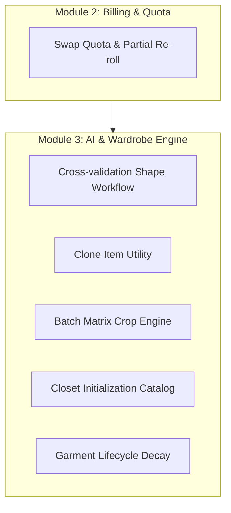
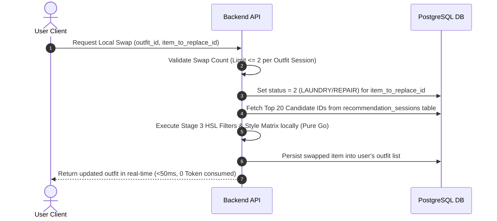
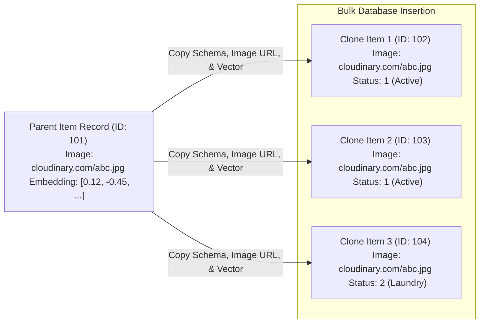

# UPCOMING BUSINESS REQUIREMENTS & FEATURE EXPANSION SPECIFICATION

This document details the upcoming business requirements, strategic features, and core algorithmic updates designed to optimize user experience, eliminate resource-draining loopholes, minimize cloud computing costs (AI API overhead), and enhance user activation and retention.

---

## I. SYSTEM ARCHITECTURE EXPANSION OVERVIEW

To resolve critical real-world friction points identified during user testing, six core capability expansions are proposed across Module 2 (Billing & Quota Management) and Module 3 (AI & Wardrobe Engine). These updates ensure high-fidelity styling recommendations while preserving platform cost-efficiency.



---

## II. DETAILED FEATURE SPECIFICATIONS & ALGORITHMIC WORKFLOWS

### 1. Swap Quota & Partial Re-roll Pipeline (Module 2)

#### A. Business Problem Statement
Users frequently forget to update their wardrobe items' physical status (e.g., an item is currently dirty or torn). When the AI Outfit Recommendation Engine (Stage 4) suggests an outfit incorporating this unavailable item, the user is forced to consume another unit of their strictly limited **Daily Outfit Quota** to re-roll the entire outfit. Furthermore, a simple "Undo" action creates a screenshot loophole where users "cheat" by capturing recommendations and undoing the action to reclaim their quota.

#### B. Functional Specification
- **Local Swap UI:** Users can trigger a **"Đổi món này" (Local Swap)** action specifically on a single item within a generated outfit combination.
- **Quota Protection:** A local swap action **does not consume** an additional daily outfit quota unit.
- **Quota Guardrail:** Each unique outfit recommendation event (costing 1 Quota) includes a maximum allowance of **two (2) local swaps**. Initiating a 3rd swap requires consuming 1 new Daily Outfit Quota unit.

#### C. Backend Algorithmic Flow & Zero-LLM Local Swap Optimization
To prevent extreme token accumulation and reduce latency to milliseconds, the partial re-roll feature **completely bypasses LLM invocations**.
1. **State Update:** Immediately update the target item's `status` to `2 (LAUNDRY/REPAIR)` in the `wardrobe_items` table.
2. **Persistent Session Retrieval:** When an outfit recommendation session is first generated, the system stores the **IDs of the Top 20 Item Candidates** (Stage 2) in a lightweight relational table `recommendation_sessions` (under `candidate_item_ids` as a compact INT/UUID array). This removes memory constraints and the 15-minute time limit.
3. **Local HSL & Style Matrix Evaluation:** The backend loads the metadata of these 20 candidates and filters them locally using the Stage 3 Color Complementary/Analogous algorithms and Style Matrix (pure Go calculations).
4. **Immediate Replacement:** The backend automatically selects the highest-scoring candidate, integrates it into the outfit structure, and updates the DB.



#### D. Architectural Trade-offs Matrix

| Architectural Choice | Pros (System Benefits) | Cons (Technical Costs) |
| :--- | :--- | :--- |
| **Zero-LLM Local Swap (Bypass LLM)** | **0 additional tokens consumed** and **0 extra LLM requests** (guaranteeing 1 outfit generation = exactly 1 Gemini request). Latency is cut down from ~2.5 seconds to < 50 milliseconds. | The stylistic rationale text written by the LLM in the initial generation remains unchanged (though minor template-based text tweaks can be applied locally). |
| **Persistent Session IDs (PostgreSQL Array)** | Removes memory footprint in Redis, completely bypassing the 15-minute timeout. Users can swap items hours or days after recommendation. | Requires a minor DB schema addition (`recommendation_sessions` table or similar relational mapping) to hold the candidate arrays. |

---

### 2. Cross-Validation Shape Workflow (Module 3)

#### A. Business Problem Statement
Users often upload photos of themselves wearing loose, oversized clothing. This severely impacts the accuracy of the Vision AI Body Estimation engine, leading to faulty body shape classification in their user profile and resulting in awkward, ill-fitting outfit recommendations from the Stage 4 LLM.

#### B. Functional Specification
- **Vision AI Dry-run:** When a user uploads a personal photo, the Vision AI estimates the body shape parameters and populates the `body_profile` JSONB structure, but sets a status attribute `verified_by_user = false`.
- **Interactive Form Validator (User Override UX):** The frontend displays the AI-estimated body shape using visually rich cards (e.g., Hourglass, Pear, Rectangle, Inverted Triangle) alongside manual input fields for Key Physical Metrics (Height, Weight, and optional chest/waist/hip measurements).
- **User Override:** The user has full authority to override the AI's estimation by clicking a card or correcting the numerical indices. Once submitted, the system commits the data with `verified_by_user = true`.
- **Precedence Rule:** The Stage 4 Outfit Generator must *strictly* prioritize data marked as `verified_by_user = true` when synthesizing style logic.

#### C. Database Schema Design (JSONB Structure in `users.body_profile`)

```json
{
  "height_cm": 178.0,
  "weight_kg": 72.5,
  "body_shape": "hourglass",
  "measurements": {
    "chest_cm": 95.0,
    "waist_cm": 78.0,
    "hip_cm": 96.0
  },
  "inferred_by_ai": {
    "body_shape": "rectangle",
    "confidence_score": 0.68
  },
  "verified_by_user": true,
  "last_updated_at": "2026-05-30T14:30:00Z"
}
```

---

### 3. Clone Item Utility (Module 3)

#### A. Business Problem Statement
Male users in particular typically own multiple identical or highly similar wardrobe items (e.g., five identical black crewneck t-shirts, ten identical white sports socks). Forcing users to photograph, upload, and wait for Vision AI processing on each identical item introduces severe friction during onboarding.

#### B. Functional Specification
- **Quick Clone Action:** The digital closet interface displays a **"Clone"** button next to any existing verified item.
- **Bulk Clones Creation:** The user inputs the desired quantity ($N$) of duplicates.
- **Bulk Database Insertion:** The backend executes a Single Bulk SQL `INSERT` to generate $N$ separate records in the `wardrobe_items` table.
- **Resource & Image Sharing:** All cloned records inherit the metadata (color palette, material, style, category) and the identical `image_url` (stored on Cloudinary) from the parent item.
- **Vector Sharing:** The system copies the parent item's vector embedding directly to the clones, completely bypassing both the Vision AI extraction pipeline and Vector generation operations.



- **Business Value:**
  - Reduces Cloudinary storage consumption by avoiding redundant visual duplicate uploads.
  - Zero computational overhead (does not invoke Gemini Vision or Embedding models).
  - Enables independent item tracking (e.g., shirt 1 is "Active", shirt 2 is "Dirty/Laundry").

---

### 4. Batch Matrix Crop Engine (Module 3)

#### A. Business Problem Statement
Digitizing small accessories (necklaces, rings, watches, bracelets) one by one is incredibly tedious. Users want a quick, centralized way to ingest all their minor accessories in a single session.

#### B. Functional Specification
- **Batch Flatlay Ingestion:** Users lay out small accessories on a flat surface in a grid-like matrix (2x2 or 3x3 layout) and take a single, high-resolution master photo.
- **Frontend Interactive Cropping (Grid-Cropper UI):** Upon upload, the frontend opens an interactive grid-cropper overlay. The user can quickly resize and drag coordinate boxes over each item on the canvas.
- **Parallel Upload & Event Ingestion:** The frontend crops the master canvas into 4 or 9 individual image blobs and uploads them concurrently (Parallel Upload) to the Backend.
- **Asynchronous In-Memory Queue Ingestion:** The Backend processes these parallel uploads asynchronously using **Go Channels and an In-Memory Worker Pool (Background Workers)**. This eliminates the dependency on heavy external Message Brokers (like RabbitMQ or Kafka), making the architecture simple and highly performant on existing server configurations.

```mermaid
graph TD
    A[Master Flatlay Image Grid] --> B[Frontend Grid-Cropper UI]
    B -->|User adjusts 2x2 or 3x3 crop frames| C[Generate N cropped Image Blobs]
    C -->|Parallel API Upload Requests| D[Backend API Ingestion Layer]
    D -->|Send Tasks to Go Channel| E[Internal Go Channel / Jobs Queue]
    E -->|Worker Thread 1| F1[Process Accessory 1 via Vision AI]
    E -->|Worker Thread 2| F2[Process Accessory 2 via Vision AI]
    E -->|Worker Thread 3| F3[Process Accessory 3 via Vision AI]

> [!WARNING]
> **API Rate Limiting & Concurrency Control Requirements:**
> Under heavy ingestion loads (e.g., a 3x3 accessory grid resulting in 9 simultaneous image processing tasks), executing unthrottled concurrent API requests to external LLM providers (Google Gemini / OpenAI) will trigger a **429 Too Many Requests** error.
> 
> **Architectural Enhancements to `core_service.go`:**
> 1. **Buffered Channel Semaphore:** Implement a concurrent request limiter in the AI Service (e.g., maximum 2 simultaneous Gemini API calls) to restrict peak throughput.
> 2. **Token Bucket Rate Limiter:** Apply a local rate limiter (`golang.org/x/time/rate`) to strictly respect the RPM (Requests Per Minute) limits of free/low-tier API models.
> 3. **Exponential Backoff Retry:** Enhance the fallback/retry mechanism to sleep progressively (e.g., 1s, 2s, 4s) when HTTP 429 is encountered, before failing the task.
```

---

### 5. Closet Initialization via Global Fashion Catalog (Module 3)

#### A. Business Problem Statement
A blank slate wardrobe creates a high drop-off rate. Users who register (UC-01) want to see the recommendations engine working immediately without spending 10 minutes photographing their closet.

#### B. Functional Specification
- **Global Fashion Catalog:** The system maintains a system-owned "Admin" account populated with a curated library of standard "Essential Items" (e.g., standard black/white t-shirts, blue jeans, white sneakers, black trousers, denim jackets) containing clean color taxonomy and pre-calculated vector embeddings.
- **Onboarding Questionnaire:** During system registration (UC-01), the user is presented with a **"Khởi tạo tủ đồ nhanh" (Quick Closet Initialization)** interface showcasing visual cards of these essentials.
- **Instant Digitalization:** The user checks the boxes of standard items they own.
- **Single SQL Query Copier:** The backend duplicates these selected essential assets directly into the user's `wardrobe_items` using a bulk SQL insert query, replicating all classification tags and vector embeddings instantly.

```sql
-- Conceptual Single SQL Query execution for Instant Closet Initialization
INSERT INTO wardrobe_items (user_id, category_id, name, color, style, material, image_url, embedding, status, created_at)
SELECT 
    $target_user_id, 
    category_id, 
    name, 
    color, 
    style, 
    material, 
    image_url, 
    embedding, 
    1, -- Active status
    NOW()
FROM wardrobe_items
WHERE user_id = $system_admin_id AND id IN ($selected_catalog_ids);
```

- **Business Value:** Instant user activation. Users receive a functional, high-fidelity outfit recommendation within 60 seconds of registration with zero physical photo uploads.

---

### 6. Garment Lifecycle Decay Algorithm (Module 3)

#### A. Business Problem Statement
Users own clothes they bought years ago but haven't worn in months or years (forgotten or out-of-style garments). Traditional vector retrieval (Stage 2 Cosine Similarity) treats these old, un-interacted garments identically to newly uploaded items, resulting in stale suggestions that ignore the user's shifting fashion habits.

#### B. Algorithmic Formulation (Mathematical Decay)
To penalize obsolete items without deleting them, the **Multi-Stage RAG Outfit Engine** scales the raw Cosine similarity scores using a mathematical temporal decay factor based on interaction frequency.

Let $S_{\text{cosine}}$ be the calculated cosine similarity score between the user query vector and the garment vector. The adjusted score $S_{\text{adjusted}}$ is formulated as:

$$S_{\text{adjusted}} = S_{\text{cosine}} \times \text{Decay\_Factor}(t)$$

Where:
- $t$ is the elapsed duration in days since the garment was last recorded in an approved outfit (`last_used_at`), or since its creation date (`created_at`) if never worn.
- The **Decay Factor** $\text{Decay\_Factor}(t)$ is governed by a half-life exponential formula:

$$\text{Decay\_Factor}(t) = \begin{cases} 1.0 & \text{if } t \le 180 \text{ days} \\ e^{-\lambda (t - 180)} & \text{if } t > 180 \text{ days} \end{cases}$$

- $\lambda$ represents the decay rate coefficient. If a garment remains completely ignored for more than 180 days (6 months), the decay factor begins scaling down ($0.5$ or $0.2$) pushing the garment toward the tail-end of Stage 2 recommendations.

#### C. Database Query Optimization Rule

> [!IMPORTANT]
> **Performance Optimization Safeguard:** 
> Do **NOT** execute real-time relational table `JOIN` calculations between `wardrobe_items` and `outfit_items` during the RAG Stage 2 sweep. Doing so creates a performance bottleneck as the user's closet size scales.
>
> **Solution:** Add a direct `last_used_at` timestamp field to the `wardrobe_items` table schema. Every time a user successfully saves an outfit recommendation, execute an asynchronous atomic database write to touch the `last_used_at` field for all constituent items in that outfit. This keeps Stage 2 Cosine calculations highly efficient as a single-table fast query.

---

### 7. Chatbot Outfit Request Redirect & Quota Simplification (Module 2 & 3)

#### A. Business Problem Statement
The original specification proposed a **"Double Quota Consumption Logic"** (deducting 1 Chatbot Quota + 1 Outfit Quota) if a user requested outfit recommendations inside the conversational AI Chatbot. This logic is highly complex to enforce, ambiguous to the user, and easily leads to frustration when quotas are deducted without clear warning. Additionally, processing complex multi-stage outfit assembly logic within a chat session inflates token usage and increases hallucination risks.

#### B. Functional Specification
- **Ditch Double Quota:** Completely deprecate and remove the "Double Quota Consumption Logic" proposal.
- **Intent Classification & Redirection:** When a user initiates a prompt inside the AI Chatbot that expresses an intent to generate or assemble a new outfit (e.g., *"Phối cho tôi một bộ đi chơi tối nay"*, *"Chọn giúp tôi cái quần hợp với áo này"*), the Chatbot's System Prompt / Guardrail will intercept the request.
- **Gentle User Guidance:** Instead of attempting to recommend and persist outfit combinations in the chat window, the AI Chatbot will block the generation and return a friendly, standardized redirection guidance message:

> *"Để nhận được gợi ý phối đồ chuẩn xác nhất từ thuật toán HSL và AI chuyên dụng của Smart Wardrobe, bạn vui lòng sử dụng chức năng **'Phối đồ' (Outfit Generator)** ngay trên màn hình chính nhé! 👗✨"*

- **Business Value:**
  - **Transparency:** Promotes an honest, straightforward pricing and quota system with zero unexpected deductions.
  - **Friction Reduction:** Guides users to the dedicated outfit pipeline (RAG Stages 1-4) which yields far superior styling results compared to pure LLM chat.
  - **FinOps Optimization:** Substantially reduces input/output token consumption in chat windows (which often carry heavy historical context).

---

## III. IMPLEMENTATION FEASIBILITY & RISK ASSESSMENT

Based on the existing codebase audit, the implementation of these six features is **highly feasible** and structurally aligned with the platform's architectural design:

```
+------------------------------------+------------------+---------------------------------------------------------+
| Feature Area                       | Feasibility Tier | Primary Technical Recommendation                         |
+------------------------------------+------------------+---------------------------------------------------------+
| 1. Swap Quota & Partial Re-roll    | Very High        | Persist candidate IDs in DB, evaluate Stage 3 locally.  |
| 2. Cross-Validation Shape Workflow | Very High        | Leverage PostgreSQL JSONB operators to query values.     |
| 3. Clone Item Utility              | Very High        | Utilize batch INSERT SQL for zero embedding cost.       |
| 4. Batch Matrix Crop Engine        | High             | Use Go Channels + Rate Limiter & Concurrency Semaphore. |
| 5. Closet Initialization Catalog   | Very High        | Utilize static global catalog items linked to system ID.|
| 6. Garment Lifecycle Decay         | High             | Persist last_used_at field directly to save Join cost.  |
| 7. Chatbot Outfit Redirection      | Very High        | Implement intent matching rules in Chatbot system prompt|
+------------------------------------+------------------+---------------------------------------------------------+
```

This comprehensive, cost-conscious roadmap successfully bridges the gaps in user experience while drastically optimizing infrastructure resource consumption.
