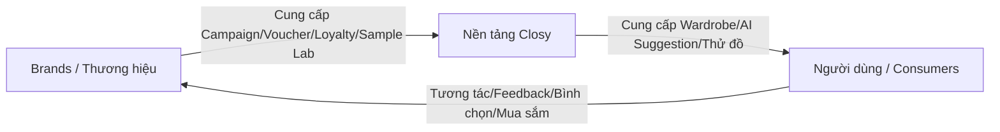

# Mô hình kinh doanh B2B2C của Closy

Dự án Closy áp dụng mô hình kinh doanh **B2B2C** (Business-to-Business-to-Consumer):

## 1. Phân khúc khách hàng doanh nghiệp (B2B)
*   Các nhãn hàng thời trang thiết kế nội địa (Local Brands).
*   Các thương hiệu bán lẻ thời trang lớn muốn tăng tỷ lệ giữ chân khách hàng (Customer Retention) và tăng lòng trung thành (Loyalty).
*   Các phòng thiết kế cần khảo nghiệm ý kiến khách hàng trước sản xuất.

## 2. Phân khúc khách hàng cá nhân (B2C)
*   Người tiêu dùng cá nhân (chủ yếu là Gen Z và Millennials) cần quản lý trang phục hiệu quả và nhận gợi ý ăn mặc hàng ngày từ trợ lý AI.
