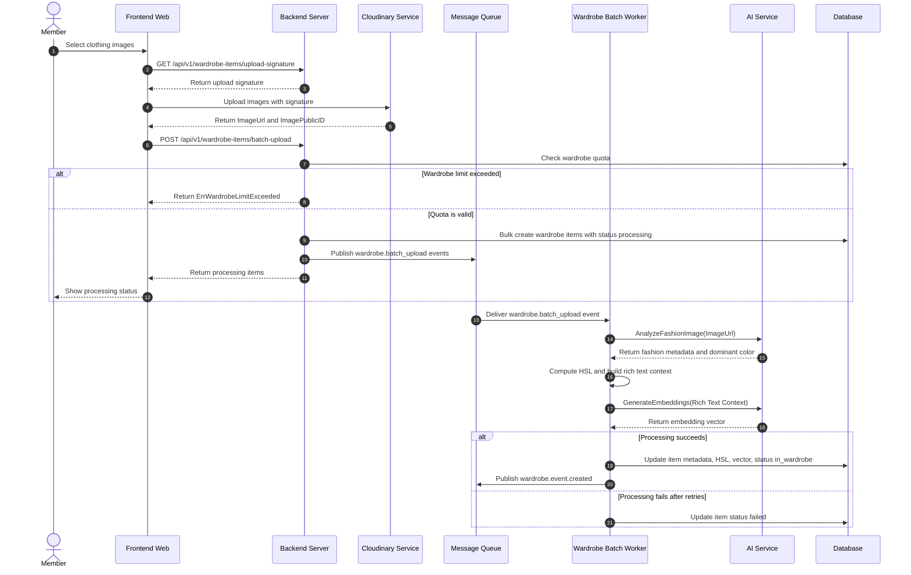
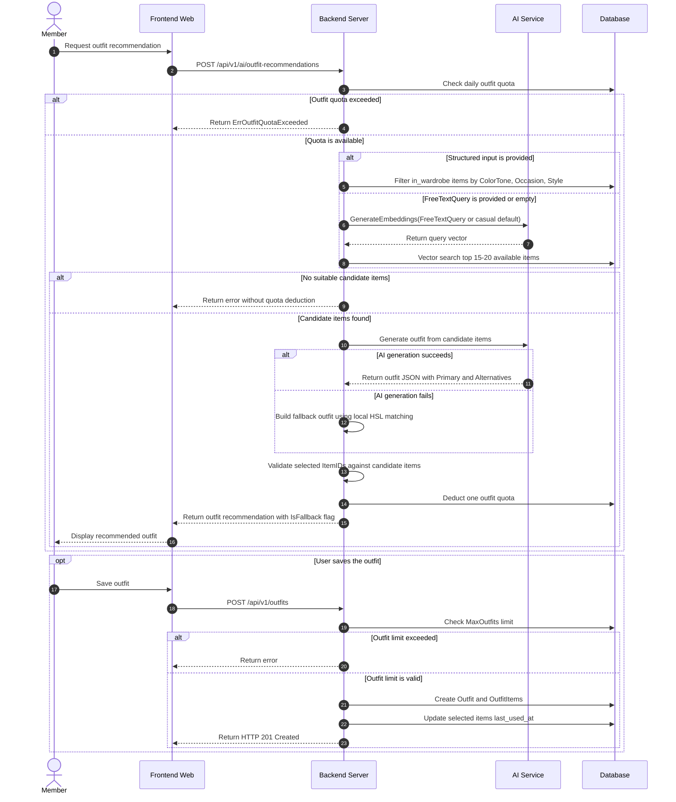
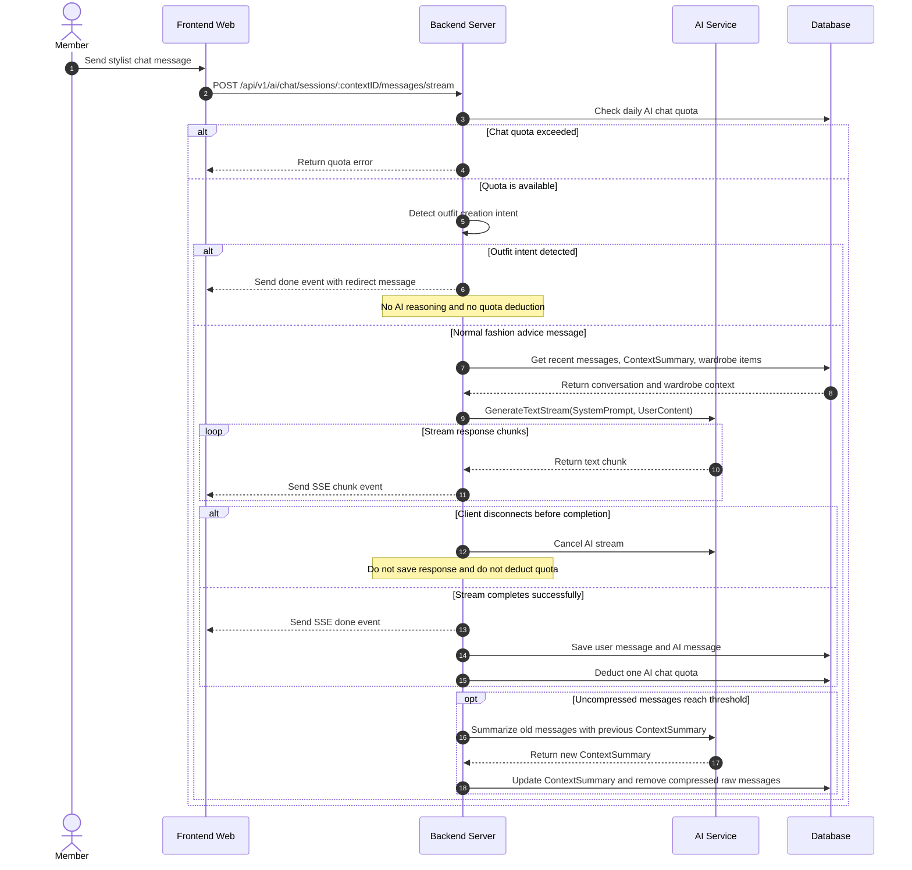
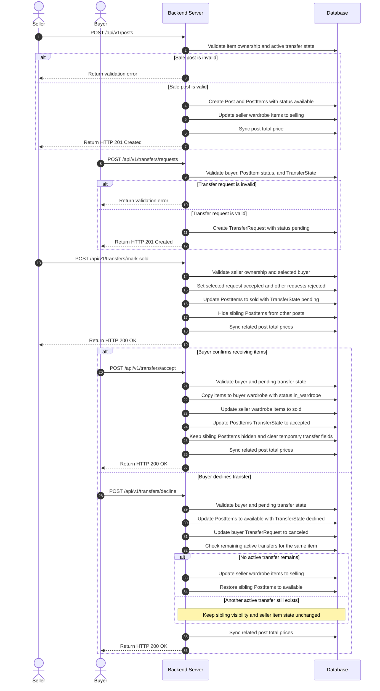
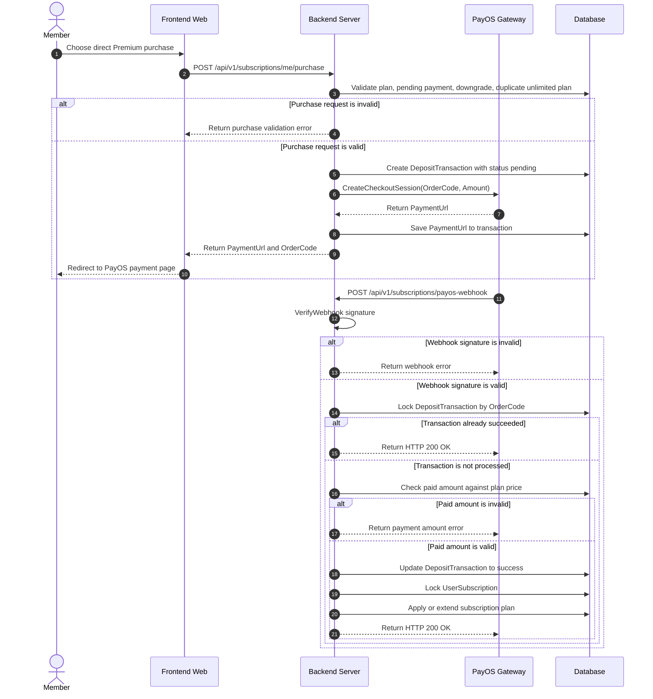
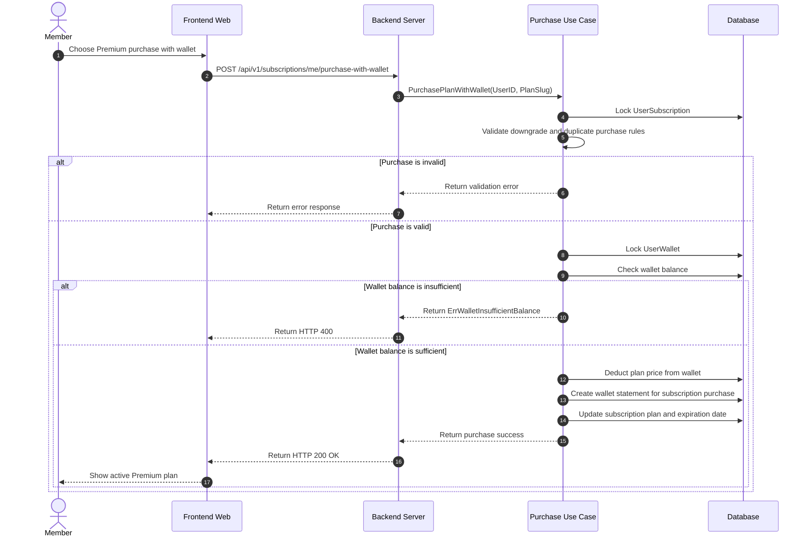
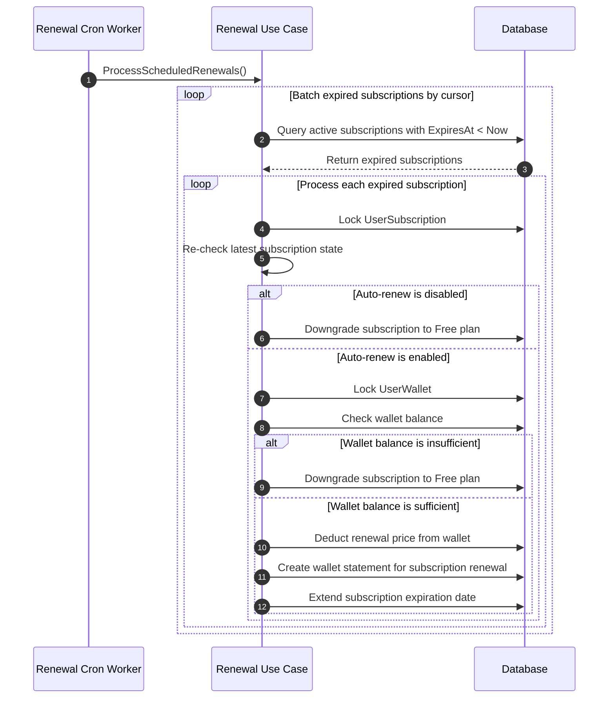
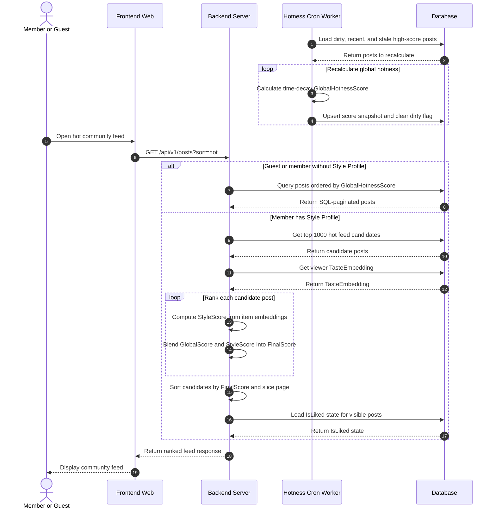

# Smart Wardrobe - Core Feature Sequence Diagrams v2.1

> Version v2.1 for UML submission.  
> Scope: simplified sequence diagrams based on the latest core feature specification.  
> Format: Mermaid sequence diagrams.

> Participant naming convention:
> - `Member`, `Seller`, `Buyer`, `Viewer`: user-facing actors.
> - `FE`: Frontend Web.
> - `BE`: Backend Server.
> - `DB`: Database.
> - External services keep their service names, such as `AI`, `PayOS`, `Cloudinary`, and `MQ`.

---

## 1. Automated Wardrobe Digitization

---

## 2. AI Outfit Recommendation and Save Outfit

---

## 3. AI Style Stylist Chatbot

---

## 4. P2P Marketplace Item Transfer

---

## 5. Direct Subscription Purchase via PayOS

---

## 6. Wallet Purchase Flow

---

## 7. Scheduled Auto-Renewal RenewalWorker

---

## 8. Community Hotness and Feed Ranking

