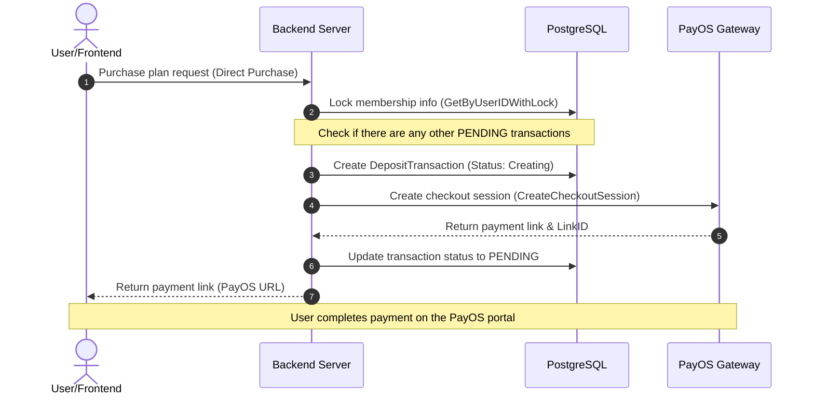

# Closy Subscription & Billing System

This document explains in detail the entire technical architecture and business flow of the Membership Subscription & Billing module (`internal/modules/subscription`) in the **Closy** project.

---

## 1. Domain Entities

The module manages the entire membership lifecycle through tightly linked entities in the database:

*   **`SubscriptionPlan`**: Defines plan information (Name, `Slug` code, `Price`, usage `DurationDays`, configuration limits such as `MaxWardrobeItems`, `MaxOutfits`, and daily AI usage limits `AiOutfitDailyQuota`, `AiChatDailyQuota`).
*   **`UserSubscription`**: Stores the user's current subscription plan status.
    *   Stores expiration info (`ExpiresAt`) and optimized version (`Version` for optimistic locking to prevent conflicts).
    *   **Fallback Fields (`FallbackPlanID`, `FallbackPlanCode`...)**: Used to remember the user's original lifetime plan when they overwrite it by subscribing to a higher-tier finite day plan. When the finite plan expires, the system automatically restores this lifetime plan.
*   **`UserWallet`**: Internal wallet storing the user's account balance. Can be topped up via a payment gateway and used for auto-renewal or active plan purchases.
*   **`DepositTransaction`**: Manages top-up transactions or direct plan purchases. Supports distributed locking via occupation time (`Lease`) to coordinate parallel reconciliation.
*   **`WalletStatement`**: Log of wallet balance fluctuations (Currency transaction history), ensuring transparency and serving financial audits.
*   **`ProviderWebhookInbox`**: Inbox for temporarily storing Webhooks received from the payment gateway (PayOS). Asynchronous processing to increase reliability and prevent blocking the payment gateway's connection.
*   **`SubscriptionRenewalAttempt`**: Tracks and controls the number of auto-renewal attempts for each user, preventing duplicate charges.

---

## 2. State Machine & Transition Rules

The core subscription plan transition logic is defined in `state_machine.go` and coordinates across 3 main plan types: `DefaultFree`, `Finite` (Fixed duration), and `Lifetime`.

```mermaid
state-chart
    [*] --> DefaultFree : Account Registration
    DefaultFree --> Finite : Buy daily plan (Activate)
    DefaultFree --> Lifetime : Buy lifetime plan (Activate)
    
    Finite --> Finite : Buy same Tier (Accumulate extension days)
    Finite --> Finite_Higher : Buy higher Tier (Upgrade immediately)
    Finite --> Lifetime : Buy lifetime plan (Upgrade)
    
    Lifetime --> Lifetime_Higher : Buy higher Tier lifetime plan (Upgrade)
    Lifetime --> Finite_Higher : Buy higher Tier daily plan (Overlay - Save lifetime plan to Fallback)
    
    Finite_Higher --> Lifetime : Daily plan expires -> Restore original lifetime plan (Fallback Restored)
    Finite --> DefaultFree : Daily plan expires (Downgrade to default)
```

### Transition Rule Details:

1.  **Extend Plan (`ExtendFinite`)**: The user buys a finite plan of the same tier. The new duration will equal the old duration plus the days of the newly purchased plan.
2.  **Upgrade Plan (`UpgradeFinite` / `UpgradeLifetime`)**: The user subscribes to a plan with a higher tier (`TierRank` is greater). The new plan takes effect immediately.
3.  **Overwrite Lifetime Plan (`OverlayLifetimeWithFinite`)**: When a user is on a lifetime plan (e.g., Silver Lifetime) but wants to experience a higher finite plan (e.g., Gold 30-day). The system saves the Silver Lifetime plan in `Fallback` and activates the Gold 30-day plan.
4.  **Restore Lifetime Plan (`RestoreFallback`)**: When the above Gold 30-day plan expires, the system automatically reloads the info saved in `Fallback` as the main active plan, ensuring the customer's lifetime benefits.
5.  **Wallet Protection on User Error**: If the user successfully pays for a plan with benefits lower than or equal to their current lifetime plan (`CreditWalletLowerTier` / `CreditWalletSameLifetime`), the system does not downgrade the plan but automatically converts the paid amount into internal wallet balance for the user.

---

## 3. Purchase Flow

The system supports 2 main payment methods:

### Flow 1: Direct Purchase / Top-up via Payment Gateway



*   **Optimistic / Pessimistic Locking**: To prevent the user from continuously clicking and creating multiple duplicate payment links, the database enforces a unique constraint (`ux_active_direct_purchase_per_user`) on the `deposit_transactions` table, allowing a maximum of 1 `Pending` or `Creating` transaction per user at a time.

### Flow 2: Internal Wallet Purchase

*   Takes place entirely within a single Database Transaction using **Pessimistic Locking** (`FOR UPDATE`):
    1.  Lock the user's wallet data row (`UserWallet`) to avoid race conditions.
    2.  Lock the membership subscription row (`UserSubscription`).
    3.  Check balance, deduct money from wallet (`Balance`), and insert a balance fluctuation log (`WalletStatement`).
    4.  Change the corresponding plan via the state machine and save the event history.

---

## 4. Webhook Inbox Mechanism & Async Reconciliation

To prevent data loss due to unstable networks or delayed Webhooks, Closy built a 2-layer processing system:

### Layer 1: Webhook Inbox (Receive and Log first)
When PayOS calls the Webhook to the API:
1.  The system verifies the secure SHA256 signature.
2.  Saves the raw payload into the `ProviderWebhookInbox` table with status `RECEIVED`. This step responds with `HTTP 200` to PayOS immediately within a few milliseconds to free up the connection.
3.  A background worker (`WebhookInboxWorker`) periodically scans this inbox table, processes sequentially, and changes the status to `PROCESSED`. If an error occurs, it logs the reason and automatically retries (`RETRY`) or marks it as requiring intervention (`INVESTIGATION_REQUIRED`).

### Layer 2: Async Auto-Reconciliation (Reconciliation Worker)
For transactions the user has paid on the portal but the Webhook has not been sent or was lost:
1.  `PaymentReconciliationWorker` periodically scans overdue transactions in `Pending` or `Creating` status.
2.  Uses **Claiming (Advisory-like Locks)** by assigning a `ProcessingToken` and `Lease` expiration to ensure in a multi-replica system (multiple containers running concurrently) only 1 worker processes that transaction at a time.
3.  The worker proactively calls the PayOS API to query the payment status:
    *   If the portal reports **Paid**: Call the function to complete the transaction and activate the plan.
    *   If the portal reports **Unpaid & Expired**: Cancel the payment link on the portal and mark the transaction as `Expired`.
    *   If connection error: Increment retry count and calculate the next run time using **Exponential Backoff** algorithm.

---

## 5. Auto-Renewal Process

Every day, the system runs a background renewal task (`ProcessScheduledRenewals`):

1.  **Batch Processing**: Retrieve expired plans (`ExpiresAt <= Now`) that have auto-renewal enabled (`IsAutoRenewEnabled = true`).
2.  **Lock Record**: Lock the membership plan and account wallet information.
3.  **Auto Deduct**:
    *   If wallet balance is sufficient: Deduct the amount, update the new expiration date (adding configured days), record status to `SubscriptionRenewalAttempt` to prevent duplicate deductions.
    *   If wallet balance is insufficient or auto-renewal is disabled: Trigger the downgrade flow (`downgradeToFree`), reverting the user to the `DefaultFree` plan (or restoring the `Fallback` lifetime plan if available).
