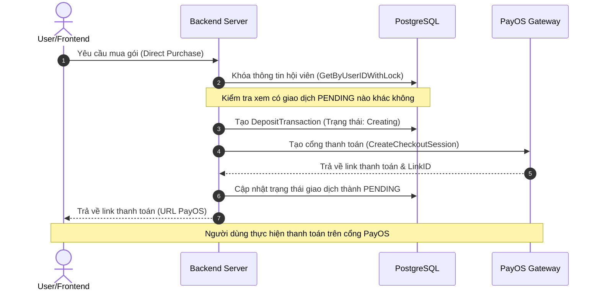

# Closy Subscription & Billing System

Tài liệu này giải thích chi tiết toàn bộ kiến trúc kỹ thuật và luồng nghiệp vụ của phân hệ Đăng ký hội viên & Thanh toán (`internal/modules/subscription`) trong dự án **Closy**.

---

## 1. Mô hình Dữ liệu (Domain Entities)

Phân hệ quản lý toàn bộ vòng đời hội viên thông qua các thực thể (Entities) liên kết chặt chẽ trong cơ sở dữ liệu:

*   **`SubscriptionPlan`**: Định nghĩa thông tin gói cước (Tên, Mã cước `Slug`, Giá `Price`, số ngày sử dụng `DurationDays`, các hạn mức cấu hình như `MaxWardrobeItems`, `MaxOutfits`, và lượt sử dụng AI hàng ngày `AiOutfitDailyQuota`, `AiChatDailyQuota`).
*   **`UserSubscription`**: Lưu trạng thái gói hội viên hiện tại của người dùng.
    *   Lưu thông tin hạn dùng (`ExpiresAt`), phiên bản tối ưu (`Version` để chống xung đột bằng optimistic lock).
    *   **Fallback Fields (`FallbackPlanID`, `FallbackPlanCode`...)**: Dùng để ghi nhớ gói trọn đời (Lifetime) gốc của người dùng khi họ đăng ký đè một gói giới hạn ngày (Finite) cao cấp hơn. Khi gói giới hạn ngày hết hạn, hệ thống tự phục hồi về gói cước trọn đời này.
*   **`UserWallet`**: Ví nội bộ lưu số dư tài khoản của người dùng. Có thể nạp tiền thông qua cổng thanh toán và dùng số dư này để tự động gia hạn hoặc chủ động mua gói cước.
*   **`DepositTransaction`**: Quản lý các giao dịch nạp tiền hoặc mua gói trực tiếp. Hỗ trợ khóa phân tán thông qua thời gian chiếm dụng (`Lease`) để điều phối việc đối soát song song.
*   **`WalletStatement`**: Nhật ký biến động số dư ví (Lịch sử giao dịch tiền tệ), đảm bảo tính minh bạch và phục vụ kiểm toán tài chính.
*   **`ProviderWebhookInbox`**: Hộp thư lưu trữ tạm thời các Webhook nhận được từ cổng thanh toán (PayOS). Xử lý bất đồng bộ để tăng độ tin cậy và không làm nghẽn kết nối của cổng thanh toán.
*   **`SubscriptionRenewalAttempt`**: Theo dõi và kiểm soát số lần thử gia hạn tự động của từng người dùng, ngăn chặn việc tính phí trùng lặp.

---

## 2. Máy Trạng thái Hội viên & Quy tắc Chuyển đổi (State Machine)

Core logic chuyển đổi trạng thái gói cước được định nghĩa tại `state_machine.go` và điều phối qua 3 loại gói cước chính: `DefaultFree` (Miễn phí mặc định), `Finite` (Thời hạn số ngày nhất định), và `Lifetime` (Trọn đời).

```mermaid
state-chart
    [*] --> DefaultFree : Đăng ký tài khoản
    DefaultFree --> Finite : Mua gói ngày (Kích hoạt)
    DefaultFree --> Lifetime : Mua gói trọn đời (Kích hoạt)
    
    Finite --> Finite : Mua cùng Tier (Cộng dồn ngày gia hạn)
    Finite --> Finite_Higher : Mua Tier cao hơn (Nâng cấp ngay lập tức)
    Finite --> Lifetime : Mua gói trọn đời (Nâng cấp)
    
    Lifetime --> Lifetime_Higher : Mua gói trọn đời Tier cao hơn (Nâng cấp)
    Lifetime --> Finite_Higher : Mua gói ngày Tier cao hơn (Overlay - Lưu gói trọn đời vào Fallback)
    
    Finite_Higher --> Lifetime : Hết hạn gói ngày -> Phục hồi lại gói trọn đời gốc (Fallback Restored)
    Finite --> DefaultFree : Hết hạn gói ngày (Hạ cấp về mặc định)
```

### Chi tiết các Quy tắc chuyển đổi (Transitions):

1.  **Gia hạn gói thời hạn (`ExtendFinite`)**: Người dùng mua cùng cấp gói cước giới hạn ngày. Thời hạn mới sẽ bằng thời hạn cũ cộng thêm số ngày của gói cước mới mua.
2.  **Nâng cấp gói (`UpgradeFinite` / `UpgradeLifetime`)**: Người dùng đăng ký gói cước có cấp bậc cao hơn (`TierRank` lớn hơn). Gói cước mới sẽ được áp dụng ngay lập tức.
3.  **Ghi đè gói trọn đời (`OverlayLifetimeWithFinite`)**: Khi người dùng đang ở gói trọn đời (ví dụ: Silver Lifetime) nhưng muốn trải nghiệm gói thời hạn cao hơn (ví dụ: Gold 30 ngày). Hệ thống sẽ lưu gói Silver Lifetime vào phần `Fallback` và kích hoạt gói Gold 30 ngày.
4.  **Phục hồi gói trọn đời (`RestoreFallback`)**: Khi gói Gold 30 ngày ở trên hết hạn, hệ thống tự động tải thông tin lưu trong `Fallback` lên lại làm gói hoạt động chính, đảm bảo quyền lợi trọn đời của khách hàng.
5.  **Bảo vệ ví khi thao tác sai**: Nếu người dùng đã thanh toán thành công một gói cước có quyền lợi thấp hơn hoặc tương đương gói trọn đời hiện tại của họ (`CreditWalletLowerTier` / `CreditWalletSameLifetime`), hệ thống không hạ cấp gói cước mà tự động chuyển đổi số tiền đã thanh toán thành số dư ví nội bộ cho người dùng.

---

## 3. Quy trình Thanh toán & Đăng ký (Purchase Flow)

Hệ thống hỗ trợ 2 phương thức thanh toán chính:

### Luồng 1: Mua trực tiếp / Nạp tiền qua cổng thanh toán (Direct Purchase / Top-up)



*   **Khóa phòng ngừa (Optimistic / Pessimistic Locking)**: Để tránh tình trạng người dùng click liên tục tạo nhiều link thanh toán trùng lặp, cơ sở dữ liệu áp dụng ràng buộc duy nhất (`ux_active_direct_purchase_per_user`) trên bảng `deposit_transactions` chỉ cho phép tối đa 1 giao dịch `Pending` hoặc `Creating` tại một thời điểm cho một người dùng.

### Luồng 2: Mua bằng ví nội bộ (Internal Wallet Purchase)

*   Diễn ra hoàn toàn trong một Database Transaction duy nhất sử dụng cơ chế **Pessimistic Locking** (`FOR UPDATE`):
    1.  Khóa dòng dữ liệu ví (`UserWallet`) của người dùng để tránh race conditions.
    2.  Khóa dòng đăng ký hội viên (`UserSubscription`).
    3.  Kiểm tra số dư, trừ tiền trong ví (`Balance`), và thêm bản ghi nhật ký biến động số dư (`WalletStatement`).
    4.  Thay đổi gói cước tương ứng thông qua máy trạng thái và lưu lịch sử sự kiện.

---

## 4. Cơ chế Webhook Inbox & Đối soát Bất đồng bộ (Async Reconciliation)

Để tránh mất mát dữ liệu do mạng chập chờn hoặc Webhook đến lệch thời gian, Closy xây dựng hệ thống xử lý 2 lớp:

### Lớp 1: Webhook Inbox (Nhận và Lưu vết trước)
Khi PayOS gọi Webhook đến API:
1.  Hệ thống kiểm tra chữ ký SHA256 bảo mật.
2.  Lưu nguyên bản payload vào bảng `ProviderWebhookInbox` với trạng thái `RECEIVED`. Bước này phản hồi `HTTP 200` ngay lập tức cho PayOS chỉ trong vài mili-giây để giải phóng kết nối.
3.  Một worker chạy ngầm (`WebhookInboxWorker`) sẽ quét bảng inbox này định kỳ, xử lý tuần tự và chuyển trạng thái sang `PROCESSED`. Nếu lỗi, sẽ ghi nhận lý do và tự động thử lại (`RETRY`) hoặc đánh dấu cần can thiệp (`INVESTIGATION_REQUIRED`).

### Lớp 2: Tự động đối soát ngầm (Reconciliation Worker)
Đối với các giao dịch người dùng đã thanh toán trên cổng nhưng Webhook chưa kịp gửi hoặc bị mất:
1.  `PaymentReconciliationWorker` quét định kỳ các giao dịch ở trạng thái `Pending` hoặc `Creating` đã quá hạn đối soát.
2.  Sử dụng cơ chế **Claiming (Advisory-like Locks)** bằng cách gán `ProcessingToken` và thời hạn `Lease` để đảm bảo trong hệ thống chạy multi-replica (nhiều container chạy song song) chỉ có duy nhất 1 worker xử lý giao dịch đó tại một thời điểm.
3.  Worker chủ động gọi API của PayOS để truy vấn thông tin trạng thái thanh toán:
    *   Nếu cổng báo **Đã thanh toán (Paid)**: Gọi hàm hoàn tất giao dịch và kích hoạt gói cước.
    *   Nếu cổng báo **Chưa thanh toán & Quá hạn dùng**: Hủy link thanh toán trên cổng và đánh dấu giao dịch là `Expired`.
    *   Nếu lỗi kết nối: Tăng số lần thử và tính toán thời gian chạy lại tiếp theo bằng thuật toán **Exponential Backoff** (giãn cách thời gian tăng dần).

---

## 5. Quy trình Tự động Gia hạn định kỳ (Auto-Renewal)

Mỗi ngày, hệ thống chạy một tác vụ gia hạn ngầm (`ProcessScheduledRenewals`):

1.  **Quét theo lô (Batch Processing)**: Lấy ra các gói cước đã hết hạn (`ExpiresAt <= Now`) và có bật tự động gia hạn (`IsAutoRenewEnabled = true`).
2.  **Khóa bản ghi**: Khóa thông tin gói hội viên và ví tài khoản.
3.  **Trừ tiền tự động**:
    *   Nếu số dư ví đủ: Thực hiện trừ tiền, cập nhật ngày hết hạn mới (cộng thêm số ngày cấu hình), ghi nhận trạng thái vào `SubscriptionRenewalAttempt` để phòng tránh trừ tiền lặp lại.
    *   Nếu số dư ví không đủ hoặc tắt tính năng tự động gia hạn: Kích hoạt luồng hạ cấp (`downgradeToFree`), đưa người dùng về gói cước mặc định `DefaultFree` (hoặc trả về gói trọn đời `Fallback` nếu có).
