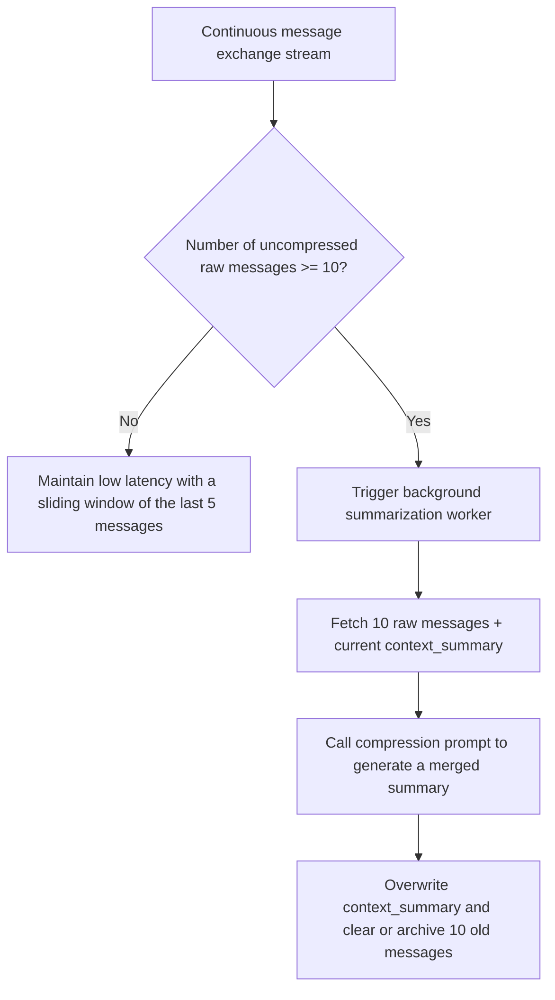

# Specification of asynchronous rules, thresholds, and time correlation

## I. Asynchronous threshold-based conversational memory pipeline

To avoid bloating the context window and optimize token costs, the system should not reprocess the entire conversation history in real time. Instead, it coordinates an asynchronous threshold-based summarization mechanism with a sliding window.

### 1. Target Operational Mechanism

- **Evaluate active flow:** When the user is chatting, the system only fetches a small window of the most recent messages to maintain low latency.
- **Asynchronous trigger threshold:** When the number of raw messages hits a threshold, a background process is triggered.
- **Progressive merging:** The worker compresses the raw conversation with the existing summary.
- **Status recording:** The new summary replaces the old summary and old raw data is partially cleared.

### 2. Current Version

The current version of the backend already has:

- AI chat sessions
- Session listing
- Message history
- Streamed response handling

However, the background threshold-based summary pipeline described above should still be considered a **target design or architectural expansion direction**, and not by default assumed to be fully running if the code does not fully reflect it.

### 3. Architectural Trade-off Matrix

The reasoning of choosing a message threshold mechanism instead of relying on the user leaving the session remains valuable at the design level:

| Architectural Property      | Operational Benefit                                                                                                                                                                                                 | System Trade-off                                                                                                                                                                                                 |
| ------------------------- | ----------------------------------------------------------------------------------------------------------------------------------------------------------------------------------------------------------------- | ----------------------------------------------------------------------------------------------------------------------------------------------------------------------------------------------------------------- |
| **Keep context compact**       | Periodic compression helps the main prompt maintain a stable token size, reducing context drift and costs.                                                                                                      | Incurs additional background costs for summarization if the user chats for very long.                                                                                                                                        |
| **Server-side determinism** | The trigger logic is completely on the server side, less dependent on client-side behavior.                                                                                                                               | If the summarization prompt is poor, old information may fade out after many compression cycles.                                                                                                                                |

---

## II. Global trend components of the community system

The community feed uses gravity and time-decay concepts instead of just chronological sorting.

### 1. Real-time interaction recording layer

When a user likes or comments:

- The `like_count` and `comment_count` counters are updated immediately.
- This step is minimized to avoid slowing down interactions.

### 2. Schedule-based analysis layer

The old design describes a job running periodically to recalculate `global_hotness_score` based on the time-decay formula.

$$\text{global\_hotness\_score} = \frac{(\text{Like\_Count} \times 1) + (\text{Comment\_Count} \times 2) - 1}{(\text{Age\_In\_Hours} + 2)^{G}}$$

### 3. Current Version

The current version already has:

- Post score snapshot
- Hot feed
- Personalized hot feed
- Mark dirty logic and repository layers serving score updates

This shows that the global hotness idea still exists in the product, even though the job cycle or specific formula details might differ from the ideal implementation in the old docs.

### 4. Meaning of parameters

- **Like count** and **comment count** remain two important interaction signals.
- **Age in hours** remains a reasonable basis to gradually reduce the advantage of old posts.
- **Gravity coefficient** remains a moderation variable for time-based decay.

### Target Design and Current Version

This document keeps the old formula as a target specification to avoid losing the algorithmic idea, and when reading, it should be understood that the current code implements the same business spirit but might not use exactly all of these details verbatim.

---

## III. Asynchronous mechanisms that actually exist in the current version

The section below is added to more accurately reflect the current backend status without deleting the old design.

### 1. Auto-renewal worker

The current version already has a membership renewal worker:

- Runs once when the application starts
- Then runs on a daily schedule
- Calls the `ProcessScheduledRenewals` usecase

This is a real asynchronous mechanism existing in the system.

### 2. Batch upload wardrobe worker

The current version already has a worker consuming batch upload jobs:

- Receives jobs from the event broadcasting system
- Processes each item in the background
- Calls AI to analyze images
- Updates metadata and embeddings

This is a direct implementation of the "asynchronous digitization" mindset described in previous documents.

### 3. Failed item cleanup worker

The current version already has a failed item cleanup worker:

- Runs at startup
- Runs on a periodic schedule
- Calls `CleanupFailedItems`

The role of this worker is to keep the wardrobe data from accumulating failed items over time.

### 4. Retry and backoff for background jobs

The current version already has the following real behaviors:

- Distinguishes between temporary errors and critical errors
- Retries jobs with a limit count
- Gradually increases wait time between retries
- Marks the item as failed if the threshold is exceeded

This is a very important real implementation part that needs to be acknowledged as the system's current state.

### 5. `last_used_at` data and item lifecycle decay

Old documents talked a lot about time-based decay.

The current version already has the data foundation to serve this direction:

- When a user saves or updates an outfit, the system touches `last_used_at` for the related items.

This means:

- The item lifecycle decay part should not be considered fully complete yet.
- But the data foundation for the decay logic genuinely exists in the code.

---

## IV. How to read this document in the current context

When reading this document, it is necessary to distinguish two layers:

- **Target design:** threshold-based summary for chat, complete hotness formula, token-saving engines or deeper correlations.
- **Current version:** renewal worker, batch upload worker, cleanup worker, retry, and `last_used_at` data.

Thus, the document still retains all old descriptions, but no longer misleads readers into thinking everything has been implemented exactly as the initial specification.
