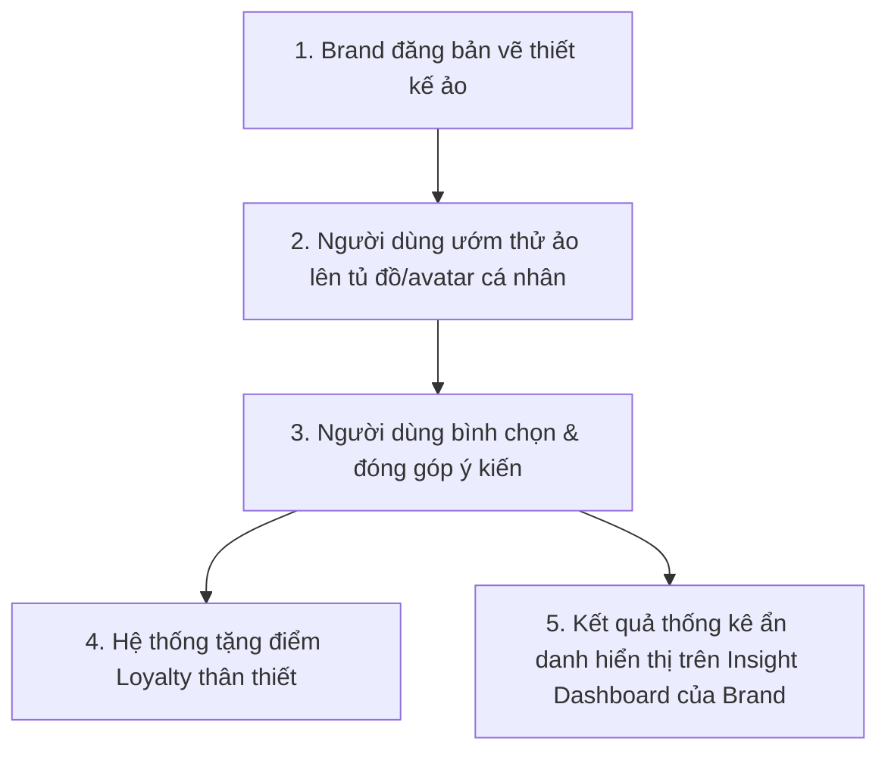

# Luồng khảo sát mẫu thử số hóa (Digital Sample Lab Flow)

Luồng hoạt động chính trong phòng Lab mẫu kỹ thuật số.

```mermaid
graph TD
    Upload[1. Brand đăng bản vẽ thiết kế ảo] --> Trial[2. Người dùng ướm thử ảo lên tủ đồ/avatar cá nhân]
    Trial --> Vote[3. Người dùng bình chọn & đóng góp ý kiến]
    Vote --> Reward[4. Hệ thống tặng điểm Loyalty thân thiết]
    Vote --> Analytics[5. Kết quả thống kê ẩn danh hiển thị trên Insight Dashboard của Brand]
```
