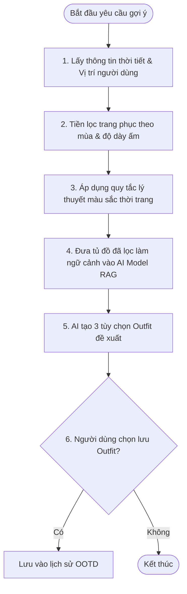

# Luồng Gợi ý Phối đồ AI (AI Outfit Recommendation Flow)

Mô tả cách thức trợ lý AI kết hợp các món đồ từ tủ đồ số dựa trên thời tiết và quy tắc màu sắc.

```mermaid
graph TD
    Start([Bắt đầu yêu cầu gợi ý]) --> Weather[1. Lấy thông tin thời tiết & Vị trí người dùng]
    Weather --> Filter[2. Tiền lọc trang phục theo mùa & độ dày ấm]
    Filter --> ColorMatch[3. Áp dụng quy tắc lý thuyết màu sắc thời trang]
    ColorMatch --> RAG[4. Đưa tủ đồ đã lọc làm ngữ cảnh vào AI Model RAG]
    RAG --> Generate[5. AI tạo 3 tùy chọn Outfit đề xuất]
    Generate --> UserDecision{6. Người dùng chọn lưu Outfit?}
    UserDecision -- Có --> Save[Lưu vào lịch sử OOTD]
    UserDecision -- Không --> End([Kết thúc])
```
