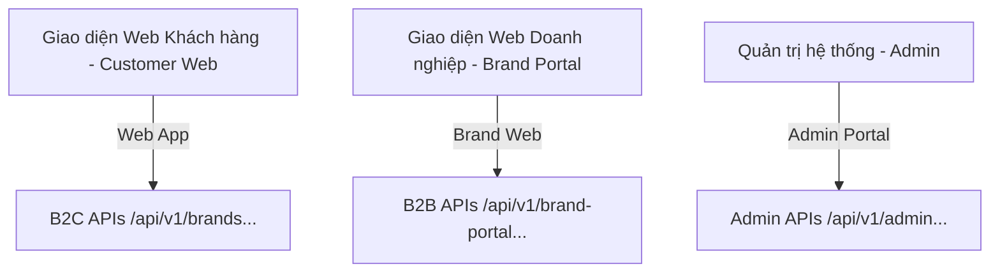
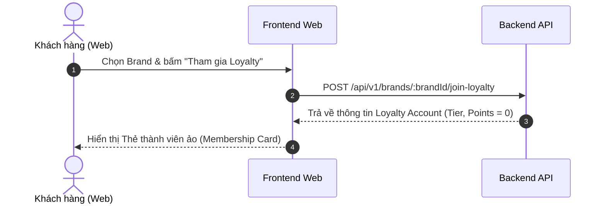
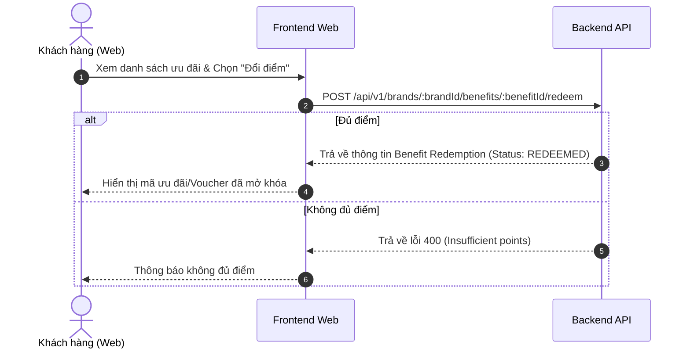
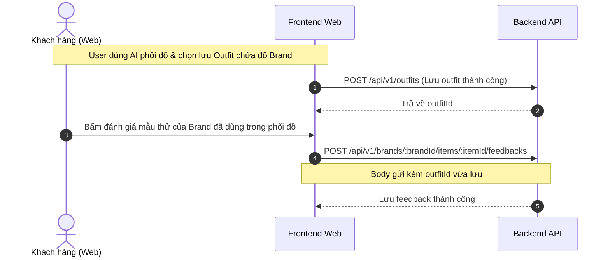

# Hướng Dẫn Phát Triển Frontend - Closy B2B2C Rebuild

Tài liệu này cung cấp hướng dẫn tích hợp, luồng nghiệp vụ (Flows), chi tiết DTO và các lưu ý quan trọng dành cho đội ngũ phát triển Frontend (Web App Khách Hàng & Brand Web Portal) khi làm việc với hệ thống APIs B2B2C mới của dự án Closy.

---

## 1. Tổng Quan Kiến Trúc B2B2C & Phân Quyền

Mô hình B2B2C của Closy là một ứng dụng Web duy nhất, được phân chia rõ ràng thành hai giao diện Web cho hai đối tượng sử dụng chính:



### 1.1. Các Vai Trò (Actors) & Xác Thực
*   **Customer (Khách hàng cá nhân):** Người dùng sử dụng giao diện Web khách hàng để quản lý tủ đồ số, nhận gợi ý phối đồ AI từ các thương hiệu và tham gia loyalty.
*   **Brand Member (Nhân sự của Brand):** Được phân quyền cụ thể trong một Brand (`brand_members`).
    *   *OWNER / MANAGER:* Quản trị toàn bộ Brand, thành viên, và phê duyệt điểm/quyền lợi.
    *   *MARKETING_STAFF:* Tạo sản phẩm, mẫu thử kỹ thuật số (Sample) và thiết lập ưu đãi (Benefits).
    *   *SUPPORT_STAFF:* Trả lời tin nhắn CS Chat của khách hàng.
*   **System Admin (Quản trị Closy):** Phê duyệt yêu cầu đăng ký Brand mới từ người dùng.

> [!IMPORTANT]
> **Quy tắc xác thực (Authentication & Authorization):**
> *   Hệ thống **không sử dụng role global riêng cho Brand** (như `ROLE_BRAND`). Tất cả tài khoản đăng nhập đều có role global là `USER`.
> *   Quyền truy cập Brand Portal được xác định bằng cách đối chiếu thông tin tài khoản hiện tại với bảng `brand_members` dựa trên `:brandId` truyền trong URL.
> *   Do đó, khi gọi các API thuộc nhóm `/api/v1/brand-portal/...`, Frontend **bắt buộc phải truyền đúng `:brandId`** trong path của API.

---

## 2. Các Luồng Nghiệp Vụ Chính (Core Flows)

### 2.1. Luồng Người Dùng (Customer Web App)

#### Luồng 2.1.1: Đăng ký thành viên & Tích lũy Loyalty

*   **Chi tiết:** Ngay sau khi bấm tham gia, tài khoản sẽ được khởi tạo ở hạng thành viên thấp nhất (mặc định dựa trên `total_spend` tích lũy từ các hóa đơn offline/online nếu có).

#### Luồng 2.1.2: Đổi điểm nhận ưu đãi (Redeem Benefits)


#### Luồng 2.1.3: Trò chuyện với Chăm Sóc Khách Hàng (CS Chat)
*   Hệ thống hỗ trợ chat trực tiếp dạng tin nhắn văn bản (HTTP Polling ở MVP).
*   **Quy tắc Reopen:** Khi gửi tin nhắn mới bằng API `POST /api/v1/brands/:brandId/conversation/messages`, nếu cuộc hội thoại đang ở trạng thái `CLOSED`, backend sẽ tự động đổi trạng thái về `OPEN`.

#### Luồng 2.1.4: Thử nghiệm sản phẩm mới (Digital Sample Lab) & Gửi Feedback sau khi phối đồ AI
*   Khi người dùng sử dụng tính năng **AI Phối đồ** hoặc **AI Stylist Chat**, hệ thống sẽ đề xuất các Outfit chứa sản phẩm của thương hiệu (`BRAND_ITEM` - bao gồm `PRODUCT` thương mại và `SAMPLE` kỹ thuật số).
*   Sau khi người dùng nhận được Outfit phối đồ từ AI (có chứa đồ của Brand) và lưu Outfit này lại, Frontend sẽ nhận được một `outfitId`.
*   Người dùng có thể tiến hành đánh giá/gửi Feedback cho chính mẫu thử (SAMPLE) đó, kèm theo thông tin Outfit đã phối thành công:


#### Luồng 2.1.5: Gợi ý phối đồ AI & Stylist Assistant (Tích Hợp Brand Items)
*   Khi khách hàng yêu cầu AI gợi ý phối đồ, Frontend gửi cờ `include_brand_items: true`.
*   AI sẽ tự động lựa chọn quần áo cá nhân trong tủ đồ của user, kết hợp với các sản phẩm/mẫu thử hợp lệ của các Brand mà user đã tham gia thành viên để tạo nên Outfit hoàn chỉnh.
*   **Lưu ý quan trọng về AI Chat Stream (SSE):** Xem chi tiết tại mục **4.2**.

---

### 2.2. Luồng Doanh Nghiệp (Brand Portal Web)

#### Luồng 2.2.1: Onboarding & Yêu cầu tạo Thương hiệu (Brand Request)
*   Bất kỳ người dùng nào cũng có thể gửi yêu cầu tạo Brand: `POST /api/v1/brand-portal/brands`.
*   Trạng thái ban đầu của Brand là `PENDING_REVIEW`. Người tạo sẽ tự động trở thành Member với role là `OWNER` (nhưng ở trạng thái chờ duyệt).
*   Sau khi Admin hệ thống phê duyệt (`PATCH /api/v1/admin/brands/:brandId/status` -> `ACTIVE`), Brand và Owner Member sẽ chính thức hoạt động (`ACTIVE`).

#### Luồng 2.2.2: Quản lý khách hàng offline & Cộng điểm Loyalty
*   Nhân viên Brand tại cửa hàng có thể ghi nhận khách mua hàng bằng số điện thoại (`phone`) hoặc mã khách hàng ngoài hệ thống Closy (`externalCustomerCode`).
*   Hệ thống sẽ tạo ra một khách hàng ngoại tuyến (`brand_customers.user_id = NULL`).
*   Khi thanh toán, nhân viên thực hiện cộng điểm cho khách hàng bằng API:
    `POST /api/v1/brand-portal/brands/:brandId/loyalty/points`.
*   **Lưu ý về Idempotency Key:** Khi gọi API cộng điểm, Frontend bắt buộc phải tạo một UUID ngẫu nhiên gửi kèm trong trường `idempotencyKey` để tránh cộng điểm trùng lặp do lỗi mạng hoặc nhấn nút nhiều lần.

#### Luồng 2.2.3: Quản lý sản phẩm & Mẫu thử (Brand Items)
*   Nhân sự Brand tạo sản phẩm mới: `POST /api/v1/brand-portal/brands/:brandId/items`.
*   **Xử lý bất đồng bộ:** Khi tạo sản phẩm mới, Backend sẽ đẩy hình ảnh lên hàng đợi RabbitMQ để AI phân tích hình ảnh và trích xuất dữ liệu tự động (màu sắc, chất liệu, kiểu dáng). Trạng thái sản phẩm ban đầu có thể là `DRAFT` hoặc `PENDING` và tự động chuyển sang `ACTIVE` sau khi AI xử lý xong.

---

## 3. Danh Sách & Chi Tiết Tích Hợp APIs

### 3.1. Cơ Chế Xác Thực Bằng Cookie
*   Hệ thống **không sử dụng Bearer Token** trong header `Authorization`.
*   Mọi API yêu cầu xác thực sẽ đọc token trực tiếp từ **Cookie** có tên là **`accessToken`**.
*   **Lưu ý cho Frontend:** 
    *   Khi gọi API (sử dụng `fetch`, `axios`, v.v.), cấu hình request bắt buộc phải có thuộc tính `withCredentials: true` hoặc `credentials: 'include'` để trình duyệt tự động đính kèm cookie `accessToken` trong mỗi request gửi lên backend.
    *   Backend chịu trách nhiệm set cookie này thông qua HttpOnly và Secure flag khi người dùng login/register thành công.

---

### 3.2. Giao Diện Khách Hàng (Customer Web APIs)

| HTTP Method | API Path | Mô tả | Request Body / Query Params | Response chính |
| :--- | :--- | :--- | :--- | :--- |
| **GET** | `/api/v1/brands` | Lấy danh sách Brand đang hoạt động | Không | `[]BrandRes` |
| **POST** | `/api/v1/brands/:brandId/join-loyalty` | Đăng ký tham gia thành viên Brand | Không | `BrandCustomerRes` |
| **GET** | `/api/v1/brands/:brandId/benefits` | Lấy danh sách ưu đãi đang hoạt động của Brand | Không | `[]BrandBenefitRes` |
| **POST** | `/api/v1/brands/:brandId/benefits/:benefitId/redeem` | Đổi điểm tích lũy lấy ưu đãi | Không | `BenefitRedemptionRes` |
| **GET** | `/api/v1/brands/:brandId/conversation` | Lấy/Mở cuộc trò chuyện CS Chat với Brand | Không | `BrandConversationRes` |
| **POST** | `/api/v1/brands/:brandId/conversation/messages` | Gửi tin nhắn CS Chat cho Brand | `SendBrandChatMessageReq` | `BrandConversationMessageRes` |
| **GET** | `/api/v1/brands/:brandId/items` | Lấy danh sách sản phẩm/mẫu thử của Brand | Không | `[]BrandItemRes` |
| **POST** | `/api/v1/brands/:brandId/items/:itemId/feedbacks` | Gửi đánh giá cho mẫu thử (SAMPLE) kèm outfitId đã phối | `SubmitSampleFeedbackReq` | `DigitalSampleResponseRes` |
| **POST** | `/api/v1/ai/outfit-recommendations` | Yêu cầu AI gợi ý phối đồ | `RecommendOutfitReq` | `RecommendedOutfitRes` |

---

### 3.3. Giao Diện Portal Doanh Nghiệp (Brand Portal APIs)

| HTTP Method | API Path | Mô tả | Vai trò yêu cầu | Request Body / Query |
| :--- | :--- | :--- | :--- | :--- |
| **POST** | `/api/v1/brand-portal/brands` | Gửi yêu cầu đăng ký tạo Brand | Bất kỳ User nào | `CreateBrandReq` |
| **GET** | `/api/v1/brand-portal/brands/:brandId` | Xem thông tin chi tiết của Brand | Mọi Member của Brand | Không |
| **POST** | `/api/v1/brand-portal/brands/:brandId/members` | Thêm nhân viên mới vào Brand | `OWNER`, `MANAGER` | `AddBrandMemberReq` |
| **GET** | `/api/v1/brand-portal/brands/:brandId/members` | Danh sách nhân viên của Brand | Mọi Member | Không |
| **GET** | `/api/v1/brand-portal/brands/:brandId/customers` | Danh sách khách hàng (CRM) | Mọi Member | Không |
| **POST** | `/api/v1/brand-portal/brands/:brandId/customers/offline-purchase` | Đăng ký khách hàng ngoại tuyến | `OWNER`, `MANAGER` | `CreateOfflineBrandCustomerReq` |
| **POST** | `/api/v1/brand-portal/brands/:brandId/loyalty/points` | Thay đổi điểm tích lũy của khách hàng | `OWNER`, `MANAGER` | `GrantLoyaltyPointsReq` |
| **POST** | `/api/v1/brand-portal/brands/:brandId/benefits` | Tạo ưu đãi/quyền lợi mới | `OWNER`, `MANAGER`, `MARKETING_STAFF` | `CreateBrandBenefitReq` |
| **GET** | `/api/v1/brand-portal/brands/:brandId/benefits` | Danh sách ưu đãi phía Portal | Mọi Member | Không |
| **PATCH** | `/api/v1/brand-portal/brands/:brandId/benefits/:benefitId/status` | Bật/tắt/Lưu trữ ưu đãi | `OWNER`, `MANAGER`, `MARKETING_STAFF` | `UpdateBenefitStatusReq` |
| **GET** | `/api/v1/brand-portal/brands/:brandId/conversations` | Danh sách các hội thoại CS Chat | `OWNER`, `MANAGER`, `SUPPORT_STAFF` | Phân trang |
| **GET** | `/api/v1/brand-portal/brands/:brandId/conversations/:conversationId/messages` | Lấy tin nhắn trong cuộc hội thoại | `OWNER`, `MANAGER`, `SUPPORT_STAFF` | Phân trang |
| **POST** | `/api/v1/brand-portal/brands/:brandId/conversations/:conversationId/messages` | Nhân viên trả lời tin nhắn chat | `OWNER`, `MANAGER`, `SUPPORT_STAFF` | `SendBrandChatMessageReq` |
| **POST** | `/api/v1/brand-portal/brands/:brandId/items` | Tạo sản phẩm/mẫu thử mới | `OWNER`, `MANAGER`, `MARKETING_STAFF` | `CreateBrandItemReq` |
| **GET** | `/api/v1/brand-portal/brands/:brandId/items` | Danh sách sản phẩm/mẫu thử phía Portal | Mọi Member | Phân trang |
| **PUT** | `/api/v1/brand-portal/brands/:brandId/items/:itemId` | Sửa thông tin sản phẩm/mẫu thử | `OWNER`, `MANAGER`, `MARKETING_STAFF` | `UpdateBrandItemReq` |
| **GET** | `/api/v1/brand-portal/brands/:brandId/items/:itemId/feedbacks` | Xem danh sách đánh giá của mẫu thử | Mọi Member | Phân trang |

---

### 3.4. Chi tiết Cấu Trúc DTO (JSON Payload)

#### `CreateBrandReq` (Đăng ký Brand)
```json
{
  "slug": "unique-brand-slug",
  "name": "Tên Brand",
  "description": "Mô tả ngắn về thương hiệu",
  "logoUrl": "https://cloudinary.com/.../logo.jpg"
}
```

#### `CreateOfflineBrandCustomerReq` (Tạo khách offline)
```json
{
  "customerName": "Nguyễn Văn A",
  "phoneE164": "+84901234567",
  "externalCustomerCode": "ERP-12345"
}
```

#### `GrantLoyaltyPointsReq` (Thay đổi điểm)
```json
{
  "userId": "uuid-của-user-nếu-đã-có-tài-khoản",
  "phone": "+84901234567",
  "customerName": "Tên khách hàng",
  "externalCustomerCode": "ERP-12345",
  "purchaseAmount": 500000.0,
  "pointsDelta": 50,
  "transactionType": "EARN",
  "reason": "Mua hóa đơn tại cửa hàng",
  "referenceType": "ORDER",
  "referenceId": "uuid-hóa-đơn-nếu-có",
  "idempotencyKey": "uuid-ngẫu-nhiên-để-tránh-gửi-trùng"
}
```
*   *Lưu ý:* `transactionType` bắt buộc là một trong các giá trị: `EARN`, `ADJUST`, `REFUND`.

#### `CreateBrandBenefitReq` (Tạo ưu đãi)
```json
{
  "name": "Giảm giá 10% cho khách VIP",
  "description": "Ưu đãi áp dụng trên toàn hệ thống cửa hàng",
  "benefitType": "DISCOUNT",
  "unlockType": "TIER_PRIVILEGE",
  "requiredPoints": 0,
  "requiredTierId": "uuid-của-tier-VIP",
  "featureCode": "BRAND_ITEM_RECOMMENDATION",
  "featureConfig": {
    "discount_percent": 10
  }
}
```
*   `benefitType` nhận: `VOUCHER`, `DISCOUNT`, `GIFT`, `FREE_SHIPPING`, `EARLY_ACCESS`, `FEATURE_ACCESS`.
*   `unlockType` nhận: `TIER_PRIVILEGE` (theo hạng thành viên), `POINT_REDEMPTION` (đổi điểm), `MANUAL_GRANT` (tặng thủ công).
*   `featureCode` nhận: `SAMPLE_MIX_ACCESS` (thử mẫu số), `BRAND_ITEM_RECOMMENDATION` (gợi ý đồ thương hiệu), `PRIORITY_BRAND_CHAT` (chat ưu tiên).

#### `CreateBrandItemReq` (Tạo sản phẩm/mẫu thử)
```json
{
  "categoryId": "uuid-danh-mục-quần-áo",
  "imageUrl": "https://cloudinary.com/.../item.jpg",
  "imagePublicId": "cloudinary-public-id",
  "productCode": "SKU-999-WHITE",
  "name": "Áo Thun Cotton Trắng",
  "description": "Áo thun cơ bản 100% cotton",
  "price": 250000.0,
  "itemType": "PRODUCT",
  "status": "ACTIVE"
}
```
*   `itemType` bắt buộc: `PRODUCT` (sản phẩm thương mại) hoặc `SAMPLE` (mẫu thử kỹ thuật số).

#### `SubmitSampleFeedbackReq` (Gửi phản hồi mẫu thử sau khi phối đồ)
```json
{
  "outfitId": "uuid-outfit-chứa-đồ-brand-đã-phối-và-lưu-lại",
  "voteType": "LIKE",
  "rating": 5,
  "feedbackText": "Áo phối lên dáng rất ôm và trẻ trung."
}
```
*   `voteType` nhận: `LIKE`, `DISLIKE`, `WOULD_BUY` (sẽ mua khi sản xuất), `NOT_INTERESTED` (không hứng thú).

#### `RecommendOutfitReq` (AI Phối đồ B2C)
```json
{
  "occasion": "casual",
  "styleTarget": "minimalist",
  "season": "summer",
  "weather": "hot",
  "colorTone": "pastel",
  "details": "Thêm ghi chú cá nhân hóa",
  "include_brand_items": true
}
```

---

## 4. Các "Bẫy" Cần Tránh Khi Lập Trình Frontend (Gotchas & Warnings)

### 4.1. Tự động phát hiện Context khi lưu Outfit (Bẫy Save Outfit)
Khi người dùng lưu một Outfit (tự phối tay hoặc lưu từ gợi ý AI) bằng cách gọi API `POST /api/v1/outfits` hoặc `PATCH /api/v1/outfits/:id`:
*   **Sai lầm phổ biến:** Truyền trường `itemContext` (như `USER_WARDROBE` hoặc `BRAND_ITEM`) lên từ phía Frontend.
*   **Quy tắc đúng:** Payload `SaveOutfitReq` **không chứa** trường `itemContext` và `wardrobeItemId`. Frontend chỉ gửi duy nhất danh sách đối tượng chứa **`fashionItemId`** và các thông số hiển thị canvas (tọa độ x, y, scale, layer).
*   **Lý do:** Backend sẽ tự động kiểm tra `fashionItemId` đó xem có nằm trong tủ đồ cá nhân của người dùng hay không. Nếu có, Backend tự điền `USER_WARDROBE`. Nếu không (đây là sản phẩm thương hiệu), Backend tự liên kết và điền `BRAND_ITEM`.

---

### 4.2. Phân mảnh token chuyển hướng trong AI Chat Stream (SSE Gotcha)
Trong tính năng Chat với Stylist AI (`POST /api/v1/ai/chat/sessions/:contextID/messages/stream`):
*   Khi mô hình AI phát hiện người dùng có ý định muốn phối đồ, nó sẽ chèn token chuyển hướng **`[ACTION:REDIRECT_OUTFIT]`** vào cuối luồng Stream tin nhắn.
*   **Cảnh báo cực kỳ quan trọng:** Vì đây là Server-Sent Events (SSE) truyền tải tin nhắn theo từng ký tự/từ (chunk), token này **có thể bị cắt nhỏ thành nhiều phần** ở các chunk khác nhau.
    *   *Ví dụ:* Chunk 1 nhận được: `"[ACTION:RE"`, Chunk 2 nhận tiếp: `"DIRECT_OUTFIT]"`
*   **Giải pháp:** Frontend **không được** kiểm tra token này trực tiếp trên từng chunk riêng lẻ nhận được. Thay vào đó, Frontend phải **lũy kế văn bản (accumulate string)** của toàn bộ cuộc trò chuyện từ lúc bắt đầu stream, sau đó thực hiện kiểm tra sự tồn tại của chuỗi `[ACTION:REDIRECT_OUTFIT]` trên văn bản tổng hợp đó để hiển thị nút bấm/popup điều hướng người dùng sang màn hình Phối Đồ AI.

---

### 4.3. Cơ chế tránh trùng lặp điểm (Idempotency Key cho Loyalty)
Khi nhân viên thao tác cộng/trừ điểm hoặc điều chỉnh điểm thủ công trên Brand Portal:
*   Frontend **bắt buộc** phải tự động sinh ra một mã UUID phiên làm việc mới độc nhất đặt vào trường `idempotencyKey`.
*   Mã này phải được giữ nguyên nếu người dùng ấn nút "Gửi lại" do sự cố mất kết nối hoặc phản hồi chậm từ máy chủ.
*   Nếu máy chủ nhận được yêu cầu trùng `idempotencyKey` trong cùng một Brand, nó sẽ trả về ngay lập tức kết quả của lần xử lý trước đó mà không cộng điểm thêm lần nào nữa để tránh thất thoát tiền/điểm của doanh nghiệp.

---

### 4.4. Quản lý Khách Hàng Offline & Link Tài Khoản Thật
*   Tài khoản khách hàng được import hoặc tạo thủ công bởi nhân viên cửa hàng (`POST /api/v1/brand-portal/brands/:brandId/customers/offline-purchase`) sẽ chỉ có thông tin số điện thoại (`phoneE164`) và có `userId = NULL`. Các khách hàng này **không thể đăng nhập** vào Closy Web.
*   Khi thiết kế UI Web khách hàng, nếu phát hiện người dùng mới đăng ký Closy có số điện thoại trùng khớp với một khách hàng offline đã tồn tại, ứng dụng cần hướng dẫn người dùng thực hiện luồng "Claim Account" (liên kết mã QR hoặc nhập số điện thoại xác thực OTP) để đồng bộ toàn bộ điểm loyalty và lịch sử mua sắm offline trước đó vào tài khoản mới.

---

### 4.5. Bảo mật thông tin Tủ đồ cá nhân (Data Privacy)
*   **Nguyên tắc tuyệt đối:** Không được phép thiết kế bất kỳ màn hình nào phía Brand Portal hiển thị trực tiếp danh sách quần áo cụ thể trong tủ đồ cá nhân (raw wardrobe) của một người dùng cụ thể.
*   Các chỉ số phân tích dữ liệu (Analytics/Insight) trên Brand Portal chỉ được hiển thị dưới dạng **dữ liệu tổng hợp (aggregated metrics)** (ví dụ: Tổng số lượt phối thử mẫu thử SKU-A, tỷ lệ người dùng chọn LIKE mẫu thử SKU-B) để bảo vệ quyền riêng tư của khách hàng.
