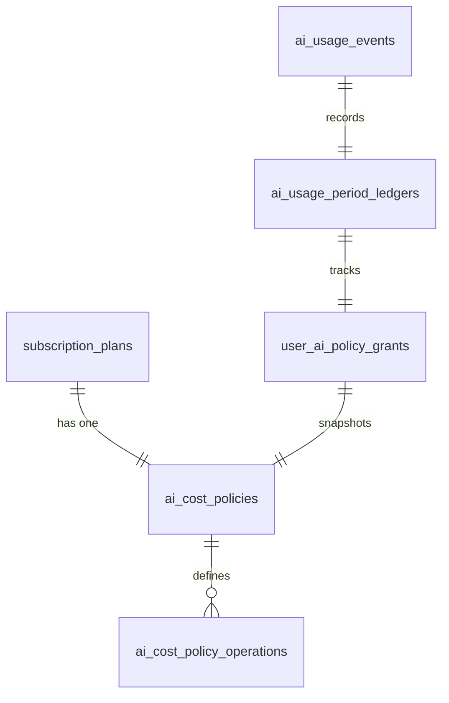
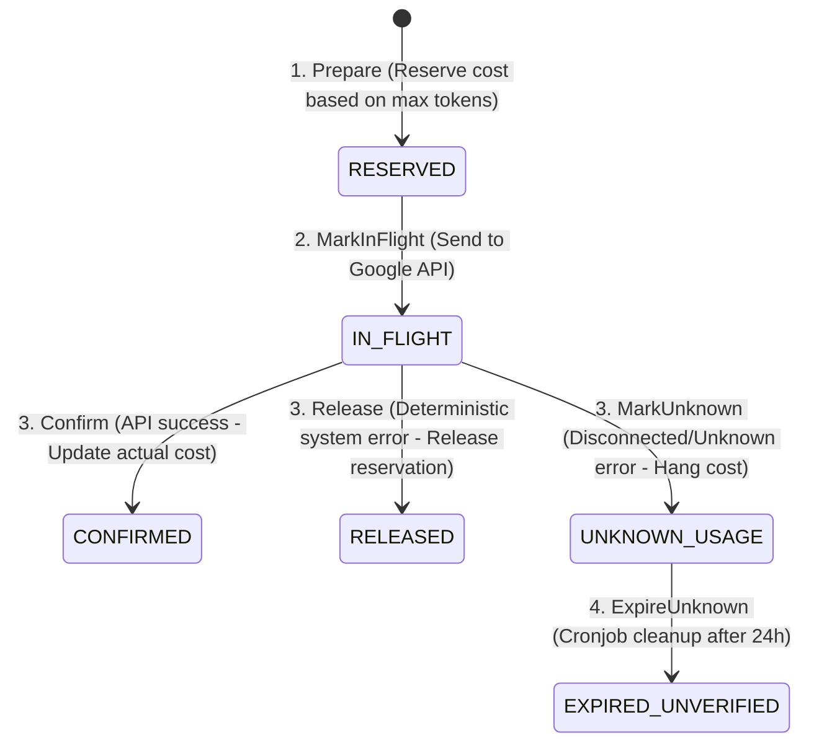

# Technical Guide: AI Cost Control & Structured Output System

This document is for developers (Developer Guide) to understand the structure, processing flow, and operational methods of the AI cost management system (AI Cost Control) and how it ensures output formatting (Structured Output) in the project.

---

## 1. High-Level Architecture

The AI cost management system is designed independently of subscription plan identifiers (no hard-coded `plan_slug`). It operates based on a dynamic **Policy Engine** mechanism:

1. **Dynamic Policy Resolution**: When a user sends an AI request, the system will determine the active **Policy Grant** of that user to apply constraints.
2. **Reservation-First**: Every AI request using a paid model must reserve a budget (Reserved Cost) based on the actual input Tokens and maximum output Tokens before sending the request to the AI provider.
3. **Graceful Fallback**: When financial limits are exceeded or technical issues occur from the paid model, the system automatically downgrades to a free model (Gemma/local) or switches to local processing algorithms (local algorithms).

---

## 2. Database & GORM Entities

The system uses 5 main tables to store policies and usage history. All Entities are declared in the `internal/shared/domain/entities/subscription_entities.go` file:

### Entity Relationship Diagram (ERD)



### Main data tables:

- **`ai_cost_policies`**: Defines overall policies (Mode: `STRICT` or `OBSERVE_ONLY`, `period_days`, budget ceiling `hard_cost_micro_vnd`, and transition thresholds).
- **`ai_cost_policy_operations`**: Configures Token limits (Normal/Reduced), Routes (Normal/Free), and max paid attempts (`max_paid_attempts_per_day`) for each operation (`chat`, `outfit`, `summary`, `rewriter`).
- **`user_ai_policy_grants`**: User policy grant records, automatically generated from the current subscription plan's policy when the user makes their first AI call.
- **`ai_usage_period_ledgers`**: Ledger tracking cumulative costs in the user's current period (Period Index). The cycle is calculated automatically (rolling index) based on the formula:
  $$\text{Period Index} = \text{int}\left( \frac{\text{Now} - \text{Effective From}}{\text{Period Days}} \right)$$
- **`ai_usage_events`**: Detailed log of each AI request for auditing (Audit Trail) and lifecycle tracking.

---

## 3. Reservation Lifecycle

The lifecycle of an AI call goes through strict states to ensure no budget leakage:



### Code Step Details:

#### Step 1: Prepare & Reserve Cost

Before calling the Gemini API, `AIService` calls `Prepare(userID, operation, promptTokens)`.

- The function checks the user's policy. If it's a **STRICT** plan (Premium):
    - Calculate the maximum expected cost using Decimal:
      $$\text{Reserved Cost} = (\text{prompt\_tokens} \times \text{input\_rate} \times \text{fx}) + (\text{max\_output\_tokens} \times \text{output\_rate} \times \text{fx})$$
    - Start a database transaction and perform a **Row-level Lock (`FOR UPDATE`)** on the `ai_usage_period_ledgers` table to avoid race conditions when there are multiple concurrent requests:
        ```go
        tx.Clauses(clause.Locking{Strength: "UPDATE"}).Where("grant_id=? AND period_index=?", grant.ID, idx).First(&ledger)
        ```
    - Compare the total actual cost + current reserved cost against the block threshold (Free Route Threshold). If exceeded, the system refuses to call the paid model and routes to the free model.
    - If the cost hits the compact threshold (Compact Threshold), the system returns a directive to reduce the maximum token size (`ReducedMaxInputTokens` / `ReducedMaxOutputTokens`).
    - Save the event with the state `RESERVED`.
- If the policy is **OBSERVE_ONLY** (Free):
    - Count the number of successful paid events of the user today (`logical_route = 'paid_flash_lite'`).
    - If the count is less than `MaxPaidAttemptsPerDay` (default is 5), allow calling the paid model (so the user can trial it).
    - If greater than or equal to 5 (Paid Attempt Guard), reject and route to the free Gemma model.

#### Step 2: MarkInFlight

When preparing to send the payload, the state is updated to `IN_FLIGHT`.

#### Step 3: Confirm / Release

- **When API succeeds**: Returns the actual token count (`prompt_tokens`, `output_tokens`, `thinking_tokens`). The system calculates the actual cost, subtracts the previously added reserved part in the ledger, accumulates the actual cost into the ledger, and updates the event state to `CONFIRMED`.
- **When deterministic API error occurs** (e.g., HTTP 400, 401, 403, 429): The system calls `Release()`, reverting the reserved cost to 0 and changes the state to `RELEASED`.
- **When an unexpected error or disconnection occurs**: The system changes it to `UNKNOWN_USAGE`. After 24h, the periodic cleanup Worker (`AIUsageReconciliationWorker`) will scan via cronjob to revert these unverified reserved costs to the `EXPIRED_UNVERIFIED` state.

---

## 4. Startup Validation

To avoid misconfigurations leading to currency leakage (e.g., setting the maximum limit too high or hard cost too low), the system performs static auditing via `SubscriptionCatalogValidator` in `internal/modules/subscription/application/validator/catalog_validator.go` immediately when the server boots.

**STRICT Policy check rule:**
$$\text{Free Transition Threshold (VND)} + (\text{Period Days} \times \text{Max Unknown requests/day} \times \text{Max reserved cost of 1 request}) \le \text{Hard Cost (VND)}$$

If any subscription plan configuration violates the above formula (i.e., in the worst-case scenario, the hanging amount plus the block threshold exceeds the actual Hard Cost), the server will **refuse to start** and report a detailed error for devs to adjust the configuration.

---

## 5. Structured Output & Prompt Budgeting

To ensure AI always responds with the correct JSON structure and avoids token overflow, the source code implements the following optimization techniques:

### 1. Prompt Budgeting (Trimming input data)

In the outfit recommendation service ([prompt.go](file:///c:/0LamViec/0FPTU/7-semester-7/exe101/projects/smart-wardrobe-be/internal/modules/wardrobe/application/usecase/wardrobe/ai/recommendation/synthesis/prompt.go)):

- When the outfit candidate pool is too large, `BuildRecommendationPromptWithLimits` will automatically calculate the character length.
- If it exceeds the configured limit (`recommendation_prompt_max_characters`), the system trims detailed descriptions, secondary fashion tags, and gradually removes low-scoring candidates at the bottom of the list until the prompt is within a safe limit.

### 2. Force JSON format (Gemini Response Schema)

AI call configurations are attached with Gemini system configuration parameters:

- `ResponseMIMEType: "application/json"`
- `ResponseSchema`: Defines the required JSON structure (e.g., `title`, `explanation`, `items` for Outfit). This helps Google Gemini return a 100% standard JSON.

### 3. Output Sanitization & Anti-SQL Injection/Placeholder

In [json.go](file:///c:/0LamViec/0FPTU/7-semester-7/exe101/projects/smart-wardrobe-be/internal/modules/wardrobe/application/usecase/wardrobe/ai/recommendation/synthesis/json.go):

- **Clean Markdown**: Remove wrapping tags like `json ... `.
- **Balanced Bracket Scanning**: Use the `ExtractFirstJSONObject` function to count nested curly braces `{}`. This technique helps accurately extract the first JSON string even if the AI writes extra introductory text before or after the JSON.
- **Check Placeholders**: Reject responses containing placeholder values like `"string"`, `"uuid"`, `"primary_id"`.
- **Anti-SQL Injection / Unsafe tsquery**: Scan dangerous phrases like `@@`, `to_tsquery`, `;`, `--`, `select` to eliminate the risk of indirect attacks.

---

## 6. Local Fallbacks

When AI has parsing errors or runs out of service quotas, the system performs a fallback:

1. **Outfit Recommendation Fallback**:
    - When calling Gemini fails, the system triggers [RunLocalHSLMatching](file:///c:/0LamViec/0FPTU/7-semester-7/exe101/projects/smart-wardrobe-be/internal/modules/wardrobe/application/usecase/wardrobe/ai/recommendation/ranking/hsl.go).
    - This algorithm uses a local HSL color processing library, matching the harmony of the color wheel (Complementary, Analogous, Triadic, Monochromatic) to coordinate the most optimal outfit from the user's existing clothing list, returning results immediately with the flag `IsFallback = true`.
2. **Chat History Summary Fallback**:
    - If compressing the conversation encounters an error, the system skips and keeps the old summary (`ContextSummary`), without blocking the user's chat flow.
3. **Query Rewriter Fallback**:
    - If the LLM Rewriter encounters an error, the system automatically uses `LocalRecommendationQueryRewriter` to extract keywords based on a static Regex rule set and local Taxonomy to perform a hybrid search on Elasticsearch/Database.
