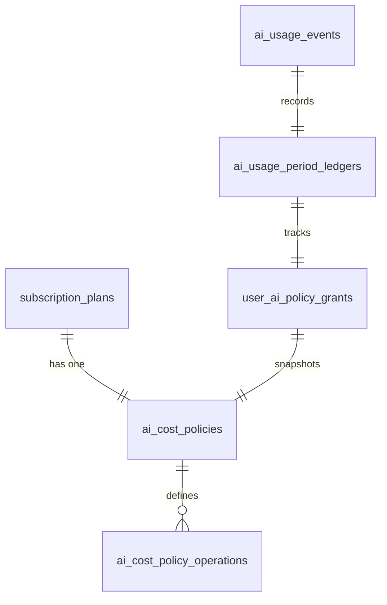
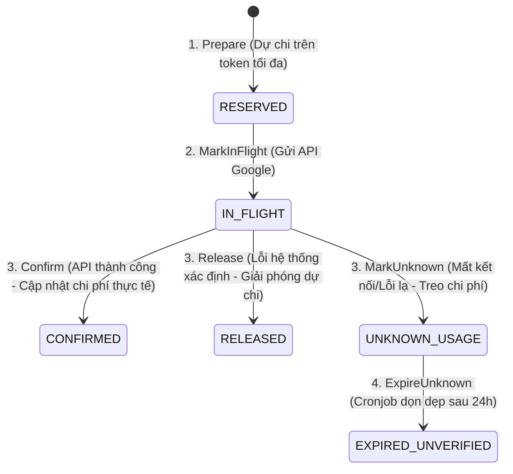

# Hướng Dẫn Kỹ Thuật: Hệ Thống AI Cost Control & Structured Output

Tài liệu này dành cho lập trình viên (Developer Guide) để hiểu cấu trúc, luồng xử lý và cách thức hoạt động của hệ thống quản lý chi phí AI (AI Cost Control) và đảm bảo định dạng đầu ra (Structured Output) trong dự án.

---

## 1. Kiến Trúc Tổng Quan (High-Level Architecture)

Hệ thống quản lý chi phí AI được thiết kế độc lập với mã định danh gói dịch vụ (không hard-code `plan_slug`). Nó hoạt động dựa trên cơ chế **Policy Engine** động:

1. **Dynamic Policy Resolution**: Khi user gửi request AI, hệ thống sẽ xác định **Policy Grant** (quyền hạn chính sách) đang hoạt động của user đó để áp dụng các ràng buộc.
2. **Reservation-First**: Mọi request AI sử dụng mô hình trả phí phải được đặt trước ngân sách (Reserved Cost) dựa trên số lượng Token đầu vào thực tế và Token đầu ra tối đa trước khi gửi yêu cầu đến nhà cung cấp AI.
3. **Graceful Fallback**: Khi vượt quá hạn mức tài chính hoặc xảy ra sự cố kỹ thuật từ mô hình trả phí, hệ thống sẽ tự động hạ cấp xuống mô hình miễn phí (Gemma/local) hoặc chuyển sang thuật toán xử lý cục bộ (local algorithms).

---

## 2. Cơ Sở Dữ Liệu & GORM Entities

Hệ thống sử dụng 5 bảng chính để lưu trữ chính sách và lịch sử sử dụng. Tất cả các Entity được khai báo trong tệp tin `internal/shared/domain/entities/subscription_entities.go`:

### Sơ đồ quan hệ thực thể (ERD)



### Các bảng dữ liệu chính:

- **`ai_cost_policies`**: Định nghĩa chính sách tổng thể (Mode: `STRICT` hoặc `OBSERVE_ONLY`, chu kỳ `period_days`, trần ngân sách `hard_cost_micro_vnd`, và các ngưỡng chuyển đổi).
- **`ai_cost_policy_operations`**: Cấu hình giới hạn Token (Normal/Reduced), Route (Normal/Free), và giới hạn lượt thử trả phí (`max_paid_attempts_per_day`) cho từng tác vụ (`chat`, `outfit`, `summary`, `rewriter`).
- **`user_ai_policy_grants`**: Bản ghi quyền hạn chính sách của người dùng, được sinh ra tự động từ chính sách của gói đăng ký hiện tại khi người dùng thực hiện cuộc gọi AI đầu tiên.
- **`ai_usage_period_ledgers`**: Sổ cái theo dõi chi phí tích lũy trong chu kỳ hiện tại (Period Index) của người dùng. Chu kỳ được tính tự động (rolling index) dựa trên công thức:
  $$\text{Period Index} = \text{int}\left( \frac{\text{Now} - \text{Effective From}}{\text{Period Days}} \right)$$
- **`ai_usage_events`**: Nhật ký chi tiết của từng request AI để phục vụ kiểm toán (Audit Trail) và theo dõi trạng thái vòng đời.

---

## 3. Quy Trình Đặt Trước & Cắt Giảm Chi Phí (Reservation Lifecycle)

Vòng đời của một cuộc gọi AI trải qua các trạng thái nghiêm ngặt để đảm bảo không bị rò rỉ ngân sách:



### Chi tiết các bước trong code:

#### Bước 1: Prepare & Reserve Cost (Dự chi)

Trước khi gọi API Gemini, `AIService` gọi `Prepare(userID, operation, promptTokens)`.

- Hàm kiểm tra chính sách của user. Nếu là gói **STRICT** (Premium):
    - Tính toán chi phí dự kiến lớn nhất bằng Decimal:
      $$\text{Reserved Cost} = (\text{prompt\_tokens} \times \text{input\_rate} \times \text{fx}) + (\text{max\_output\_tokens} \times \text{output\_rate} \times \text{fx})$$
    - Bắt đầu một database transaction và thực hiện **Row-level Lock (`FOR UPDATE`)** trên bảng `ai_usage_period_ledgers` để tránh race condition khi có nhiều request đồng thời:
        ```go
        tx.Clauses(clause.Locking{Strength: "UPDATE"}).Where("grant_id=? AND period_index=?", grant.ID, idx).First(&ledger)
        ```
    - So sánh tổng chi phí thực tế + chi phí dự chi hiện tại với ngưỡng chặn (Free Route Threshold). Nếu vượt quá, hệ thống từ chối cho gọi mô hình trả phí và định tuyến sang mô hình free.
    - Nếu chi phí chạm ngưỡng thu hẹp (Compact Threshold), hệ thống sẽ trả về chỉ thị giảm kích thước token tối đa (`ReducedMaxInputTokens` / `ReducedMaxOutputTokens`).
    - Lưu sự kiện với trạng thái `RESERVED`.
- Nếu chính sách là **OBSERVE_ONLY** (Free):
    - Đếm số lượng event trả phí thành công trong ngày của user (`logical_route = 'paid_flash_lite'`).
    - Nếu số lượt nhỏ hơn `MaxPaidAttemptsPerDay` (mặc định là 5), cho phép gọi mô hình trả phí (để user trải nghiệm thử).
    - Nếu lớn hơn hoặc bằng 5 (Paid Attempt Guard), từ chối và định tuyến sang mô hình Gemma miễn phí.

#### Bước 2: MarkInFlight (Đang thực hiện)

Khi chuẩn bị gửi payload đi, trạng thái được cập nhật thành `IN_FLIGHT`.

#### Bước 3: Confirm (Xác nhận) / Release (Giải phóng)

- **Khi API thành công**: Trả về số token thực tế (`prompt_tokens`, `output_tokens`, `thinking_tokens`). Hệ thống tính toán chi phí thực tế, trừ đi phần dự phòng đã cộng trước đó trong ledger, cộng dồn chi phí thực tế vào ledger, và cập nhật trạng thái event thành `CONFIRMED`.
- **Khi API lỗi xác định** (ví dụ: HTTP 400, 401, 403, 429): Hệ thống gọi `Release()`, đưa dự chi về 0 và chuyển trạng thái thành `RELEASED`.
- **Khi gặp lỗi bất ngờ hoặc đứt kết nối**: Hệ thống chuyển thành `UNKNOWN_USAGE`. Sau 24h, Worker dọn dẹp định kỳ (`AIUsageReconciliationWorker`) sẽ quét qua cronjob để hoàn tác các dự chi chưa được xác thực này về trạng thái `EXPIRED_UNVERIFIED`.

---

## 4. Startup Validation (Bộ Kiểm Tra Khởi Động)

Để tránh trường hợp cấu hình sai dẫn đến rò rỉ tiền tệ (ví dụ: đặt hạn mức tối đa quá lớn hoặc hard cost quá nhỏ), hệ thống thực hiện kiểm toán tĩnh thông qua `SubscriptionCatalogValidator` trong `internal/modules/subscription/application/validator/catalog_validator.go` ngay khi bật server.

**Quy tắc kiểm tra STRICT Policy:**
$$\text{Ngưỡng chuyển đổi Free (VND)} + (\text{Số ngày chu kỳ} \times \text{Số request Unknown tối đa/ngày} \times \text{Chi phí dự chi tối đa của 1 request}) \le \text{Hard Cost (VND)}$$

Nếu bất kỳ cấu hình gói cước nào vi phạm công thức trên (tức là trong trường hợp xấu nhất, số tiền treo lơ lửng cộng với ngưỡng chặn vượt quá Hard Cost thực tế), server sẽ **từ chối khởi động** và báo lỗi chi tiết để dev điều chỉnh cấu hình.

---

## 5. Structured Output & Prompt Budgeting

Để đảm bảo AI luôn phản hồi đúng cấu hình JSON và không bị tràn token, mã nguồn triển khai các kỹ thuật tối ưu hóa sau:

### 1. Prompt Budgeting (Cắt tỉa dữ liệu đầu vào)

Trong dịch vụ gợi ý trang phục ([prompt.go](file:///c:/0LamViec/0FPTU/7-semester-7/exe101/projects/smart-wardrobe-be/internal/modules/wardrobe/application/usecase/wardrobe/ai/recommendation/synthesis/prompt.go)):

- Khi bể ứng viên trang phục quá lớn, `BuildRecommendationPromptWithLimits` sẽ tự động tính toán chiều dài ký tự.
- Nếu vượt quá giới hạn cấu hình (`recommendation_prompt_max_characters`), hệ thống sẽ cắt tỉa bớt mô tả chi tiết, nhãn tags thời trang phụ, và loại bỏ dần các candidate có điểm số thấp ở cuối danh sách cho đến khi prompt nằm trong giới hạn an toàn.

### 2. Ép định dạng JSON (Gemini Response Schema)

Các cấu hình cuộc gọi AI được đính kèm tham số cấu hình hệ thống của Gemini:

- `ResponseMIMEType: "application/json"`
- `ResponseSchema`: Định nghĩa cấu trúc JSON bắt buộc (ví dụ: `title`, `explanation`, `items` đối với Outfit). Điều này giúp Google Gemini trả về JSON chuẩn xác 100%.

### 3. Khử trùng đầu ra & Chống SQL Injection/Placeholder

Tại [json.go](file:///c:/0LamViec/0FPTU/7-semester-7/exe101/projects/smart-wardrobe-be/internal/modules/wardrobe/application/usecase/wardrobe/ai/recommendation/synthesis/json.go):

- **Làm sạch Markdown**: Loại bỏ các thẻ bao bọc `json ... `.
- **Balanced Bracket Scanning**: Sử dụng hàm `ExtractFirstJSONObject` để đếm ngoặc nhọn `{}` lồng nhau. Kỹ thuật này giúp cắt chính xác chuỗi JSON đầu tiên ngay cả khi AI viết thêm lời dẫn ở trước hoặc sau JSON.
- **Kiểm tra Placeholder**: Từ chối các phản hồi chứa giá trị giả lập như `"string"`, `"uuid"`, `"primary_id"`.
- **Chống SQL Injection / Unsafe tsquery**: Quét các cụm từ nguy hiểm như `@@`, `to_tsquery`, `;`, `--`, `select` để loại bỏ nguy cơ tấn công gián tiếp.

---

## 6. Cơ Chế Fallback Cục Bộ (Local Fallbacks)

Khi AI bị lỗi phân tích cú pháp hoặc hết hạn ngạch gọi dịch vụ, hệ thống sẽ thực hiện fallback:

1. **Outfit Recommendation Fallback**:
    - Khi gọi Gemini bị lỗi, hệ thống kích hoạt [RunLocalHSLMatching](file:///c:/0LamViec/0FPTU/7-semester-7/exe101/projects/smart-wardrobe-be/internal/modules/wardrobe/application/usecase/wardrobe/ai/recommendation/ranking/hsl.go).
    - Thuật toán này sử dụng thư viện xử lý màu sắc HSL cục bộ, so khớp độ hài hòa của bánh xe màu sắc (Complementary, Analogous, Triadic, Monochromatic) để phối ra bộ đồ tối ưu nhất từ danh sách đồ hiện có của người dùng, trả về kết quả ngay lập tức với cờ `IsFallback = true`.
2. **Chat History Summary Fallback**:
    - Nếu việc nén đoạn hội thoại gặp lỗi, hệ thống sẽ bỏ qua và giữ nguyên nội dung tóm tắt cũ (`ContextSummary`), không chặn luồng chat của người dùng.
3. **Query Rewriter Fallback**:
    - Nếu LLM Rewriter gặp lỗi, hệ thống tự động sử dụng `LocalRecommendationQueryRewriter` để bóc tách từ khóa dựa trên tập luật Regex tĩnh và Taxonomy cục bộ để thực hiện tìm kiếm lai (hybrid search) trên Elasticsearch/Database.
