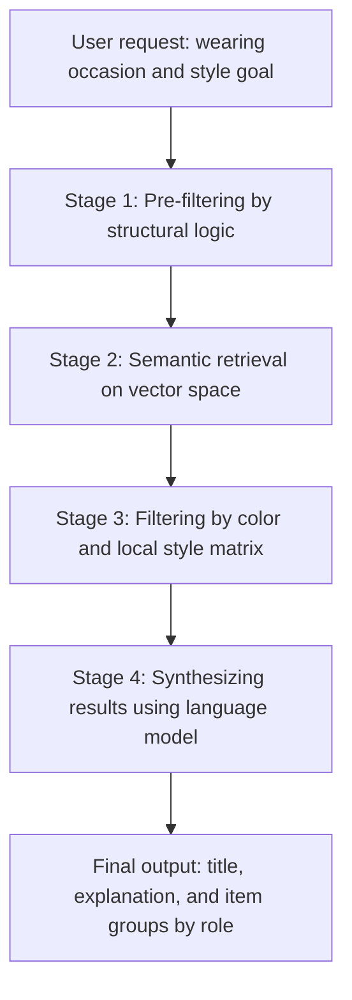
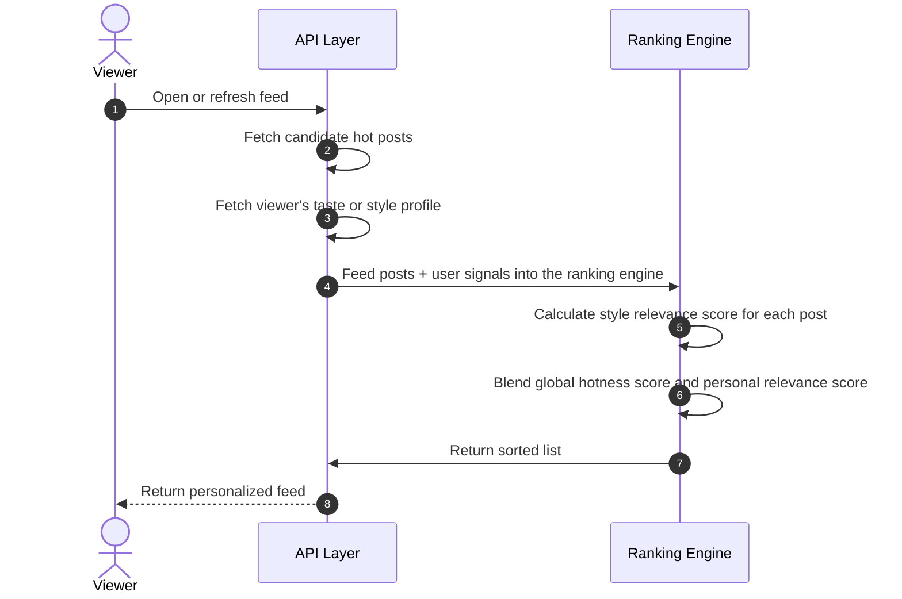

# Core pipeline and algorithmic flow specification of the system

## I. AI pipelines and advanced digital wardrobe

### 1. Asynchronous wardrobe digitization flow

To keep the system responsive during computationally heavy phases, the wardrobe digitization pipeline decouples user requests from background AI analysis through an event-based mechanism.

#### Target Design

- The client handles media uploads and pushes images to storage infrastructure.
- The API receives the request and returns a quick acceptance response instead of waiting for the AI to finish processing.
- The system maps AI results into domain data before officially saving it.

#### Current Version

The current version of the backend has clearly implemented this part as:

- API for batch upload wardrobe items
- Quick item creation with processing status
- Triggering background jobs for each item
- Workers consuming jobs
- AI analyzing images, generating metadata and embeddings
- Updating the item again after completion
- Featuring retry and backoff for temporary errors

In other words, the old asynchronous description was not removed, but implemented into a more concrete background pipeline.

#### Data Mapping Rules

The old descriptions about taxonomy normalization, color grouping, or AI label mapping to domain data still need to be kept as important directions, as this is the middleware layer enabling AI data to be used in the real system.

### 2. Multi-Stage RAG Outfit Recommendation Pipeline

To avoid injecting the entire wardrobe into the prompt causing massive token cost spikes, the system uses a multi-stage pipeline approach to refine data before synthesizing the outfit.

#### Target Design

- **Stage 1:** Eliminate unavailable or contextually inappropriate items.
- **Stage 2:** Retrieve items with high semantic relevance.
- **Stage 3:** Run local rules on color and harmony.
- **Stage 4:** Use the language model to generate the complete outfit, explanation, and item group structure.

#### Current Version

The current version already has the `RecommendOutfit` API, AI quotas, wardrobe data, item metadata, and `last_used_at` data.

The current expected output of `RecommendOutfit` is also clearer at the DTO layer:

- returns `title`
- returns `explanation`
- returns `items` by `role`
- each `role` has one `primary` and multiple `alternatives`

However, the entire 4-stage pipeline exactly as the old description should not be understood as fully exposed in the current code layer. This document retains the target architecture while acknowledging that the backend currently has at least the following parts:

- Real wardrobe data
- Item metadata and embeddings
- Membership quota
- Logic to save outfits and update `last_used_at`

Deeper RAG layers remain a critical algorithmic direction for the product.

#### Business Output Shape of Recommendation

According to current expectations, a recommendation is not just a single "complete outfit", but a result package that can aid decision-making:

- `title`: Name or label of the suggested outfit
- `explanation`: Reason why the suggestion fits the occasion, style, or context
- `items`: Set of item groups by role

Each item group by role includes:

- `role`: Role of the item in the outfit
- `primary`: The prioritized item
- `alternatives`: Alternative items for the same role

The business meaning of this output format is:

- The frontend can display the outfit more flexibly
- Users can easily understand why the outfit was selected
- The system has a foundation ready for local swap or re-roll per role
- The recommendation is no longer locked into a single option

### Current Version of Local Swap

In the current version, local swap is supported by allowing the frontend to directly use the `alternatives` array of each role.

This means:

- The backend does not need to open a separate swap flow for each item change
- Local swap does not consume additional new outfit quotas
- The number of local swaps is not limited by the backend per swap turn
- The actual limit lies only in the number of alternatives currently available in the recommendation payload

#### Stage 3: Color and Harmony Check

Rules such as:

- complementary check
- analogous check
- style matrix filter

Are still kept in the document as the target design of the coordination engine, even if the current implementation might use them to a different extent or hasn't fully manifested them.

### 3. Conversational ReAct Autonomous Agent Loop

Chatbot interactions in the system are described as an agent capable of thinking, calling tools, and synthesizing evidence-based answers.

#### Target Design

- **Step 1:** Manage conversational memory with a sliding window.
- **Step 2:** The model receives input and decides whether to call a tool.
- **Step 3:** The backend system executes the tool to retrieve real data.
- **Step 4:** The model generates answers based on verified data.

#### Current Version

The current version of the backend already has:

- Create chat sessions
- Fetch session list
- Fetch messages
- Store sessions
- Send messages and stream responses

Therefore, the chat engine is no longer just an idea. However, the complete ReAct loop, background summary, and tool-call orchestration should still be read as the target design or an architectural expansion layer to be kept in the document.

---

## II. Two-Stage Hybrid Feed Algorithm

The discovery system splits the global background computation part and the real-time personalized ranking part, helping to achieve lower latency.

### 1. Stage 1: Calculating Global Hotness Score via Time-Decay

A separate background process evaluates community interactions to update the post's global hotness index.

#### Target Design

$$\text{Global\_Score} = \text{Time-Decay}(\text{like\_count}, \text{comment\_count}, \text{item\_age})$$

This model emphasizes that hotness should not solely rely on raw interaction counts, but needs to gradually decay over time.

#### Current Version

The current backend already has:

- Hot feed
- Candidate post set for personalized hot feed
- Global hotness score at snapshot
- Sorting logic combining hotness score and personal relevance score

This means the old description of global hotness remains true at the business concept level, even if the formula and actual cron job execution might differ in details based on the implementation.

### 2. Stage 2: Real-time Personalization and Score Blending

When the user opens the feed, the system combines global data and personalization signals.

#### Step A: Synthesizing user vectors or profiles

The old design assumes the system has a separate fashion taste vector for the viewer.

#### Current Version

Current code already has `StyleProfile` or `TasteEmbedding` on the user and uses it to calculate style scores for the personalized hot feed. Therefore, this part is no longer just an assumption but has an initial implementation.

#### Step B: Calculating style relevance score

The old design uses max pooling logic on items within the post.

#### Current Version

The current backend genuinely has a step to calculate style scores based on items in the post and the user's embedding, then blends the score with the global hotness score.

#### Step C: Linear score blending

The old design describes the formula:

$$\text{Final\_Feed\_Score} = (\text{Global\_Score} \times 0.4) + (S_{\text{style}} \times 0.6)$$

#### Current Version

The current version also follows this exact spirit: blending global hotness score with personal relevance score to create a personalized hot feed.

### Conclusion for the Feed section

The feed section in the old docs should not be discarded as it still accurately reflects the product's intent. What needs to be done is to read it as:

- **Target design** at the fully idealized level
- **Current version** already having a fairly clear materialized part in the backend
